# Assignments Answers

This sections contains the Task 5 of each module.

## Module 0 Fundamentals: Visualization

Hand-create classifiers result

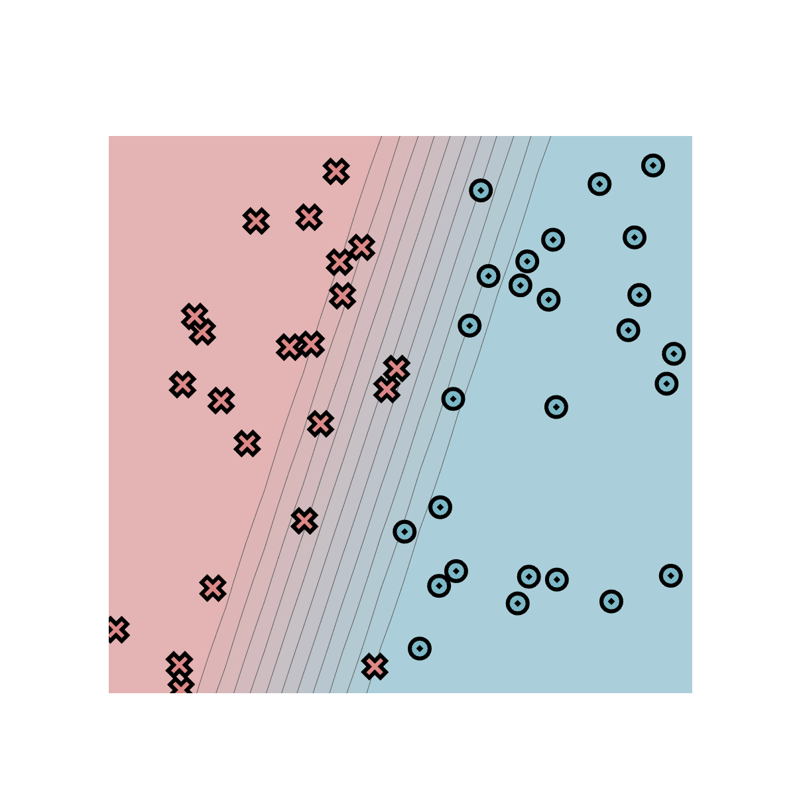

Parameters

|           | linear.weight_0_0 | linear.weight_1_0 | linear_bias_0 |
| --------- | ----------------- | ----------------- | ------------- |
| parameter | -8.14             | 2.57              | 2.26          |

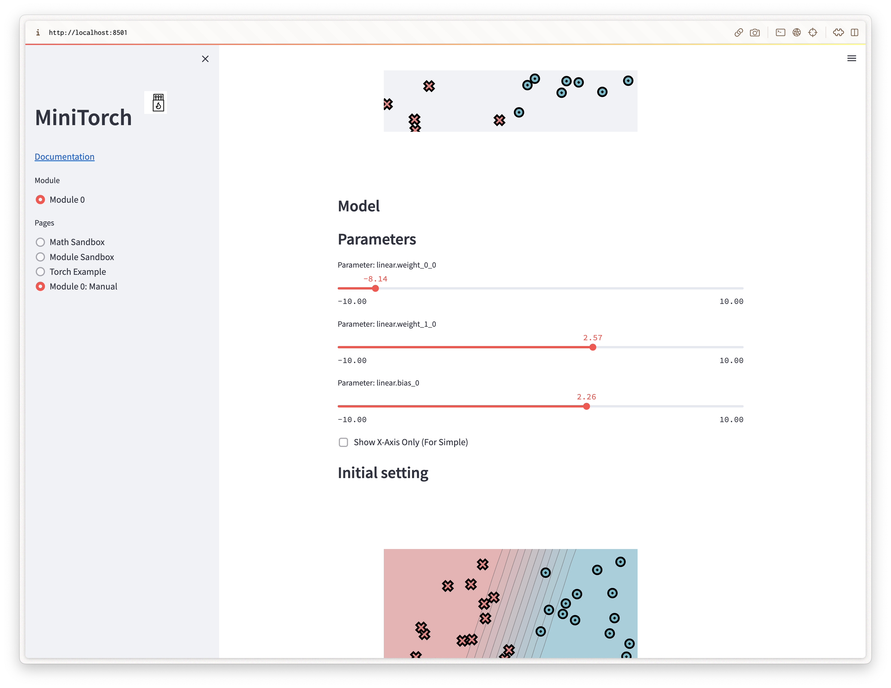

## Module 1 Automatic Differentiation: Training

### Simple

Training results

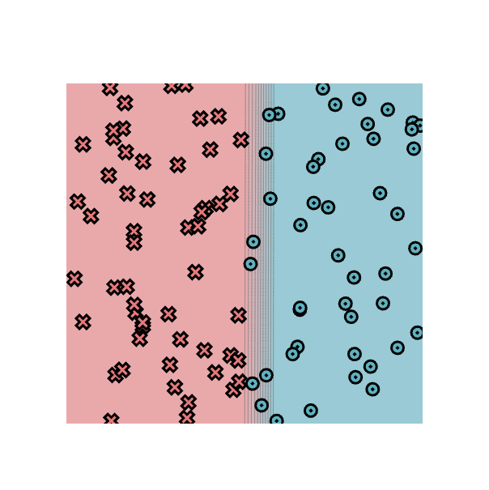

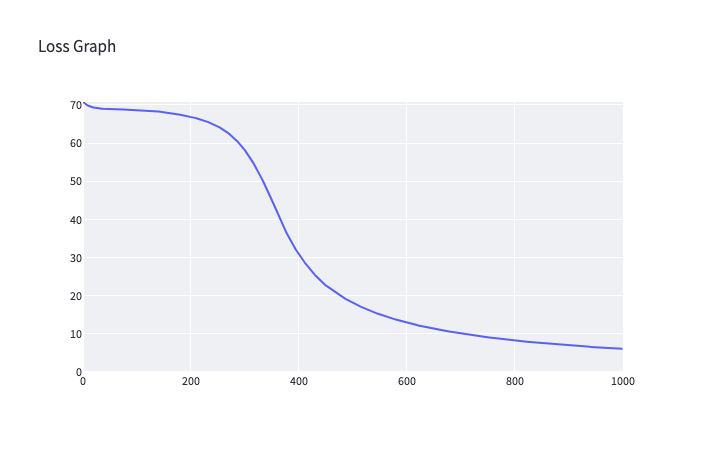

Parameters

|           | Size of hidden layer | Learning rate | Number of epochs |
| --------- | -------------------- | ------------- | ---------------- |
| parameter | 2                    | 0.1           | 1000             |

Training log

```bash
Epoch: 0/1000, loss: 0, correct: 0
Epoch: 10/1000, loss: 69.83387030970839, correct: 54
Epoch: 20/1000, loss: 69.33731639249814, correct: 54
Epoch: 30/1000, loss: 69.09934632237164, correct: 54
Epoch: 40/1000, loss: 68.97897908925825, correct: 54
Epoch: 50/1000, loss: 68.91157547037709, correct: 54
Epoch: 60/1000, loss: 68.86544001238153, correct: 54
Epoch: 70/1000, loss: 68.8261794116557, correct: 54
Epoch: 80/1000, loss: 68.78697655439072, correct: 54
Epoch: 90/1000, loss: 68.73900767401152, correct: 54
Epoch: 100/1000, loss: 68.6853540162345, correct: 54
Epoch: 110/1000, loss: 68.62028681114859, correct: 54
Epoch: 120/1000, loss: 68.53336517329807, correct: 54
Epoch: 130/1000, loss: 68.42193657879287, correct: 54
Epoch: 140/1000, loss: 68.28342873343344, correct: 54
Epoch: 150/1000, loss: 68.11366775957627, correct: 54
Epoch: 160/1000, loss: 67.91101335479249, correct: 54
Epoch: 170/1000, loss: 67.68831753846034, correct: 54
Epoch: 180/1000, loss: 67.44047823495822, correct: 54
Epoch: 190/1000, loss: 67.17066817802143, correct: 54
Epoch: 200/1000, loss: 66.87546980778345, correct: 54
Epoch: 210/1000, loss: 66.53363035398041, correct: 54
Epoch: 220/1000, loss: 66.1376655657919, correct: 54
Epoch: 230/1000, loss: 65.65320931981866, correct: 54
Epoch: 240/1000, loss: 65.08460890352715, correct: 54
Epoch: 250/1000, loss: 64.42121181488241, correct: 54
Epoch: 260/1000, loss: 63.605728022582326, correct: 54
Epoch: 270/1000, loss: 62.593365679175534, correct: 54
Epoch: 280/1000, loss: 61.39963711462486, correct: 54
Epoch: 290/1000, loss: 59.960751105649635, correct: 75
Epoch: 300/1000, loss: 58.25204040365655, correct: 77
Epoch: 310/1000, loss: 56.230605690548835, correct: 80
Epoch: 320/1000, loss: 53.90173276100133, correct: 81
Epoch: 330/1000, loss: 51.280892034698645, correct: 82
Epoch: 340/1000, loss: 48.417101954913015, correct: 83
Epoch: 350/1000, loss: 45.32810619120758, correct: 87
Epoch: 360/1000, loss: 42.02779799536094, correct: 90
Epoch: 370/1000, loss: 38.63861558092667, correct: 90
Epoch: 380/1000, loss: 35.87998856022041, correct: 91
Epoch: 390/1000, loss: 33.33686481166928, correct: 91
Epoch: 400/1000, loss: 31.0094277462763, correct: 92
Epoch: 410/1000, loss: 29.017057046795355, correct: 93
Epoch: 420/1000, loss: 27.159102655303837, correct: 93
Epoch: 430/1000, loss: 25.510032329194132, correct: 95
Epoch: 440/1000, loss: 24.04802135681818, correct: 95
Epoch: 450/1000, loss: 22.774319739533635, correct: 96
Epoch: 460/1000, loss: 21.646507239809353, correct: 96
Epoch: 470/1000, loss: 20.661906402831406, correct: 96
Epoch: 480/1000, loss: 19.7718304854027, correct: 96
Epoch: 490/1000, loss: 18.936903594502684, correct: 98
Epoch: 500/1000, loss: 18.172604390784166, correct: 98
Epoch: 510/1000, loss: 17.45473963496327, correct: 98
Epoch: 520/1000, loss: 16.80732447568578, correct: 98
Epoch: 530/1000, loss: 16.20227139037546, correct: 98
Epoch: 540/1000, loss: 15.644781052626033, correct: 98
Epoch: 550/1000, loss: 15.119812613629412, correct: 98
Epoch: 560/1000, loss: 14.636932028276274, correct: 98
Epoch: 570/1000, loss: 14.179243606011912, correct: 99
Epoch: 580/1000, loss: 13.754668978328068, correct: 99
Epoch: 590/1000, loss: 13.35036672485198, correct: 99
Epoch: 600/1000, loss: 12.969653308669225, correct: 99
Epoch: 610/1000, loss: 12.613738387874639, correct: 99
Epoch: 620/1000, loss: 12.273389362736468, correct: 99
Epoch: 630/1000, loss: 11.954894469453874, correct: 100
Epoch: 640/1000, loss: 11.64823887317686, correct: 100
Epoch: 650/1000, loss: 11.357413799706604, correct: 100
Epoch: 660/1000, loss: 11.083976216377616, correct: 100
Epoch: 670/1000, loss: 10.819802793611133, correct: 100
Epoch: 680/1000, loss: 10.568291370605223, correct: 100
Epoch: 690/1000, loss: 10.330918304129943, correct: 100
Epoch: 700/1000, loss: 10.100918518625724, correct: 100
Epoch: 710/1000, loss: 9.881226717109755, correct: 100
Epoch: 720/1000, loss: 9.671580385760473, correct: 100
Epoch: 730/1000, loss: 9.471177549870076, correct: 100
Epoch: 740/1000, loss: 9.277633902759762, correct: 100
Epoch: 750/1000, loss: 9.091815321964186, correct: 100
Epoch: 760/1000, loss: 8.915004274739362, correct: 100
Epoch: 770/1000, loss: 8.74321581333003, correct: 100
Epoch: 780/1000, loss: 8.577902129778568, correct: 100
Epoch: 790/1000, loss: 8.420300952596289, correct: 100
Epoch: 800/1000, loss: 8.266760028287882, correct: 100
Epoch: 810/1000, loss: 8.118741769550928, correct: 100
Epoch: 820/1000, loss: 7.9759126592168155, correct: 100
Epoch: 830/1000, loss: 7.839337033413065, correct: 100
Epoch: 840/1000, loss: 7.7060357149149175, correct: 100
Epoch: 850/1000, loss: 7.577174463263095, correct: 100
Epoch: 860/1000, loss: 7.453751267161946, correct: 100
Epoch: 870/1000, loss: 7.333066009090351, correct: 100
Epoch: 880/1000, loss: 7.216213482134545, correct: 100
Epoch: 890/1000, loss: 7.103006900057781, correct: 100
Epoch: 900/1000, loss: 6.994337329664501, correct: 100
Epoch: 910/1000, loss: 6.887880538792922, correct: 100
Epoch: 920/1000, loss: 6.784594330289042, correct: 100
Epoch: 930/1000, loss: 6.685452065714585, correct: 100
Epoch: 940/1000, loss: 6.588823168626528, correct: 100
Epoch: 950/1000, loss: 6.495840736833851, correct: 100
Epoch: 960/1000, loss: 6.405774293652577, correct: 100
Epoch: 970/1000, loss: 6.319073928577305, correct: 100
Epoch: 980/1000, loss: 6.233876437491685, correct: 100
Epoch: 990/1000, loss: 6.150940044956688, correct: 100
Epoch: 1000/1000, loss: 6.070499396031767, correct: 100
```

### Diag

Training results

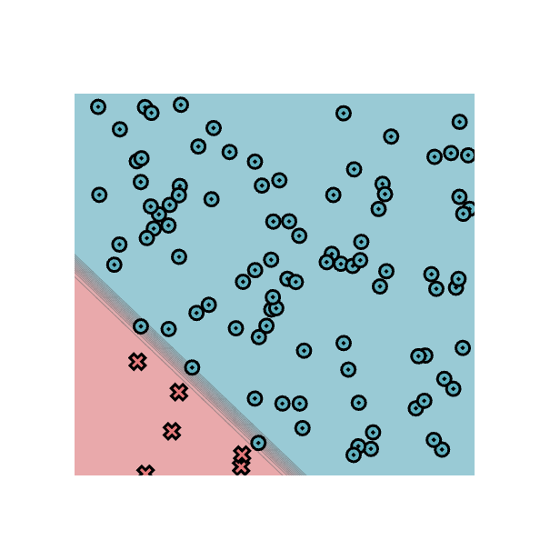

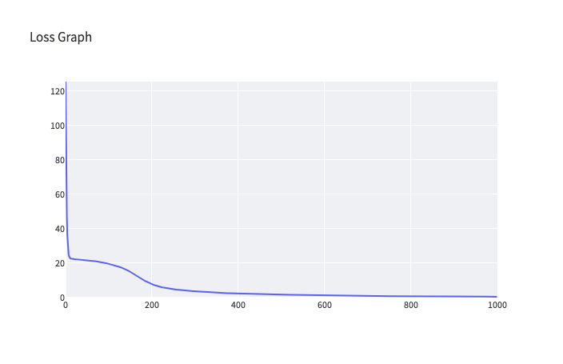

Parameters

|           | Size of hidden layer | Learning rate | Number of epochs |
| --------- | -------------------- | ------------- | ---------------- |
| parameter | 2                    | 0.5           | 1000             |

Training log

```bash
Epoch: 0/1000, loss: 0, correct: 0
Epoch: 10/1000, loss: 23.37888443375921, correct: 94
Epoch: 20/1000, loss: 22.34636128542458, correct: 94
Epoch: 30/1000, loss: 22.14963440195095, correct: 94
Epoch: 40/1000, loss: 21.935731838943138, correct: 94
Epoch: 50/1000, loss: 21.688592041978985, correct: 94
Epoch: 60/1000, loss: 21.39977195187248, correct: 94
Epoch: 70/1000, loss: 21.061738982292486, correct: 94
Epoch: 80/1000, loss: 20.667055960115828, correct: 94
Epoch: 90/1000, loss: 20.207451262156994, correct: 94
Epoch: 100/1000, loss: 19.672610857546143, correct: 94
Epoch: 110/1000, loss: 19.048592235871556, correct: 94
Epoch: 120/1000, loss: 18.31579387964861, correct: 94
Epoch: 130/1000, loss: 17.442417104559986, correct: 94
Epoch: 140/1000, loss: 16.378521893679164, correct: 94
Epoch: 150/1000, loss: 15.029686907501315, correct: 94
Epoch: 160/1000, loss: 13.331537252556828, correct: 94
Epoch: 170/1000, loss: 11.83371444174687, correct: 94
Epoch: 180/1000, loss: 10.397269056873993, correct: 94
Epoch: 190/1000, loss: 9.044533746447904, correct: 95
Epoch: 200/1000, loss: 7.8646146527297764, correct: 96
Epoch: 210/1000, loss: 6.931593669603746, correct: 96
Epoch: 220/1000, loss: 6.216573359113893, correct: 97
Epoch: 230/1000, loss: 5.711148739672355, correct: 98
Epoch: 240/1000, loss: 5.276304121020911, correct: 98
Epoch: 250/1000, loss: 4.900219875766415, correct: 99
Epoch: 260/1000, loss: 4.574222004477321, correct: 100
Epoch: 270/1000, loss: 4.3043084695385465, correct: 100
Epoch: 280/1000, loss: 4.067316665993125, correct: 100
Epoch: 290/1000, loss: 3.845781876175298, correct: 100
Epoch: 300/1000, loss: 3.6515992923539686, correct: 100
Epoch: 310/1000, loss: 3.4740195741916247, correct: 100
Epoch: 320/1000, loss: 3.311001617982212, correct: 100
Epoch: 330/1000, loss: 3.160813156008099, correct: 100
Epoch: 340/1000, loss: 3.021982762162218, correct: 100
Epoch: 350/1000, loss: 2.8932548046725244, correct: 100
Epoch: 360/1000, loss: 2.7735514948618194, correct: 100
Epoch: 370/1000, loss: 2.66194262049836, correct: 100
Epoch: 380/1000, loss: 2.5576214866482294, correct: 100
Epoch: 390/1000, loss: 2.4598847751048236, correct: 100
Epoch: 400/1000, loss: 2.368116604242381, correct: 100
Epoch: 410/1000, loss: 2.2817756051427596, correct: 100
Epoch: 420/1000, loss: 2.2003842176175223, correct: 100
Epoch: 430/1000, loss: 2.1235198509456032, correct: 100
Epoch: 440/1000, loss: 2.0508074821134485, correct: 100
Epoch: 450/1000, loss: 1.981913405919142, correct: 100
Epoch: 460/1000, loss: 1.9165398810098038, correct: 100
Epoch: 470/1000, loss: 1.854420608133474, correct: 100
Epoch: 480/1000, loss: 1.7953167901396867, correct: 100
Epoch: 490/1000, loss: 1.7390137445232938, correct: 100
Epoch: 500/1000, loss: 1.6853179668932743, correct: 100
Epoch: 510/1000, loss: 1.6340545920482046, correct: 100
Epoch: 520/1000, loss: 1.5850651828338513, correct: 100
Epoch: 530/1000, loss: 1.5382058094146713, correct: 100
Epoch: 540/1000, loss: 1.4933453777655932, correct: 100
Epoch: 550/1000, loss: 1.4503641740273956, correct: 100
Epoch: 560/1000, loss: 1.4091525947116375, correct: 100
Epoch: 570/1000, loss: 1.3696100381748133, correct: 100
Epoch: 580/1000, loss: 1.3316439380080163, correct: 100
Epoch: 590/1000, loss: 1.2951689159505617, correct: 100
Epoch: 600/1000, loss: 1.2601060392715826, correct: 100
Epoch: 610/1000, loss: 1.2263821700711268, correct: 100
Epoch: 620/1000, loss: 1.1939293929336128, correct: 100
Epoch: 630/1000, loss: 1.1626845113284372, correct: 100
Epoch: 640/1000, loss: 1.1325886032043038, correct: 100
Epoch: 650/1000, loss: 1.1035866281030766, correct: 100
Epoch: 660/1000, loss: 1.0756270793280034, correct: 100
Epoch: 670/1000, loss: 1.0486616753313018, correct: 100
Epoch: 680/1000, loss: 1.0226450849356714, correct: 100
Epoch: 690/1000, loss: 0.9975346828696247, correct: 100
Epoch: 700/1000, loss: 0.973290331007316, correct: 100
Epoch: 710/1000, loss: 0.9498741827278077, correct: 100
Epoch: 720/1000, loss: 0.9272505071748535, correct: 100
Epoch: 730/1000, loss: 0.9053855311618083, correct: 100
Epoch: 740/1000, loss: 0.8842472966517376, correct: 100
Epoch: 750/1000, loss: 0.86380553196246, correct: 100
Epoch: 760/1000, loss: 0.8440315350012083, correct: 100
Epoch: 770/1000, loss: 0.8248980672011456, correct: 100
Epoch: 780/1000, loss: 0.8063792570623315, correct: 100
Epoch: 790/1000, loss: 0.7884505119987998, correct: 100
Epoch: 800/1000, loss: 0.7710884378115858, correct: 100
Epoch: 810/1000, loss: 0.7542707648183905, correct: 100
Epoch: 820/1000, loss: 0.7379762799993242, correct: 100
Epoch: 830/1000, loss: 0.7221847644977183, correct: 100
Epoch: 840/1000, loss: 0.706876935974185, correct: 100
Epoch: 850/1000, loss: 0.6920343953212129, correct: 100
Epoch: 860/1000, loss: 0.6776395772799614, correct: 100
Epoch: 870/1000, loss: 0.663675704612197, correct: 100
Epoch: 880/1000, loss: 0.6501267454921409, correct: 100
Epoch: 890/1000, loss: 0.6369773738220618, correct: 100
Epoch: 900/1000, loss: 0.6242129322104067, correct: 100
Epoch: 910/1000, loss: 0.6118193973800897, correct: 100
Epoch: 920/1000, loss: 0.5997833477996846, correct: 100
Epoch: 930/1000, loss: 0.5880919333524864, correct: 100
Epoch: 940/1000, loss: 0.5767328468776749, correct: 100
Epoch: 950/1000, loss: 0.5656942974349273, correct: 100
Epoch: 960/1000, loss: 0.5549649851588127, correct: 100
Epoch: 970/1000, loss: 0.54453407758313, correct: 100
Epoch: 980/1000, loss: 0.5343911873255304, correct: 100
Epoch: 990/1000, loss: 0.524526351027931, correct: 100
Epoch: 1000/1000, loss: 0.5149300094841182, correct: 100
```

### Split

Training results

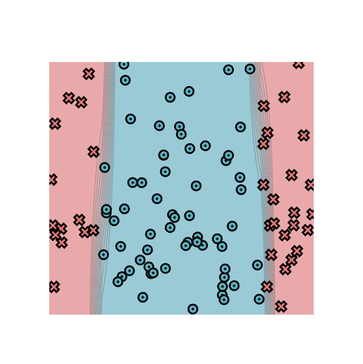

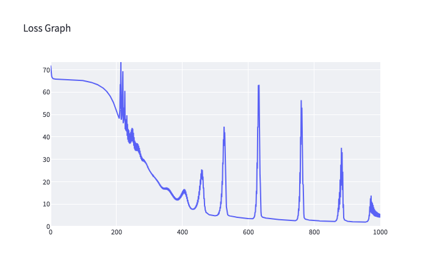

Parameters

|           | Size of hidden layer | Learning rate | Number of epochs |
| --------- | -------------------- | ------------- | ---------------- |
| parameter | 4                    | 0.5           | 1000             |

Training log

```bash
Epoch: 0/1000, loss: 0, correct: 0
Epoch: 10/1000, loss: 65.91112116614295, correct: 63
Epoch: 20/1000, loss: 65.73389551174799, correct: 63
Epoch: 30/1000, loss: 65.69894405533825, correct: 63
Epoch: 40/1000, loss: 65.65960586507651, correct: 63
Epoch: 50/1000, loss: 65.6150142087589, correct: 63
Epoch: 60/1000, loss: 65.56107532656056, correct: 63
Epoch: 70/1000, loss: 65.4945167049024, correct: 63
Epoch: 80/1000, loss: 65.40836715046295, correct: 63
Epoch: 90/1000, loss: 65.28617599933641, correct: 63
Epoch: 100/1000, loss: 65.10013910147639, correct: 63
Epoch: 110/1000, loss: 64.81400693148285, correct: 63
Epoch: 120/1000, loss: 64.48184948586146, correct: 63
Epoch: 130/1000, loss: 64.06347213989066, correct: 63
Epoch: 140/1000, loss: 63.51707007592204, correct: 63
Epoch: 150/1000, loss: 62.78230674855274, correct: 64
Epoch: 160/1000, loss: 61.795406975535215, correct: 64
Epoch: 170/1000, loss: 60.44281945218934, correct: 65
Epoch: 180/1000, loss: 58.52637206074998, correct: 67
Epoch: 190/1000, loss: 55.78256685262423, correct: 68
Epoch: 200/1000, loss: 51.939549284209946, correct: 73
Epoch: 210/1000, loss: 49.65555685512624, correct: 68
Epoch: 220/1000, loss: 69.32452975351475, correct: 63
Epoch: 230/1000, loss: 47.94529704416879, correct: 71
Epoch: 240/1000, loss: 41.62894185828402, correct: 72
Epoch: 250/1000, loss: 43.594679603021554, correct: 72
Epoch: 260/1000, loss: 37.29134203005639, correct: 76
Epoch: 270/1000, loss: 35.06706490750561, correct: 78
Epoch: 280/1000, loss: 30.382897964493786, correct: 83
Epoch: 290/1000, loss: 28.57090635183601, correct: 84
Epoch: 300/1000, loss: 25.282858662091353, correct: 86
Epoch: 310/1000, loss: 22.881154197903804, correct: 88
Epoch: 320/1000, loss: 20.978773441273976, correct: 89
Epoch: 330/1000, loss: 18.794853637257912, correct: 89
Epoch: 340/1000, loss: 16.832343151032692, correct: 89
Epoch: 350/1000, loss: 16.437149583975412, correct: 89
Epoch: 360/1000, loss: 15.708958707424076, correct: 90
Epoch: 370/1000, loss: 13.639858324844454, correct: 92
Epoch: 380/1000, loss: 11.877078407213423, correct: 94
Epoch: 390/1000, loss: 11.836822683535582, correct: 94
Epoch: 400/1000, loss: 13.764260574086757, correct: 92
Epoch: 410/1000, loss: 14.14225073885231, correct: 92
Epoch: 420/1000, loss: 9.348813930646095, correct: 95
Epoch: 430/1000, loss: 7.5386731857393166, correct: 98
Epoch: 440/1000, loss: 8.023652218051687, correct: 95
Epoch: 450/1000, loss: 12.120241432004898, correct: 92
Epoch: 460/1000, loss: 22.008527410699102, correct: 89
Epoch: 470/1000, loss: 7.245756563957877, correct: 97
Epoch: 480/1000, loss: 5.34840965720282, correct: 100
Epoch: 490/1000, loss: 4.957702121335128, correct: 100
Epoch: 500/1000, loss: 4.78129257859041, correct: 100
Epoch: 510/1000, loss: 5.4871139962029485, correct: 100
Epoch: 520/1000, loss: 13.03008630845936, correct: 92
Epoch: 530/1000, loss: 32.35406471307626, correct: 87
Epoch: 540/1000, loss: 4.948607378151059, correct: 100
Epoch: 550/1000, loss: 4.521844250901176, correct: 100
Epoch: 560/1000, loss: 4.264974917253811, correct: 100
Epoch: 570/1000, loss: 4.044792748521779, correct: 100
Epoch: 580/1000, loss: 3.848561734210338, correct: 100
Epoch: 590/1000, loss: 3.6708068740025857, correct: 100
Epoch: 600/1000, loss: 3.5093626243020504, correct: 100
Epoch: 610/1000, loss: 3.3972660418668523, correct: 100
Epoch: 620/1000, loss: 4.8379928713426015, correct: 98
Epoch: 630/1000, loss: 44.118218682243686, correct: 85
Epoch: 640/1000, loss: 4.839818702082511, correct: 99
Epoch: 650/1000, loss: 3.8462901097470406, correct: 100
Epoch: 660/1000, loss: 3.6072422146523797, correct: 100
Epoch: 670/1000, loss: 3.421460169130777, correct: 100
Epoch: 680/1000, loss: 3.2663844090073426, correct: 100
Epoch: 690/1000, loss: 3.1254535832680825, correct: 100
Epoch: 700/1000, loss: 2.995395923206236, correct: 100
Epoch: 710/1000, loss: 2.874732763956231, correct: 100
Epoch: 720/1000, loss: 2.7624884945757477, correct: 100
Epoch: 730/1000, loss: 2.6583522145692773, correct: 100
Epoch: 740/1000, loss: 2.5837784160795807, correct: 100
Epoch: 750/1000, loss: 3.5825563733210912, correct: 100
Epoch: 760/1000, loss: 36.44294825463226, correct: 89
Epoch: 770/1000, loss: 3.927644252593207, correct: 100
Epoch: 780/1000, loss: 2.9899017190207577, correct: 100
Epoch: 790/1000, loss: 2.789133429012235, correct: 100
Epoch: 800/1000, loss: 2.6563922496624603, correct: 100
Epoch: 810/1000, loss: 2.543600866306065, correct: 100
Epoch: 820/1000, loss: 2.445712689055499, correct: 100
Epoch: 830/1000, loss: 2.354604162367693, correct: 100
Epoch: 840/1000, loss: 2.2715790523964987, correct: 100
Epoch: 850/1000, loss: 2.1987404278825826, correct: 100
Epoch: 860/1000, loss: 2.1916162172990568, correct: 100
Epoch: 870/1000, loss: 3.4320446432533447, correct: 100
Epoch: 880/1000, loss: 12.94677108627442, correct: 93
Epoch: 890/1000, loss: 3.7235872127188854, correct: 100
Epoch: 900/1000, loss: 2.384540333504462, correct: 100
Epoch: 910/1000, loss: 2.1961609174359795, correct: 100
Epoch: 920/1000, loss: 2.102732324660702, correct: 100
Epoch: 930/1000, loss: 2.02010250592072, correct: 100
Epoch: 940/1000, loss: 1.9580947496859908, correct: 100
Epoch: 950/1000, loss: 1.9243336386478742, correct: 100
Epoch: 960/1000, loss: 2.1071688676205276, correct: 100
Epoch: 970/1000, loss: 6.226374276810863, correct: 97
Epoch: 980/1000, loss: 5.0927181255157965, correct: 97
Epoch: 990/1000, loss: 4.266989187875595, correct: 98
Epoch: 1000/1000, loss: 3.944932887977147, correct: 98
```

### Xor

Training results

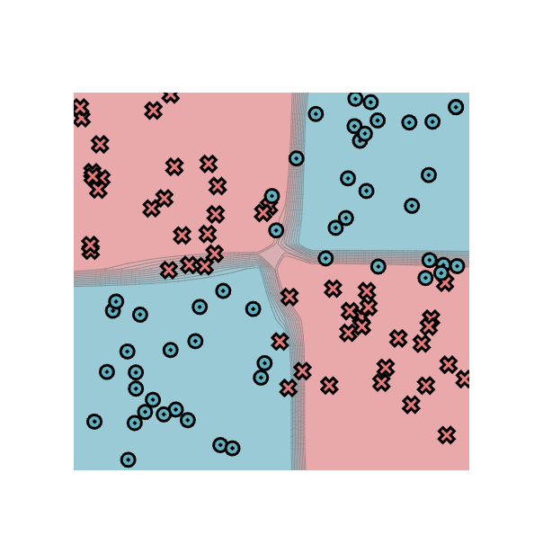

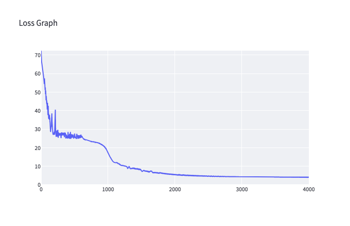

Parameters

|           | Size of hidden layer | Learning rate | Number of epochs |
| --------- | -------------------- | ------------- | ---------------- |
| parameter | 6                    | 0.5           | 4000             |

Training log

```bash
Epoch: 0/4000, loss: 0, correct: 0
Epoch: 10/4000, loss: 65.86478152311031, correct: 51
Epoch: 20/4000, loss: 63.71643790140269, correct: 76
Epoch: 30/4000, loss: 61.05286555225735, correct: 85
Epoch: 40/4000, loss: 57.372546926462554, correct: 87
Epoch: 50/4000, loss: 55.339194797427794, correct: 74
Epoch: 60/4000, loss: 51.226307639053985, correct: 78
Epoch: 70/4000, loss: 47.81649791737423, correct: 78
Epoch: 80/4000, loss: 44.775759419013944, correct: 79
Epoch: 90/4000, loss: 41.982425172159104, correct: 80
Epoch: 100/4000, loss: 38.95474572372831, correct: 84
Epoch: 110/4000, loss: 35.83944149849975, correct: 85
Epoch: 120/4000, loss: 35.22901768259593, correct: 85
Epoch: 130/4000, loss: 35.14230007369122, correct: 85
Epoch: 140/4000, loss: 28.872380156341748, correct: 89
Epoch: 150/4000, loss: 30.786517114015034, correct: 89
Epoch: 160/4000, loss: 35.97921707699105, correct: 85
Epoch: 170/4000, loss: 30.399737557320613, correct: 89
Epoch: 180/4000, loss: 27.00569288478453, correct: 90
Epoch: 190/4000, loss: 27.23166238949593, correct: 90
Epoch: 200/4000, loss: 27.080420350396864, correct: 90
Epoch: 210/4000, loss: 35.135282454769, correct: 85
Epoch: 220/4000, loss: 27.07681421317141, correct: 91
Epoch: 230/4000, loss: 26.918688373565217, correct: 90
Epoch: 240/4000, loss: 26.5573845406478, correct: 90
Epoch: 250/4000, loss: 28.996114406899324, correct: 90
Epoch: 260/4000, loss: 28.355764798011197, correct: 90
Epoch: 270/4000, loss: 26.647745157215088, correct: 90
Epoch: 280/4000, loss: 26.798742999275138, correct: 90
Epoch: 290/4000, loss: 27.942682787961818, correct: 90
Epoch: 300/4000, loss: 25.4632944504336, correct: 90
Epoch: 310/4000, loss: 26.571273581549754, correct: 91
Epoch: 320/4000, loss: 27.42606392142974, correct: 90
Epoch: 330/4000, loss: 27.00517391996846, correct: 90
Epoch: 340/4000, loss: 27.03588495881604, correct: 90
Epoch: 350/4000, loss: 26.908126157239558, correct: 90
Epoch: 360/4000, loss: 27.407906738477553, correct: 90
Epoch: 370/4000, loss: 25.113223562212273, correct: 90
Epoch: 380/4000, loss: 26.65886744196865, correct: 91
Epoch: 390/4000, loss: 26.47892278474925, correct: 90
Epoch: 400/4000, loss: 26.02640584194419, correct: 90
Epoch: 410/4000, loss: 25.65529220416306, correct: 90
Epoch: 420/4000, loss: 25.168081778000342, correct: 89
Epoch: 430/4000, loss: 25.962573362007852, correct: 91
Epoch: 440/4000, loss: 26.359155832040166, correct: 91
Epoch: 450/4000, loss: 26.185162982702117, correct: 91
Epoch: 460/4000, loss: 26.562340101963027, correct: 90
Epoch: 470/4000, loss: 25.699745545943905, correct: 91
Epoch: 480/4000, loss: 26.722022836113997, correct: 90
Epoch: 490/4000, loss: 25.216126061423513, correct: 90
Epoch: 500/4000, loss: 26.577432940463712, correct: 90
Epoch: 510/4000, loss: 25.35579641099124, correct: 91
Epoch: 520/4000, loss: 25.11886959259449, correct: 91
Epoch: 530/4000, loss: 26.44365198856725, correct: 90
Epoch: 540/4000, loss: 26.167395313501114, correct: 90
Epoch: 550/4000, loss: 25.588157893543308, correct: 91
Epoch: 560/4000, loss: 26.150207185089, correct: 90
Epoch: 570/4000, loss: 25.966140937542676, correct: 91
Epoch: 580/4000, loss: 25.39021554871839, correct: 91
Epoch: 590/4000, loss: 25.30024536236951, correct: 91
Epoch: 600/4000, loss: 25.565118763811885, correct: 91
Epoch: 610/4000, loss: 26.27766497152956, correct: 90
Epoch: 620/4000, loss: 25.329314732654286, correct: 91
Epoch: 630/4000, loss: 24.913050393557963, correct: 91
Epoch: 640/4000, loss: 24.702492401141654, correct: 91
Epoch: 650/4000, loss: 24.51829023698362, correct: 90
Epoch: 660/4000, loss: 24.345360179458133, correct: 91
Epoch: 670/4000, loss: 24.299679993499137, correct: 91
Epoch: 680/4000, loss: 24.228417627720614, correct: 90
Epoch: 690/4000, loss: 24.11915611844688, correct: 90
Epoch: 700/4000, loss: 24.031824935560323, correct: 90
Epoch: 710/4000, loss: 23.872711384605346, correct: 91
Epoch: 720/4000, loss: 23.699927753727902, correct: 91
Epoch: 730/4000, loss: 23.61165901496215, correct: 91
Epoch: 740/4000, loss: 23.43021054576859, correct: 91
Epoch: 750/4000, loss: 23.347213328877938, correct: 91
Epoch: 760/4000, loss: 23.286038927991736, correct: 91
Epoch: 770/4000, loss: 23.22293631802761, correct: 91
Epoch: 780/4000, loss: 23.150012487193518, correct: 91
Epoch: 790/4000, loss: 22.954304668980743, correct: 91
Epoch: 800/4000, loss: 22.906239857356848, correct: 91
Epoch: 810/4000, loss: 22.87987014846074, correct: 91
Epoch: 820/4000, loss: 22.714656352657144, correct: 91
Epoch: 830/4000, loss: 22.703460429014918, correct: 91
Epoch: 840/4000, loss: 22.58815876340029, correct: 91
Epoch: 850/4000, loss: 22.42316673775754, correct: 91
Epoch: 860/4000, loss: 22.38634260008976, correct: 91
Epoch: 870/4000, loss: 22.261399185287505, correct: 91
Epoch: 880/4000, loss: 21.951757711253038, correct: 91
Epoch: 890/4000, loss: 21.888456202930403, correct: 91
Epoch: 900/4000, loss: 21.689955191807055, correct: 91
Epoch: 910/4000, loss: 21.487262175824952, correct: 91
Epoch: 920/4000, loss: 21.162266934223805, correct: 92
Epoch: 930/4000, loss: 20.942213085326795, correct: 92
Epoch: 940/4000, loss: 20.599647910485203, correct: 92
Epoch: 950/4000, loss: 20.21635202368988, correct: 92
Epoch: 960/4000, loss: 19.747320798362647, correct: 93
Epoch: 970/4000, loss: 19.346154854362723, correct: 93
Epoch: 980/4000, loss: 18.75350312701078, correct: 93
Epoch: 990/4000, loss: 18.11563853064218, correct: 93
Epoch: 1000/4000, loss: 17.439888714538125, correct: 94
Epoch: 1010/4000, loss: 16.446786789450663, correct: 94
Epoch: 1020/4000, loss: 15.682325819354254, correct: 94
Epoch: 1030/4000, loss: 15.084115467336314, correct: 95
Epoch: 1040/4000, loss: 14.509878295119849, correct: 95
Epoch: 1050/4000, loss: 13.891097451382254, correct: 95
Epoch: 1060/4000, loss: 13.322932984810574, correct: 95
Epoch: 1070/4000, loss: 12.765509315967394, correct: 95
Epoch: 1080/4000, loss: 12.289999764260507, correct: 96
Epoch: 1090/4000, loss: 12.10936110671226, correct: 94
Epoch: 1100/4000, loss: 12.000244592359461, correct: 94
Epoch: 1110/4000, loss: 11.924099619166949, correct: 95
Epoch: 1120/4000, loss: 11.836531243106167, correct: 96
Epoch: 1130/4000, loss: 11.933095155898107, correct: 96
Epoch: 1140/4000, loss: 11.728012917130144, correct: 95
Epoch: 1150/4000, loss: 11.473107296682034, correct: 95
Epoch: 1160/4000, loss: 11.29724709038734, correct: 95
Epoch: 1170/4000, loss: 11.067417978113092, correct: 96
Epoch: 1180/4000, loss: 10.865008342648506, correct: 96
Epoch: 1190/4000, loss: 10.51935591057666, correct: 96
Epoch: 1200/4000, loss: 10.433352556145483, correct: 96
Epoch: 1210/4000, loss: 10.40504132332547, correct: 96
Epoch: 1220/4000, loss: 10.412769659764102, correct: 96
Epoch: 1230/4000, loss: 10.313727644026013, correct: 96
Epoch: 1240/4000, loss: 10.147228115998182, correct: 96
Epoch: 1250/4000, loss: 10.166951694996028, correct: 96
Epoch: 1260/4000, loss: 10.039046882422385, correct: 96
Epoch: 1270/4000, loss: 9.882608407453716, correct: 96
Epoch: 1280/4000, loss: 9.744175961565865, correct: 96
Epoch: 1290/4000, loss: 9.088644412233856, correct: 96
Epoch: 1300/4000, loss: 8.855525819059228, correct: 96
Epoch: 1310/4000, loss: 9.588130847433769, correct: 96
Epoch: 1320/4000, loss: 9.707589448599247, correct: 96
Epoch: 1330/4000, loss: 8.859196323322717, correct: 96
Epoch: 1340/4000, loss: 8.716382706515066, correct: 96
Epoch: 1350/4000, loss: 8.82604301119381, correct: 96
Epoch: 1360/4000, loss: 8.904341019959212, correct: 96
Epoch: 1370/4000, loss: 8.918366396696142, correct: 96
Epoch: 1380/4000, loss: 8.928228027033473, correct: 96
Epoch: 1390/4000, loss: 8.906760881359322, correct: 96
Epoch: 1400/4000, loss: 8.753469929046164, correct: 96
Epoch: 1410/4000, loss: 8.704703238426546, correct: 96
Epoch: 1420/4000, loss: 8.68189284800122, correct: 96
Epoch: 1430/4000, loss: 8.633565404413778, correct: 96
Epoch: 1440/4000, loss: 8.563871232159427, correct: 96
Epoch: 1450/4000, loss: 8.484290969495639, correct: 96
Epoch: 1460/4000, loss: 8.398541242378572, correct: 96
Epoch: 1470/4000, loss: 8.296433221305373, correct: 96
Epoch: 1480/4000, loss: 8.359948346374022, correct: 96
Epoch: 1490/4000, loss: 8.120368164730158, correct: 96
Epoch: 1500/4000, loss: 7.4467614699359155, correct: 97
Epoch: 1510/4000, loss: 7.253589638606832, correct: 97
Epoch: 1520/4000, loss: 7.482903692197285, correct: 97
Epoch: 1530/4000, loss: 7.719457921119719, correct: 97
Epoch: 1540/4000, loss: 7.721242902713235, correct: 97
Epoch: 1550/4000, loss: 7.496263691740303, correct: 97
Epoch: 1560/4000, loss: 7.442482443861266, correct: 97
Epoch: 1570/4000, loss: 7.4062597764259435, correct: 97
Epoch: 1580/4000, loss: 7.3576533013405925, correct: 97
Epoch: 1590/4000, loss: 7.294503953934983, correct: 97
Epoch: 1600/4000, loss: 7.170389776737293, correct: 97
Epoch: 1610/4000, loss: 7.054325585743134, correct: 97
Epoch: 1620/4000, loss: 7.017351004899164, correct: 97
Epoch: 1630/4000, loss: 7.274543345241034, correct: 97
Epoch: 1640/4000, loss: 7.326567915004355, correct: 97
Epoch: 1650/4000, loss: 7.336012003911497, correct: 97
Epoch: 1660/4000, loss: 6.952688586255423, correct: 97
Epoch: 1670/4000, loss: 6.610567433335563, correct: 97
Epoch: 1680/4000, loss: 6.582811701985379, correct: 97
Epoch: 1690/4000, loss: 6.606681884764651, correct: 97
Epoch: 1700/4000, loss: 6.608628909959668, correct: 97
Epoch: 1710/4000, loss: 6.5784300929588815, correct: 97
Epoch: 1720/4000, loss: 6.553780265861553, correct: 97
Epoch: 1730/4000, loss: 6.499845122415263, correct: 97
Epoch: 1740/4000, loss: 6.461396922228873, correct: 97
Epoch: 1750/4000, loss: 6.420850713048824, correct: 97
Epoch: 1760/4000, loss: 6.373591443320545, correct: 97
Epoch: 1770/4000, loss: 6.448538741476918, correct: 97
Epoch: 1780/4000, loss: 6.495555624643216, correct: 97
Epoch: 1790/4000, loss: 6.400035154078853, correct: 97
Epoch: 1800/4000, loss: 6.313871564035125, correct: 97
Epoch: 1810/4000, loss: 6.250348839556732, correct: 97
Epoch: 1820/4000, loss: 6.211423068423587, correct: 97
Epoch: 1830/4000, loss: 6.140972830775699, correct: 97
Epoch: 1840/4000, loss: 6.107284744079265, correct: 97
Epoch: 1850/4000, loss: 6.046798650126082, correct: 97
Epoch: 1860/4000, loss: 6.004225352208046, correct: 97
Epoch: 1870/4000, loss: 5.963188611930791, correct: 97
Epoch: 1880/4000, loss: 5.925561450962249, correct: 97
Epoch: 1890/4000, loss: 5.8852138178820725, correct: 97
Epoch: 1900/4000, loss: 5.846183347091249, correct: 97
Epoch: 1910/4000, loss: 5.809240536749915, correct: 97
Epoch: 1920/4000, loss: 5.773921570317996, correct: 97
Epoch: 1930/4000, loss: 5.739792011122246, correct: 97
Epoch: 1940/4000, loss: 5.7066604169322055, correct: 97
Epoch: 1950/4000, loss: 5.669756646605851, correct: 97
Epoch: 1960/4000, loss: 5.637724456908546, correct: 97
Epoch: 1970/4000, loss: 5.623128862882599, correct: 97
Epoch: 1980/4000, loss: 5.585015641278183, correct: 97
Epoch: 1990/4000, loss: 5.5560972069084595, correct: 97
Epoch: 2000/4000, loss: 5.523622666381736, correct: 97
Epoch: 2010/4000, loss: 5.492055831739596, correct: 97
Epoch: 2020/4000, loss: 5.480595782688581, correct: 97
Epoch: 2030/4000, loss: 5.387461226675365, correct: 97
Epoch: 2040/4000, loss: 5.335802962240521, correct: 97
Epoch: 2050/4000, loss: 5.377979556741971, correct: 97
Epoch: 2060/4000, loss: 5.404355849068478, correct: 97
Epoch: 2070/4000, loss: 5.412825264285572, correct: 97
Epoch: 2080/4000, loss: 5.35273460423817, correct: 97
Epoch: 2090/4000, loss: 5.257864698913561, correct: 97
Epoch: 2100/4000, loss: 5.221188763978193, correct: 97
Epoch: 2110/4000, loss: 5.217233089496018, correct: 97
Epoch: 2120/4000, loss: 5.290910577746313, correct: 97
Epoch: 2130/4000, loss: 5.298038783140868, correct: 97
Epoch: 2140/4000, loss: 5.235934382572818, correct: 97
Epoch: 2150/4000, loss: 5.186443013445818, correct: 97
Epoch: 2160/4000, loss: 5.1503245200641405, correct: 97
Epoch: 2170/4000, loss: 5.138618314499308, correct: 97
Epoch: 2180/4000, loss: 5.133634803914214, correct: 97
Epoch: 2190/4000, loss: 5.163387264887302, correct: 97
Epoch: 2200/4000, loss: 5.111447988805258, correct: 97
Epoch: 2210/4000, loss: 5.0888149271076015, correct: 97
Epoch: 2220/4000, loss: 5.071987152700191, correct: 97
Epoch: 2230/4000, loss: 5.056117960781778, correct: 97
Epoch: 2240/4000, loss: 5.0403434024030975, correct: 97
Epoch: 2250/4000, loss: 5.024577120928957, correct: 97
Epoch: 2260/4000, loss: 5.008944289089054, correct: 97
Epoch: 2270/4000, loss: 4.993515841606866, correct: 97
Epoch: 2280/4000, loss: 4.9589497425886355, correct: 97
Epoch: 2290/4000, loss: 4.95385029145875, correct: 97
Epoch: 2300/4000, loss: 4.9407875271495945, correct: 97
Epoch: 2310/4000, loss: 4.9257031163447875, correct: 97
Epoch: 2320/4000, loss: 4.910887534632535, correct: 97
Epoch: 2330/4000, loss: 4.896598864681831, correct: 97
Epoch: 2340/4000, loss: 4.877559725747237, correct: 97
Epoch: 2350/4000, loss: 4.877952286007785, correct: 97
Epoch: 2360/4000, loss: 4.867723279663839, correct: 97
Epoch: 2370/4000, loss: 4.8469488559205365, correct: 97
Epoch: 2380/4000, loss: 4.8243715713788955, correct: 97
Epoch: 2390/4000, loss: 4.814029253471189, correct: 97
Epoch: 2400/4000, loss: 4.812424873161529, correct: 97
Epoch: 2410/4000, loss: 4.805973853591115, correct: 97
Epoch: 2420/4000, loss: 4.799380794743324, correct: 97
Epoch: 2430/4000, loss: 4.768548669183671, correct: 97
Epoch: 2440/4000, loss: 4.7548984519532995, correct: 97
Epoch: 2450/4000, loss: 4.751242662177098, correct: 97
Epoch: 2460/4000, loss: 4.73356157625743, correct: 97
Epoch: 2470/4000, loss: 4.729653065764508, correct: 97
Epoch: 2480/4000, loss: 4.720391727780835, correct: 97
Epoch: 2490/4000, loss: 4.62613056807328, correct: 97
Epoch: 2500/4000, loss: 4.71483754948758, correct: 97
Epoch: 2510/4000, loss: 4.709115703116681, correct: 97
Epoch: 2520/4000, loss: 4.639911958188887, correct: 97
Epoch: 2530/4000, loss: 4.587270699908586, correct: 97
Epoch: 2540/4000, loss: 4.686633518883884, correct: 97
Epoch: 2550/4000, loss: 4.662108748955986, correct: 97
Epoch: 2560/4000, loss: 4.570578487314239, correct: 97
Epoch: 2570/4000, loss: 4.602317920997761, correct: 97
Epoch: 2580/4000, loss: 4.649541350881146, correct: 97
Epoch: 2590/4000, loss: 4.544612872730479, correct: 97
Epoch: 2600/4000, loss: 4.543165466882746, correct: 97
Epoch: 2610/4000, loss: 4.6352353233819565, correct: 97
Epoch: 2620/4000, loss: 4.546004366741827, correct: 97
Epoch: 2630/4000, loss: 4.523430549640258, correct: 97
Epoch: 2640/4000, loss: 4.5625531550102085, correct: 97
Epoch: 2650/4000, loss: 4.591756726648905, correct: 97
Epoch: 2660/4000, loss: 4.495795171233482, correct: 97
Epoch: 2670/4000, loss: 4.49548825500045, correct: 97
Epoch: 2680/4000, loss: 4.495434961152699, correct: 97
Epoch: 2690/4000, loss: 4.5639628423530825, correct: 97
Epoch: 2700/4000, loss: 4.478236566993076, correct: 98
Epoch: 2710/4000, loss: 4.529259319598538, correct: 98
Epoch: 2720/4000, loss: 4.50378198081238, correct: 97
Epoch: 2730/4000, loss: 4.4735802087750605, correct: 98
Epoch: 2740/4000, loss: 4.531222213833493, correct: 98
Epoch: 2750/4000, loss: 4.464868352152741, correct: 98
Epoch: 2760/4000, loss: 4.422685852258166, correct: 98
Epoch: 2770/4000, loss: 4.43572133543785, correct: 98
Epoch: 2780/4000, loss: 4.443224130437407, correct: 98
Epoch: 2790/4000, loss: 4.434645974595041, correct: 98
Epoch: 2800/4000, loss: 4.4266988911589245, correct: 98
Epoch: 2810/4000, loss: 4.427015681943232, correct: 98
Epoch: 2820/4000, loss: 4.41930454412475, correct: 98
Epoch: 2830/4000, loss: 4.413404223887476, correct: 98
Epoch: 2840/4000, loss: 4.408181972393266, correct: 98
Epoch: 2850/4000, loss: 4.404021390233687, correct: 98
Epoch: 2860/4000, loss: 4.399653463803872, correct: 98
Epoch: 2870/4000, loss: 4.395092580727129, correct: 98
Epoch: 2880/4000, loss: 4.390470702048155, correct: 98
Epoch: 2890/4000, loss: 4.386954631082835, correct: 98
Epoch: 2900/4000, loss: 4.38680419025161, correct: 98
Epoch: 2910/4000, loss: 4.377182650150265, correct: 98
Epoch: 2920/4000, loss: 4.37416996247446, correct: 98
Epoch: 2930/4000, loss: 4.368694713594215, correct: 98
Epoch: 2940/4000, loss: 4.365643521160888, correct: 98
Epoch: 2950/4000, loss: 4.359909300807095, correct: 98
Epoch: 2960/4000, loss: 4.356511241532744, correct: 98
Epoch: 2970/4000, loss: 4.354592666438532, correct: 98
Epoch: 2980/4000, loss: 4.346752899756857, correct: 98
Epoch: 2990/4000, loss: 4.343127100305203, correct: 98
Epoch: 3000/4000, loss: 4.339335388717069, correct: 98
Epoch: 3010/4000, loss: 4.335216817540071, correct: 98
Epoch: 3020/4000, loss: 4.330972910163137, correct: 98
Epoch: 3030/4000, loss: 4.3266777564980705, correct: 98
Epoch: 3040/4000, loss: 4.322374622580007, correct: 98
Epoch: 3050/4000, loss: 4.318017604022627, correct: 98
Epoch: 3060/4000, loss: 4.313738599161171, correct: 98
Epoch: 3070/4000, loss: 4.309475135611389, correct: 98
Epoch: 3080/4000, loss: 4.305235117118689, correct: 98
Epoch: 3090/4000, loss: 4.301022698525763, correct: 98
Epoch: 3100/4000, loss: 4.296849471405407, correct: 98
Epoch: 3110/4000, loss: 4.2927011047935295, correct: 98
Epoch: 3120/4000, loss: 4.2885858204919085, correct: 98
Epoch: 3130/4000, loss: 4.28450578825264, correct: 98
Epoch: 3140/4000, loss: 4.280461854650996, correct: 98
Epoch: 3150/4000, loss: 4.2764544433169975, correct: 98
Epoch: 3160/4000, loss: 4.272483739325659, correct: 98
Epoch: 3170/4000, loss: 4.26854973932218, correct: 98
Epoch: 3180/4000, loss: 4.264652284955928, correct: 98
Epoch: 3190/4000, loss: 4.260791093359714, correct: 98
Epoch: 3200/4000, loss: 4.256965783840683, correct: 98
Epoch: 3210/4000, loss: 4.253175900266997, correct: 98
Epoch: 3220/4000, loss: 4.249420929511733, correct: 98
Epoch: 3230/4000, loss: 4.2457198375931835, correct: 98
Epoch: 3240/4000, loss: 4.242035143840051, correct: 98
Epoch: 3250/4000, loss: 4.238381508252002, correct: 98
Epoch: 3260/4000, loss: 4.234760205841014, correct: 98
Epoch: 3270/4000, loss: 4.231170865802716, correct: 98
Epoch: 3280/4000, loss: 4.22761286233026, correct: 98
Epoch: 3290/4000, loss: 4.224085555978533, correct: 98
Epoch: 3300/4000, loss: 4.220588346487199, correct: 98
Epoch: 3310/4000, loss: 4.217120629165905, correct: 98
Epoch: 3320/4000, loss: 4.2136865798717835, correct: 98
Epoch: 3330/4000, loss: 4.2102765961956505, correct: 98
Epoch: 3340/4000, loss: 4.206893826021232, correct: 98
Epoch: 3350/4000, loss: 4.203538276869394, correct: 98
Epoch: 3360/4000, loss: 4.200209459353334, correct: 98
Epoch: 3370/4000, loss: 4.196917857048401, correct: 98
Epoch: 3380/4000, loss: 4.193642156907163, correct: 98
Epoch: 3390/4000, loss: 4.1903904366665286, correct: 98
Epoch: 3400/4000, loss: 4.1871169230812, correct: 98
Epoch: 3410/4000, loss: 4.183917359143553, correct: 98
Epoch: 3420/4000, loss: 4.180739038981653, correct: 98
Epoch: 3430/4000, loss: 4.177590502598255, correct: 98
Epoch: 3440/4000, loss: 4.174459086590008, correct: 98
Epoch: 3450/4000, loss: 4.17136694752663, correct: 98
Epoch: 3460/4000, loss: 4.168273062110505, correct: 98
Epoch: 3470/4000, loss: 4.165215828877917, correct: 98
Epoch: 3480/4000, loss: 4.162179553328765, correct: 98
Epoch: 3490/4000, loss: 4.159167857665075, correct: 98
Epoch: 3500/4000, loss: 4.1561665851983065, correct: 98
Epoch: 3510/4000, loss: 4.153141395199849, correct: 98
Epoch: 3520/4000, loss: 4.15018257781082, correct: 98
Epoch: 3530/4000, loss: 4.147247618260356, correct: 98
Epoch: 3540/4000, loss: 4.144343230534977, correct: 98
Epoch: 3550/4000, loss: 4.141442604181545, correct: 98
Epoch: 3560/4000, loss: 4.1385634407149, correct: 98
Epoch: 3570/4000, loss: 4.134707729751577, correct: 98
Epoch: 3580/4000, loss: 4.133899787710109, correct: 98
Epoch: 3590/4000, loss: 4.12947620177629, correct: 98
Epoch: 3600/4000, loss: 4.128858477129893, correct: 98
Epoch: 3610/4000, loss: 4.122010396960439, correct: 98
Epoch: 3620/4000, loss: 4.123684047798539, correct: 98
Epoch: 3630/4000, loss: 4.119571908517165, correct: 98
Epoch: 3640/4000, loss: 4.1139573496748545, correct: 98
Epoch: 3650/4000, loss: 4.115867836938222, correct: 98
Epoch: 3660/4000, loss: 4.113182924940213, correct: 98
Epoch: 3670/4000, loss: 4.109053938052902, correct: 98
Epoch: 3680/4000, loss: 4.106385870023618, correct: 98
Epoch: 3690/4000, loss: 4.10536135550761, correct: 98
Epoch: 3700/4000, loss: 4.0973367478080105, correct: 98
Epoch: 3710/4000, loss: 4.09479096238867, correct: 98
Epoch: 3720/4000, loss: 4.0955253135573315, correct: 98
Epoch: 3730/4000, loss: 4.0927063183170755, correct: 98
Epoch: 3740/4000, loss: 4.086657786509758, correct: 98
Epoch: 3750/4000, loss: 4.087618906257396, correct: 98
Epoch: 3760/4000, loss: 4.0815491090385025, correct: 98
Epoch: 3770/4000, loss: 4.082232523714147, correct: 98
Epoch: 3780/4000, loss: 4.079654528409109, correct: 98
Epoch: 3790/4000, loss: 4.073790263675067, correct: 98
Epoch: 3800/4000, loss: 4.070709371475185, correct: 98
Epoch: 3810/4000, loss: 4.0667723864749235, correct: 98
Epoch: 3820/4000, loss: 4.064268384101115, correct: 98
Epoch: 3830/4000, loss: 4.061722689989481, correct: 98
Epoch: 3840/4000, loss: 4.05913583636814, correct: 98
Epoch: 3850/4000, loss: 4.058027418421737, correct: 98
Epoch: 3860/4000, loss: 4.05541110945832, correct: 98
Epoch: 3870/4000, loss: 4.055757417685371, correct: 98
Epoch: 3880/4000, loss: 4.049049143464814, correct: 98
Epoch: 3890/4000, loss: 4.04799595411734, correct: 98
Epoch: 3900/4000, loss: 4.04335562951717, correct: 98
Epoch: 3910/4000, loss: 4.043137448714665, correct: 98
Epoch: 3920/4000, loss: 4.039236740877939, correct: 98
Epoch: 3930/4000, loss: 4.040609333175244, correct: 98
Epoch: 3940/4000, loss: 4.035694781600409, correct: 98
Epoch: 3950/4000, loss: 4.031960370360022, correct: 98
Epoch: 3960/4000, loss: 4.0288766270178265, correct: 98
Epoch: 3970/4000, loss: 4.026593265173661, correct: 98
Epoch: 3980/4000, loss: 4.023840338433811, correct: 98
Epoch: 3990/4000, loss: 4.021541359248831, correct: 98
Epoch: 4000/4000, loss: 4.019616272718473, correct: 98
```

### Circle

Training results


Parameters

|           | Size of hidden layer | Learning rate | Number of epochs |
| --------- | -------------------- | ------------- | ---------------- |
| parameter | 6                    | 1.0           | 4000             |

Training log

```bash
Epoch: 0/1000, loss: 0, correct: 0
Epoch: 10/4000, loss: 55.713288307986886, correct: 73
Epoch: 20/4000, loss: 53.41095283111441, correct: 73
Epoch: 30/4000, loss: 51.0357370186112, correct: 73
Epoch: 40/4000, loss: 45.60730596170058, correct: 73
Epoch: 50/4000, loss: 55.215556734434664, correct: 67
Epoch: 60/4000, loss: 44.702547953720774, correct: 75
Epoch: 70/4000, loss: 37.143786084258366, correct: 80
Epoch: 80/4000, loss: 34.97821576670481, correct: 80
Epoch: 90/4000, loss: 43.575821658990876, correct: 79
Epoch: 100/4000, loss: 34.49556734639465, correct: 85
Epoch: 110/4000, loss: 34.640739111497155, correct: 84
Epoch: 120/4000, loss: 28.410075772589074, correct: 88
Epoch: 130/4000, loss: 23.587105482354353, correct: 90
Epoch: 140/4000, loss: 23.410999749303734, correct: 91
Epoch: 150/4000, loss: 31.285888784537946, correct: 89
Epoch: 160/4000, loss: 26.251970191950367, correct: 88
Epoch: 170/4000, loss: 19.461085247240586, correct: 93
Epoch: 180/4000, loss: 13.485106198624763, correct: 95
Epoch: 190/4000, loss: 12.211734552106524, correct: 95
Epoch: 200/4000, loss: 17.94309120563453, correct: 95
Epoch: 210/4000, loss: 22.95942666859723, correct: 90
Epoch: 220/4000, loss: 14.144614738804654, correct: 93
Epoch: 230/4000, loss: 11.47722036477266, correct: 97
Epoch: 240/4000, loss: 20.03377736431193, correct: 93
Epoch: 250/4000, loss: 15.248888043048657, correct: 93
Epoch: 260/4000, loss: 8.76239371583287, correct: 97
Epoch: 270/4000, loss: 7.973115099253373, correct: 97
Epoch: 280/4000, loss: 9.487753680913423, correct: 97
Epoch: 290/4000, loss: 34.698048597664865, correct: 79
Epoch: 300/4000, loss: 7.796484187376621, correct: 97
Epoch: 310/4000, loss: 6.752536153613654, correct: 99
Epoch: 320/4000, loss: 7.064162562769532, correct: 97
Epoch: 330/4000, loss: 8.688616147800634, correct: 97
Epoch: 340/4000, loss: 10.575905931110693, correct: 97
Epoch: 350/4000, loss: 8.251291246691993, correct: 97
Epoch: 360/4000, loss: 5.430492614925497, correct: 99
Epoch: 370/4000, loss: 5.035106630003282, correct: 99
Epoch: 380/4000, loss: 4.876433940342079, correct: 99
Epoch: 390/4000, loss: 45.10702773101374, correct: 80
Epoch: 400/4000, loss: 7.090410392591178, correct: 98
Epoch: 410/4000, loss: 5.8726466679618445, correct: 98
Epoch: 420/4000, loss: 5.402093106959081, correct: 98
Epoch: 430/4000, loss: 5.3270642756402244, correct: 98
Epoch: 440/4000, loss: 4.367944945781038, correct: 99
Epoch: 450/4000, loss: 3.9660655340974076, correct: 100
Epoch: 460/4000, loss: 4.335184902236751, correct: 99
Epoch: 470/4000, loss: 41.01560203082512, correct: 83
Epoch: 480/4000, loss: 35.56539466098557, correct: 83
Epoch: 490/4000, loss: 4.603167584090854, correct: 99
Epoch: 500/4000, loss: 4.053174020538536, correct: 100
Epoch: 510/4000, loss: 3.939930008314346, correct: 98
Epoch: 520/4000, loss: 3.881014392038245, correct: 98
Epoch: 530/4000, loss: 4.027012227730627, correct: 98
Epoch: 540/4000, loss: 6.384372595707924, correct: 98
Epoch: 550/4000, loss: 9.086229008069763, correct: 97
Epoch: 560/4000, loss: 3.388575400736181, correct: 99
Epoch: 570/4000, loss: 3.021660563325697, correct: 100
Epoch: 580/4000, loss: 2.951887776790567, correct: 100
Epoch: 590/4000, loss: 3.169535278341069, correct: 98
Epoch: 600/4000, loss: 5.569442607750859, correct: 98
Epoch: 610/4000, loss: 46.79865460321077, correct: 86
Epoch: 620/4000, loss: 4.575399921293244, correct: 100
Epoch: 630/4000, loss: 3.693380466555451, correct: 100
Epoch: 640/4000, loss: 3.362431733942188, correct: 100
Epoch: 650/4000, loss: 3.1648593650489647, correct: 100
Epoch: 660/4000, loss: 3.5543563665066653, correct: 99
Epoch: 670/4000, loss: 3.4716849934991263, correct: 99
Epoch: 680/4000, loss: 3.025823162961507, correct: 100
Epoch: 690/4000, loss: 3.411775964498391, correct: 99
Epoch: 700/4000, loss: 2.6563822574714573, correct: 100
Epoch: 710/4000, loss: 2.507792442824673, correct: 100
Epoch: 720/4000, loss: 3.4606793357117476, correct: 99
Epoch: 730/4000, loss: 2.314316175342148, correct: 100
Epoch: 740/4000, loss: 3.3203549345782153, correct: 99
Epoch: 750/4000, loss: 2.542320205015382, correct: 100
Epoch: 760/4000, loss: 2.4472732014882794, correct: 100
Epoch: 770/4000, loss: 3.2943856447375706, correct: 99
Epoch: 780/4000, loss: 9.556392741261597, correct: 96
Epoch: 790/4000, loss: 6.7647797509286685, correct: 98
Epoch: 800/4000, loss: 2.13642191393014, correct: 100
Epoch: 810/4000, loss: 2.009830417841946, correct: 100
Epoch: 820/4000, loss: 1.9341329506715215, correct: 100
Epoch: 830/4000, loss: 1.8677697103696065, correct: 100
Epoch: 840/4000, loss: 1.8074493735013748, correct: 100
Epoch: 850/4000, loss: 1.7519736265908532, correct: 100
Epoch: 860/4000, loss: 1.6998192459816135, correct: 100
Epoch: 870/4000, loss: 1.6504841588989487, correct: 100
Epoch: 880/4000, loss: 1.603677312821131, correct: 100
Epoch: 890/4000, loss: 1.5591696976079488, correct: 100
Epoch: 900/4000, loss: 1.5167730469471368, correct: 100
Epoch: 910/4000, loss: 1.4764188947006471, correct: 100
Epoch: 920/4000, loss: 1.4382213161115773, correct: 100
Epoch: 930/4000, loss: 1.4016628025461306, correct: 100
Epoch: 940/4000, loss: 1.3666856287258777, correct: 100
Epoch: 950/4000, loss: 1.333433157073403, correct: 100
Epoch: 960/4000, loss: 1.3063982973969375, correct: 100
Epoch: 970/4000, loss: 1.3460632757476008, correct: 100
Epoch: 980/4000, loss: 8.998460084176902, correct: 96
Epoch: 990/4000, loss: 42.81170644135551, correct: 83
Epoch: 1000/4000, loss: 6.065214574037838, correct: 99
Epoch: 1010/4000, loss: 5.961528070013548, correct: 97
Epoch: 1020/4000, loss: 6.001636072156907, correct: 98
Epoch: 1030/4000, loss: 12.762504977450572, correct: 95
Epoch: 1040/4000, loss: 4.6216432444432485, correct: 99
Epoch: 1050/4000, loss: 7.3720689987424475, correct: 97
Epoch: 1060/4000, loss: 9.695798886175686, correct: 97
Epoch: 1070/4000, loss: 3.6349516829905757, correct: 99
Epoch: 1080/4000, loss: 5.136303014311989, correct: 97
Epoch: 1090/4000, loss: 4.238456712101768, correct: 97
Epoch: 1100/4000, loss: 3.7969801524547986, correct: 99
Epoch: 1110/4000, loss: 4.312563824495233, correct: 97
Epoch: 1120/4000, loss: 8.768690141561787, correct: 97
Epoch: 1130/4000, loss: 36.73397524512994, correct: 89
Epoch: 1140/4000, loss: 4.778974910167288, correct: 99
Epoch: 1150/4000, loss: 3.206411566635681, correct: 100
Epoch: 1160/4000, loss: 2.6773283570092326, correct: 100
Epoch: 1170/4000, loss: 2.351166063739768, correct: 100
Epoch: 1180/4000, loss: 1.891149806375423, correct: 100
Epoch: 1190/4000, loss: 1.5960906697499786, correct: 100
Epoch: 1200/4000, loss: 1.4831601878361178, correct: 100
Epoch: 1210/4000, loss: 1.3796159365482694, correct: 100
Epoch: 1220/4000, loss: 1.31785490807717, correct: 100
Epoch: 1230/4000, loss: 1.2634322692221236, correct: 100
Epoch: 1240/4000, loss: 1.2183116421098756, correct: 100
Epoch: 1250/4000, loss: 1.174028531608405, correct: 100
Epoch: 1260/4000, loss: 1.1351186992443676, correct: 100
Epoch: 1270/4000, loss: 1.101197428660868, correct: 100
Epoch: 1280/4000, loss: 1.0696187606602652, correct: 100
Epoch: 1290/4000, loss: 1.0396646331693318, correct: 100
Epoch: 1300/4000, loss: 1.010125990041575, correct: 100
Epoch: 1310/4000, loss: 0.9832573026973157, correct: 100
Epoch: 1320/4000, loss: 0.957722616476534, correct: 100
Epoch: 1330/4000, loss: 0.9345452024429479, correct: 100
Epoch: 1340/4000, loss: 0.9122181234577128, correct: 100
Epoch: 1350/4000, loss: 0.8908618681032113, correct: 100
Epoch: 1360/4000, loss: 0.8704496287348189, correct: 100
Epoch: 1370/4000, loss: 0.8510429085545397, correct: 100
Epoch: 1380/4000, loss: 0.8326780070532358, correct: 100
Epoch: 1390/4000, loss: 0.8149954058765242, correct: 100
Epoch: 1400/4000, loss: 0.7975346495704028, correct: 100
Epoch: 1410/4000, loss: 0.7813159192508307, correct: 100
Epoch: 1420/4000, loss: 0.7658720115805155, correct: 100
Epoch: 1430/4000, loss: 0.7509894724489333, correct: 100
Epoch: 1440/4000, loss: 0.7367003270809215, correct: 100
Epoch: 1450/4000, loss: 0.7229049986235208, correct: 100
Epoch: 1460/4000, loss: 0.7096710393668966, correct: 100
Epoch: 1470/4000, loss: 0.6968416246566884, correct: 100
Epoch: 1480/4000, loss: 0.6844790522517624, correct: 100
Epoch: 1490/4000, loss: 0.6725294001338942, correct: 100
Epoch: 1500/4000, loss: 0.660955556136014, correct: 100
Epoch: 1510/4000, loss: 0.6497563125737524, correct: 100
Epoch: 1520/4000, loss: 0.6388990510588026, correct: 100
Epoch: 1530/4000, loss: 0.6283853988727637, correct: 100
Epoch: 1540/4000, loss: 0.6181825590976159, correct: 100
Epoch: 1550/4000, loss: 0.6082804762560595, correct: 100
Epoch: 1560/4000, loss: 0.5986681507954071, correct: 100
Epoch: 1570/4000, loss: 0.5893538644020999, correct: 100
Epoch: 1580/4000, loss: 0.5806135963904723, correct: 100
Epoch: 1590/4000, loss: 0.5718230746882388, correct: 100
Epoch: 1600/4000, loss: 0.5631856097596463, correct: 100
Epoch: 1610/4000, loss: 0.5548933309866294, correct: 100
Epoch: 1620/4000, loss: 0.5468718012805671, correct: 100
Epoch: 1630/4000, loss: 0.5390551096267382, correct: 100
Epoch: 1640/4000, loss: 0.5314385422507661, correct: 100
Epoch: 1650/4000, loss: 0.5240143694546409, correct: 100
Epoch: 1660/4000, loss: 0.5167749070403572, correct: 100
Epoch: 1670/4000, loss: 0.5097139228674838, correct: 100
Epoch: 1680/4000, loss: 0.5028247433451285, correct: 100
Epoch: 1690/4000, loss: 0.4961010603360045, correct: 100
Epoch: 1700/4000, loss: 0.48953724637580526, correct: 100
Epoch: 1710/4000, loss: 0.4831463190516581, correct: 100
Epoch: 1720/4000, loss: 0.47694308414744957, correct: 100
Epoch: 1730/4000, loss: 0.4709012470353908, correct: 100
Epoch: 1740/4000, loss: 0.464104347364447, correct: 100
Epoch: 1750/4000, loss: 0.4577754654459769, correct: 100
Epoch: 1760/4000, loss: 0.4516208178290229, correct: 100
Epoch: 1770/4000, loss: 0.44571969690799995, correct: 100
Epoch: 1780/4000, loss: 0.4403302581484769, correct: 100
Epoch: 1790/4000, loss: 0.4348318333326179, correct: 100
Epoch: 1800/4000, loss: 0.4296901213520303, correct: 100
Epoch: 1810/4000, loss: 0.4243119479878881, correct: 100
Epoch: 1820/4000, loss: 0.419426723829356, correct: 100
Epoch: 1830/4000, loss: 0.41534135017469953, correct: 100
Epoch: 1840/4000, loss: 0.4094820275783098, correct: 100
Epoch: 1850/4000, loss: 0.40490310895208376, correct: 100
Epoch: 1860/4000, loss: 0.39947352607070064, correct: 100
Epoch: 1870/4000, loss: 0.3945307400019262, correct: 100
Epoch: 1880/4000, loss: 0.3898622631768935, correct: 100
Epoch: 1890/4000, loss: 0.3892141481542806, correct: 100
Epoch: 1900/4000, loss: 0.38068446648818766, correct: 100
Epoch: 1910/4000, loss: 0.3764480821125719, correct: 100
Epoch: 1920/4000, loss: 0.3735388684600355, correct: 100
Epoch: 1930/4000, loss: 0.36812456705996577, correct: 100
Epoch: 1940/4000, loss: 0.36448792889409515, correct: 100
Epoch: 1950/4000, loss: 0.3638657430798249, correct: 100
Epoch: 1960/4000, loss: 0.3602564600325032, correct: 100
Epoch: 1970/4000, loss: 0.3538710710410681, correct: 100
Epoch: 1980/4000, loss: 0.3494064239899755, correct: 100
Epoch: 1990/4000, loss: 0.34548909064076316, correct: 100
Epoch: 2000/4000, loss: 0.34173150721345785, correct: 100
Epoch: 2010/4000, loss: 0.3381663878655426, correct: 100
Epoch: 2020/4000, loss: 0.33472515946819303, correct: 100
Epoch: 2030/4000, loss: 0.33196761454326207, correct: 100
Epoch: 2040/4000, loss: 0.32947887062123177, correct: 100
Epoch: 2050/4000, loss: 0.32548264565765417, correct: 100
Epoch: 2060/4000, loss: 0.3220445353794348, correct: 100
Epoch: 2070/4000, loss: 0.31877867526645626, correct: 100
Epoch: 2080/4000, loss: 0.31565923846293437, correct: 100
Epoch: 2090/4000, loss: 0.3127719514383986, correct: 100
Epoch: 2100/4000, loss: 0.31298786039509047, correct: 100
Epoch: 2110/4000, loss: 0.3073783354464755, correct: 100
Epoch: 2120/4000, loss: 0.30429588805264945, correct: 100
Epoch: 2130/4000, loss: 0.30139641682148605, correct: 100
Epoch: 2140/4000, loss: 0.298527845199334, correct: 100
Epoch: 2150/4000, loss: 0.2957190714919817, correct: 100
Epoch: 2160/4000, loss: 0.2936240347789976, correct: 100
Epoch: 2170/4000, loss: 0.2914220581556543, correct: 100
Epoch: 2180/4000, loss: 0.2883402359967524, correct: 100
Epoch: 2190/4000, loss: 0.28563691664976376, correct: 100
Epoch: 2200/4000, loss: 0.2829712649665396, correct: 100
Epoch: 2210/4000, loss: 0.2804288981316451, correct: 100
Epoch: 2220/4000, loss: 0.27826638436396134, correct: 100
Epoch: 2230/4000, loss: 0.27824682937492456, correct: 100
Epoch: 2240/4000, loss: 0.27390456846860106, correct: 100
Epoch: 2250/4000, loss: 0.2712608569505867, correct: 100
Epoch: 2260/4000, loss: 0.268882478047676, correct: 100
Epoch: 2270/4000, loss: 0.26656326786967555, correct: 100
Epoch: 2280/4000, loss: 0.2642560424270184, correct: 100
Epoch: 2290/4000, loss: 0.26436906182877973, correct: 100
Epoch: 2300/4000, loss: 0.2606351325631439, correct: 100
Epoch: 2310/4000, loss: 0.25820724929325345, correct: 100
Epoch: 2320/4000, loss: 0.25597285440206674, correct: 100
Epoch: 2330/4000, loss: 0.2538442523824475, correct: 100
Epoch: 2340/4000, loss: 0.25175358537957754, correct: 100
Epoch: 2350/4000, loss: 0.2500142088807751, correct: 100
Epoch: 2360/4000, loss: 0.24972539868157698, correct: 100
Epoch: 2370/4000, loss: 0.246215648395444, correct: 100
Epoch: 2380/4000, loss: 0.2441850276283327, correct: 100
Epoch: 2390/4000, loss: 0.24221966595913594, correct: 100
Epoch: 2400/4000, loss: 0.2402722129720109, correct: 100
Epoch: 2410/4000, loss: 0.23838312324151656, correct: 100
Epoch: 2420/4000, loss: 0.23863150254881266, correct: 100
Epoch: 2430/4000, loss: 0.23526512661340393, correct: 100
Epoch: 2440/4000, loss: 0.23336217237579798, correct: 100
Epoch: 2450/4000, loss: 0.23149472163010787, correct: 100
Epoch: 2460/4000, loss: 0.22971667367623136, correct: 100
Epoch: 2470/4000, loss: 0.22797561371673553, correct: 100
Epoch: 2480/4000, loss: 0.22817403472864556, correct: 100
Epoch: 2490/4000, loss: 0.2251060665904792, correct: 100
Epoch: 2500/4000, loss: 0.22325905786063255, correct: 100
Epoch: 2510/4000, loss: 0.22154537347849512, correct: 100
Epoch: 2520/4000, loss: 0.21990909575564888, correct: 100
Epoch: 2530/4000, loss: 0.21876224304971903, correct: 100
Epoch: 2540/4000, loss: 0.2170284830329818, correct: 100
Epoch: 2550/4000, loss: 0.2153963090801671, correct: 100
Epoch: 2560/4000, loss: 0.21382256734618713, correct: 100
Epoch: 2570/4000, loss: 0.2139575102883104, correct: 100
Epoch: 2580/4000, loss: 0.2111659054327264, correct: 100
Epoch: 2590/4000, loss: 0.20959902757538104, correct: 100
Epoch: 2600/4000, loss: 0.20808078138861424, correct: 100
Epoch: 2610/4000, loss: 0.20826137950376894, correct: 100
Epoch: 2620/4000, loss: 0.20554496875700065, correct: 100
Epoch: 2630/4000, loss: 0.20404683702398288, correct: 100
Epoch: 2640/4000, loss: 0.20261823710718782, correct: 100
Epoch: 2650/4000, loss: 0.2013113515613948, correct: 100
Epoch: 2660/4000, loss: 0.20025552317841114, correct: 100
Epoch: 2670/4000, loss: 0.19879982431071094, correct: 100
Epoch: 2680/4000, loss: 0.19740543576729686, correct: 100
Epoch: 2690/4000, loss: 0.19606731054071896, correct: 100
Epoch: 2700/4000, loss: 0.19622381445585346, correct: 100
Epoch: 2710/4000, loss: 0.19380126548875695, correct: 100
Epoch: 2720/4000, loss: 0.19247944060787303, correct: 100
Epoch: 2730/4000, loss: 0.19117776500980896, correct: 100
Epoch: 2740/4000, loss: 0.18992853272228383, correct: 100
Epoch: 2750/4000, loss: 0.19001177907560463, correct: 100
Epoch: 2760/4000, loss: 0.18777331317380028, correct: 100
Epoch: 2770/4000, loss: 0.18650883543693447, correct: 100
Epoch: 2780/4000, loss: 0.18527778367591818, correct: 100
Epoch: 2790/4000, loss: 0.18424574603291222, correct: 100
Epoch: 2800/4000, loss: 0.18327772099160344, correct: 100
Epoch: 2810/4000, loss: 0.18204661321734927, correct: 100
Epoch: 2820/4000, loss: 0.18087360644764885, correct: 100
Epoch: 2830/4000, loss: 0.17971693265384628, correct: 100
Epoch: 2840/4000, loss: 0.17984481756231474, correct: 100
Epoch: 2850/4000, loss: 0.1778064440960419, correct: 100
Epoch: 2860/4000, loss: 0.17665544647356576, correct: 100
Epoch: 2870/4000, loss: 0.17553204249139062, correct: 100
Epoch: 2880/4000, loss: 0.17444722553296885, correct: 100
Epoch: 2890/4000, loss: 0.1745628534451212, correct: 100
Epoch: 2900/4000, loss: 0.1726179480234921, correct: 100
Epoch: 2910/4000, loss: 0.1715430235100426, correct: 100
Epoch: 2920/4000, loss: 0.17048327178836434, correct: 100
Epoch: 2930/4000, loss: 0.16944392520333673, correct: 100
Epoch: 2940/4000, loss: 0.16954771335093738, correct: 100
Epoch: 2950/4000, loss: 0.16771923820021678, correct: 100
Epoch: 2960/4000, loss: 0.1667002017838519, correct: 100
Epoch: 2970/4000, loss: 0.16569414870341972, correct: 100
Epoch: 2980/4000, loss: 0.1647070503441895, correct: 100
Epoch: 2990/4000, loss: 0.16477826664743375, correct: 100
Epoch: 3000/4000, loss: 0.16306358066345888, correct: 100
Epoch: 3010/4000, loss: 0.16208166800863053, correct: 100
Epoch: 3020/4000, loss: 0.16113536603580897, correct: 100
Epoch: 3030/4000, loss: 0.16024054511961924, correct: 100
Epoch: 3040/4000, loss: 0.16026439037492982, correct: 100
Epoch: 3050/4000, loss: 0.1586407396674779, correct: 100
Epoch: 3060/4000, loss: 0.1577066269469998, correct: 100
Epoch: 3070/4000, loss: 0.1568056223726319, correct: 100
Epoch: 3080/4000, loss: 0.1559574960145774, correct: 100
Epoch: 3090/4000, loss: 0.1559727011853152, correct: 100
Epoch: 3100/4000, loss: 0.15443102549277052, correct: 100
Epoch: 3110/4000, loss: 0.15354100846393068, correct: 100
Epoch: 3120/4000, loss: 0.15268209995866952, correct: 100
Epoch: 3130/4000, loss: 0.15187368205489565, correct: 100
Epoch: 3140/4000, loss: 0.15188477411600232, correct: 100
Epoch: 3150/4000, loss: 0.15041925894331823, correct: 100
Epoch: 3160/4000, loss: 0.14957043361179895, correct: 100
Epoch: 3170/4000, loss: 0.14875083017159227, correct: 100
Epoch: 3180/4000, loss: 0.14797722561702434, correct: 100
Epoch: 3190/4000, loss: 0.1479868964243497, correct: 100
Epoch: 3200/4000, loss: 0.1465923704969382, correct: 100
Epoch: 3210/4000, loss: 0.14578204406851944, correct: 100
Epoch: 3220/4000, loss: 0.1449992162054955, correct: 100
Epoch: 3230/4000, loss: 0.14425603704347698, correct: 100
Epoch: 3240/4000, loss: 0.1442667436350438, correct: 100
Epoch: 3250/4000, loss: 0.1429383626614348, correct: 100
Epoch: 3260/4000, loss: 0.14216410320639247, correct: 100
Epoch: 3270/4000, loss: 0.14141575457326333, correct: 100
Epoch: 3280/4000, loss: 0.1406993473044919, correct: 100
Epoch: 3290/4000, loss: 0.14071280886193333, correct: 100
Epoch: 3300/4000, loss: 0.13944628975493456, correct: 100
Epoch: 3310/4000, loss: 0.13870582059658917, correct: 100
Epoch: 3320/4000, loss: 0.13798982015771433, correct: 100
Epoch: 3330/4000, loss: 0.13729694866400044, correct: 100
Epoch: 3340/4000, loss: 0.13731471656442293, correct: 100
Epoch: 3350/4000, loss: 0.13610605146605223, correct: 100
Epoch: 3360/4000, loss: 0.13539731686893774, correct: 100
Epoch: 3370/4000, loss: 0.13471167323748204, correct: 100
Epoch: 3380/4000, loss: 0.13403965761807837, correct: 100
Epoch: 3390/4000, loss: 0.13406282902676014, correct: 100
Epoch: 3400/4000, loss: 0.1329083685325006, correct: 100
Epoch: 3410/4000, loss: 0.13222945033021574, correct: 100
Epoch: 3420/4000, loss: 0.1315723756721364, correct: 100
Epoch: 3430/4000, loss: 0.13092205819217295, correct: 100
Epoch: 3440/4000, loss: 0.13096119502326906, correct: 100
Epoch: 3450/4000, loss: 0.12984876453828703, correct: 100
Epoch: 3460/4000, loss: 0.1292056417081848, correct: 100
Epoch: 3470/4000, loss: 0.1285693834815981, correct: 100
Epoch: 3480/4000, loss: 0.12794265009562064, correct: 100
Epoch: 3490/4000, loss: 0.1279781831963333, correct: 100
Epoch: 3500/4000, loss: 0.12693233485980684, correct: 100
Epoch: 3510/4000, loss: 0.1263002339427217, correct: 100
Epoch: 3520/4000, loss: 0.1256864861679626, correct: 100
Epoch: 3530/4000, loss: 0.12509001518401253, correct: 100
Epoch: 3540/4000, loss: 0.12468178895876883, correct: 100
Epoch: 3550/4000, loss: 0.12412373645405982, correct: 100
Epoch: 3560/4000, loss: 0.12351055111860476, correct: 100
Epoch: 3570/4000, loss: 0.12292670974641662, correct: 100
Epoch: 3580/4000, loss: 0.12234858033764132, correct: 100
Epoch: 3590/4000, loss: 0.12186172871421286, correct: 100
Epoch: 3600/4000, loss: 0.12142296723980768, correct: 100
Epoch: 3610/4000, loss: 0.1208393756234358, correct: 100
Epoch: 3620/4000, loss: 0.12027180791620405, correct: 100
Epoch: 3630/4000, loss: 0.11971977325818167, correct: 100
Epoch: 3640/4000, loss: 0.1191830536228198, correct: 100
Epoch: 3650/4000, loss: 0.11918461496357197, correct: 100
Epoch: 3660/4000, loss: 0.11826706569248449, correct: 100
Epoch: 3670/4000, loss: 0.11772555869289217, correct: 100
Epoch: 3680/4000, loss: 0.11718883525171973, correct: 100
Epoch: 3690/4000, loss: 0.11665912137854184, correct: 100
Epoch: 3700/4000, loss: 0.11667948220097976, correct: 100
Epoch: 3710/4000, loss: 0.11581159249212285, correct: 100
Epoch: 3720/4000, loss: 0.1152724564544594, correct: 100
Epoch: 3730/4000, loss: 0.11475226368080485, correct: 100
Epoch: 3740/4000, loss: 0.11424667726266613, correct: 100
Epoch: 3750/4000, loss: 0.11388421126746742, correct: 100
Epoch: 3760/4000, loss: 0.1134344066058407, correct: 100
Epoch: 3770/4000, loss: 0.1129181043220885, correct: 100
Epoch: 3780/4000, loss: 0.11241688650156989, correct: 100
Epoch: 3790/4000, loss: 0.11192935578132253, correct: 100
Epoch: 3800/4000, loss: 0.11144681789332446, correct: 100
Epoch: 3810/4000, loss: 0.11145047392351441, correct: 100
Epoch: 3820/4000, loss: 0.11064595416472169, correct: 100
Epoch: 3830/4000, loss: 0.11016625991239752, correct: 100
Epoch: 3840/4000, loss: 0.10969068076445602, correct: 100
Epoch: 3850/4000, loss: 0.10922595331919907, correct: 100
Epoch: 3860/4000, loss: 0.10890648648843779, correct: 100
Epoch: 3870/4000, loss: 0.10848095647530182, correct: 100
Epoch: 3880/4000, loss: 0.10800382219736883, correct: 100
Epoch: 3890/4000, loss: 0.10754143676040463, correct: 100
Epoch: 3900/4000, loss: 0.10709159469134084, correct: 100
Epoch: 3910/4000, loss: 0.10664464797789162, correct: 100
Epoch: 3920/4000, loss: 0.10665365705874681, correct: 100
Epoch: 3930/4000, loss: 0.10593324167083285, correct: 100
Epoch: 3940/4000, loss: 0.10547074117979201, correct: 100
Epoch: 3950/4000, loss: 0.1050288726344122, correct: 100
Epoch: 3960/4000, loss: 0.10459803862025108, correct: 100
Epoch: 3970/4000, loss: 0.10428973240194091, correct: 100
Epoch: 3980/4000, loss: 0.103912411808156, correct: 100
Epoch: 3990/4000, loss: 0.10346878762108251, correct: 100
Epoch: 4000/4000, loss: 0.10304066058975056, correct: 100
```

## Module 2 Tensor: Training

### Simple

Parameters

|           | Size of hidden layer | Learning rate | Number of epochs |
| --------- | -------------------- | ------------- | ---------------- |
| parameter | 3                    | 0.1           | 700              |

Training results

- Time per epoch: 0.062s


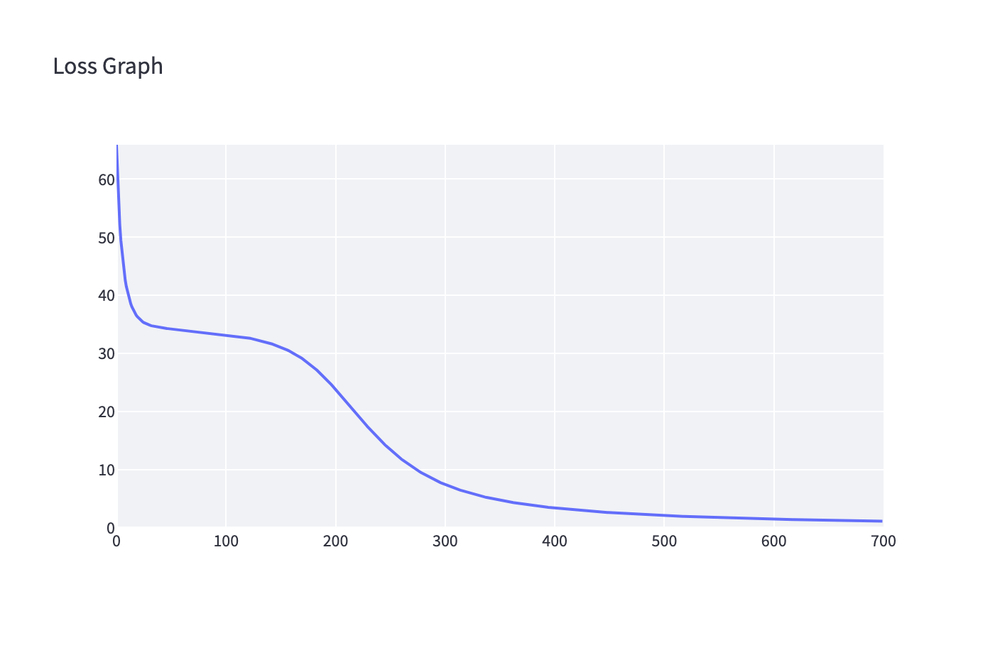

Training log

```bash
Epoch: 0/700, loss: 0, correct: 0
Epoch: 10/700, loss: 41.50248863798288, correct: 21
Epoch: 20/700, loss: 36.31631822946457, correct: 21
Epoch: 30/700, loss: 34.92400111284607, correct: 21
Epoch: 40/700, loss: 34.47123224657338, correct: 29
Epoch: 50/700, loss: 34.21710102990968, correct: 29
Epoch: 60/700, loss: 34.02501667714936, correct: 29
Epoch: 70/700, loss: 33.85159188318461, correct: 29
Epoch: 80/700, loss: 33.676868373019474, correct: 29
Epoch: 90/700, loss: 33.486722326523136, correct: 29
Epoch: 100/700, loss: 33.2694904872939, correct: 29
Epoch: 110/700, loss: 33.01201273503461, correct: 29
Epoch: 120/700, loss: 32.69731385699528, correct: 29
Epoch: 130/700, loss: 32.3027830728012, correct: 29
Epoch: 140/700, loss: 31.798904223036182, correct: 29
Epoch: 150/700, loss: 31.14530595553706, correct: 33
Epoch: 160/700, loss: 30.288692453373486, correct: 37
Epoch: 170/700, loss: 29.17522150633598, correct: 43
Epoch: 180/700, loss: 27.756338575675503, correct: 46
Epoch: 190/700, loss: 26.02855351464764, correct: 50
Epoch: 200/700, loss: 24.018768485782736, correct: 50
Epoch: 210/700, loss: 21.836784232513384, correct: 50
Epoch: 220/700, loss: 19.6206852914555, correct: 50
Epoch: 230/700, loss: 17.437697292721516, correct: 50
Epoch: 240/700, loss: 15.402991842274005, correct: 50
Epoch: 250/700, loss: 13.584807374247722, correct: 50
Epoch: 260/700, loss: 11.982226770854535, correct: 50
Epoch: 270/700, loss: 10.595503701784237, correct: 50
Epoch: 280/700, loss: 9.406896432168283, correct: 50
Epoch: 290/700, loss: 8.391252650535167, correct: 50
Epoch: 300/700, loss: 7.526548032875611, correct: 50
Epoch: 310/700, loss: 6.803235284381629, correct: 50
Epoch: 320/700, loss: 6.187102099976993, correct: 50
Epoch: 330/700, loss: 5.655540231011341, correct: 50
Epoch: 340/700, loss: 5.194940152297081, correct: 50
Epoch: 350/700, loss: 4.796726896776214, correct: 50
Epoch: 360/700, loss: 4.454636566786966, correct: 50
Epoch: 370/700, loss: 4.152555774714047, correct: 50
Epoch: 380/700, loss: 3.8844284684733634, correct: 50
Epoch: 390/700, loss: 3.6474664165245447, correct: 50
Epoch: 400/700, loss: 3.435071191764164, correct: 50
Epoch: 410/700, loss: 3.2440606909816427, correct: 50
Epoch: 420/700, loss: 3.071561491973418, correct: 50
Epoch: 430/700, loss: 2.914889154826596, correct: 50
Epoch: 440/700, loss: 2.7721147486289435, correct: 50
Epoch: 450/700, loss: 2.6418223973366612, correct: 50
Epoch: 460/700, loss: 2.5228489000196728, correct: 50
Epoch: 470/700, loss: 2.4135597831418543, correct: 50
Epoch: 480/700, loss: 2.312739582176322, correct: 50
Epoch: 490/700, loss: 2.219797697042586, correct: 50
Epoch: 500/700, loss: 2.13400348754432, correct: 50
Epoch: 510/700, loss: 2.054035787804819, correct: 50
Epoch: 520/700, loss: 1.9792570281149102, correct: 50
Epoch: 530/700, loss: 1.909178526433619, correct: 50
Epoch: 540/700, loss: 1.8434852168334828, correct: 50
Epoch: 550/700, loss: 1.7816860663313878, correct: 50
Epoch: 560/700, loss: 1.7234242133389805, correct: 50
Epoch: 570/700, loss: 1.6684147859693617, correct: 50
Epoch: 580/700, loss: 1.6163817024900027, correct: 50
Epoch: 590/700, loss: 1.5670857197468067, correct: 50
Epoch: 600/700, loss: 1.5203152816578185, correct: 50
Epoch: 610/700, loss: 1.4758802955792165, correct: 50
Epoch: 620/700, loss: 1.4336204168750137, correct: 50
Epoch: 630/700, loss: 1.3933679469840325, correct: 50
Epoch: 640/700, loss: 1.3549831023104941, correct: 50
Epoch: 650/700, loss: 1.318339040010424, correct: 50
Epoch: 660/700, loss: 1.2833203869563852, correct: 50
Epoch: 670/700, loss: 1.2498219726501534, correct: 50
Epoch: 680/700, loss: 1.217747723419944, correct: 50
Epoch: 690/700, loss: 1.1870096949846645, correct: 50
Epoch: 700/700, loss: 1.157527224054579, correct: 50
```

### Diag

Parameters

|           | Size of hidden layer | Learning rate | Number of epochs |
| --------- | -------------------- | ------------- | ---------------- |
| parameter | 3                    | 0.1           | 600              |

Training results

- Time per epoch: 0.063s

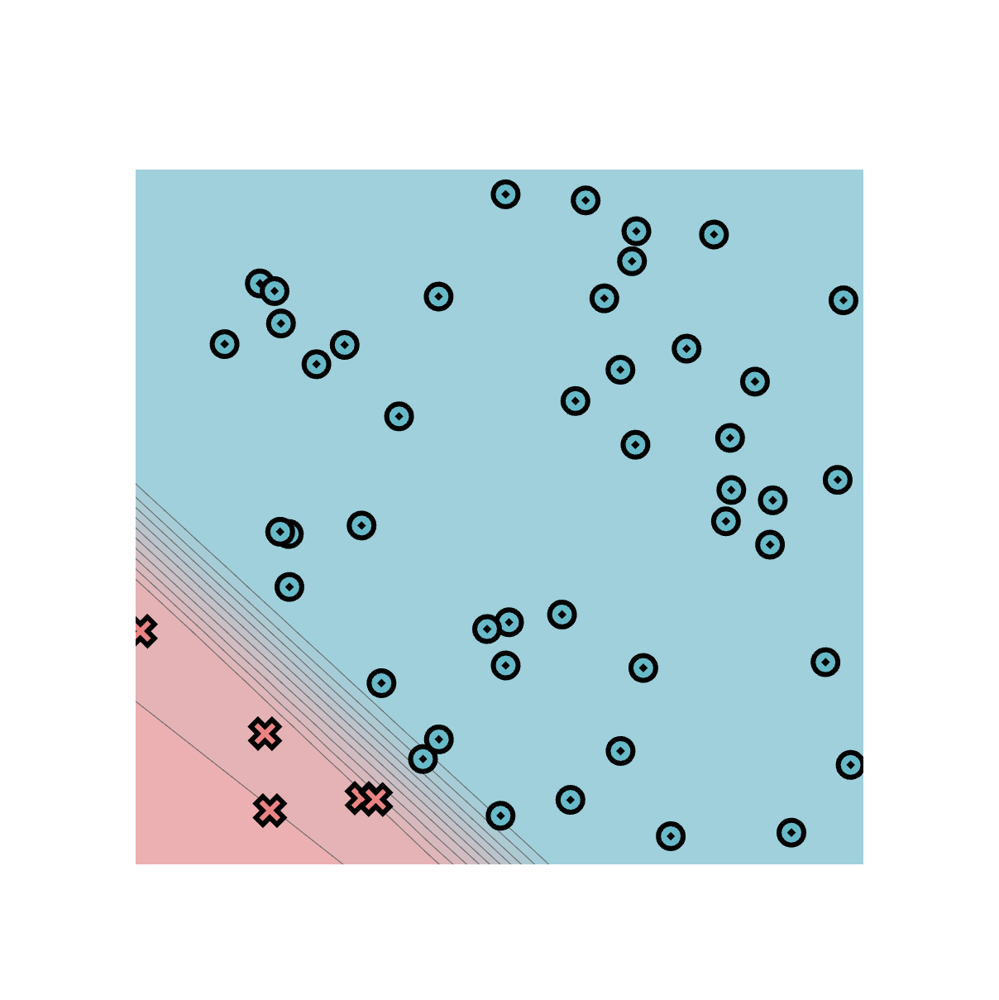

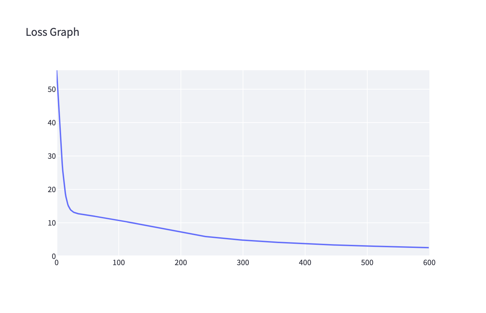

Training log

```bash
Epoch: 0/600, loss: 0, correct: 0
Epoch: 10/600, loss: 27.67989726575394, correct: 47
Epoch: 20/600, loss: 15.031558194179444, correct: 45
Epoch: 30/600, loss: 13.030605819479957, correct: 45
Epoch: 40/600, loss: 12.569009022875196, correct: 45
Epoch: 50/600, loss: 12.28018076798621, correct: 45
Epoch: 60/600, loss: 12.004073805131409, correct: 45
Epoch: 70/600, loss: 11.719152962184793, correct: 45
Epoch: 80/600, loss: 11.419845638993754, correct: 45
Epoch: 90/600, loss: 11.10559182097841, correct: 45
Epoch: 100/600, loss: 10.776843469780184, correct: 45
Epoch: 110/600, loss: 10.435636331275607, correct: 45
Epoch: 120/600, loss: 10.084036856203117, correct: 45
Epoch: 130/600, loss: 9.722607075494604, correct: 45
Epoch: 140/600, loss: 9.354597935318587, correct: 45
Epoch: 150/600, loss: 8.982360854060596, correct: 45
Epoch: 160/600, loss: 8.608046798776995, correct: 45
Epoch: 170/600, loss: 8.234749435370544, correct: 45
Epoch: 180/600, loss: 7.865356809605689, correct: 45
Epoch: 190/600, loss: 7.5027925606741865, correct: 45
Epoch: 200/600, loss: 7.149662945062035, correct: 46
Epoch: 210/600, loss: 6.808059465329838, correct: 46
Epoch: 220/600, loss: 6.479706437459847, correct: 47
Epoch: 230/600, loss: 6.165868451795294, correct: 47
Epoch: 240/600, loss: 5.904453440692729, correct: 47
Epoch: 250/600, loss: 5.691854975968948, correct: 47
Epoch: 260/600, loss: 5.489237525002306, correct: 48
Epoch: 270/600, loss: 5.294687441981102, correct: 48
Epoch: 280/600, loss: 5.109518672647591, correct: 48
Epoch: 290/600, loss: 4.949326539357826, correct: 48
Epoch: 300/600, loss: 4.808876912533211, correct: 48
Epoch: 310/600, loss: 4.680893921309398, correct: 48
Epoch: 320/600, loss: 4.5581975838864475, correct: 48
Epoch: 330/600, loss: 4.439752399467426, correct: 48
Epoch: 340/600, loss: 4.325419462339773, correct: 48
Epoch: 350/600, loss: 4.215062461390343, correct: 49
Epoch: 360/600, loss: 4.108550348107263, correct: 49
Epoch: 370/600, loss: 4.005751798514593, correct: 49
Epoch: 380/600, loss: 3.906514526166758, correct: 49
Epoch: 390/600, loss: 3.8107034621081377, correct: 50
Epoch: 400/600, loss: 3.719734368127981, correct: 50
Epoch: 410/600, loss: 3.636505680319877, correct: 50
Epoch: 420/600, loss: 3.5567822609328084, correct: 50
Epoch: 430/600, loss: 3.4801048256873224, correct: 50
Epoch: 440/600, loss: 3.409726612759962, correct: 50
Epoch: 450/600, loss: 3.3424105294872795, correct: 50
Epoch: 460/600, loss: 3.277447088713388, correct: 50
Epoch: 470/600, loss: 3.2151198932118588, correct: 50
Epoch: 480/600, loss: 3.1556545040498483, correct: 50
Epoch: 490/600, loss: 3.098053002538095, correct: 50
Epoch: 500/600, loss: 3.0419881591054714, correct: 50
Epoch: 510/600, loss: 2.987400904433333, correct: 50
Epoch: 520/600, loss: 2.9342397952225787, correct: 50
Epoch: 530/600, loss: 2.8824556629708296, correct: 50
Epoch: 540/600, loss: 2.832001451081918, correct: 50
Epoch: 550/600, loss: 2.7828321192249046, correct: 50
Epoch: 560/600, loss: 2.734904546966283, correct: 50
Epoch: 570/600, loss: 2.6876800575523507, correct: 50
Epoch: 580/600, loss: 2.6397618854407825, correct: 50
Epoch: 590/600, loss: 2.593097693014048, correct: 50
Epoch: 600/600, loss: 2.540400246596195, correct: 50
```

### Split

Parameters

|           | Size of hidden layer | Learning rate | Number of epochs |
| --------- | -------------------- | ------------- | ---------------- |
| parameter | 3                    | 0.1           | 800              |

Training results

- Time per epoch: 0.062s

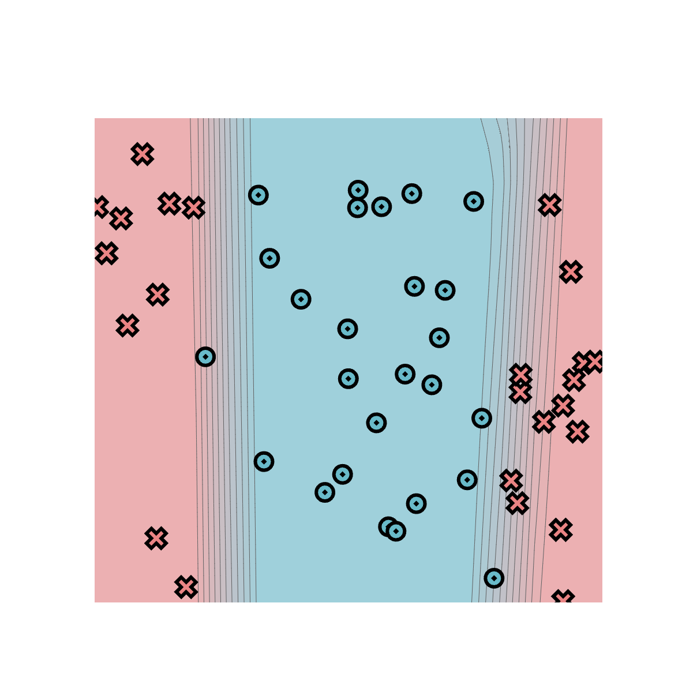

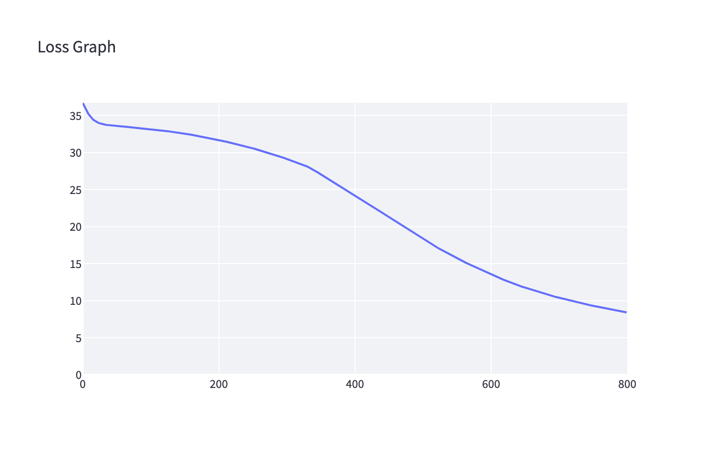

Training log

```bash
Epoch: 0/800, loss: 0, correct: 0
Epoch: 10/800, loss: 35.1372325431047, correct: 26
Epoch: 20/800, loss: 34.20277880348396, correct: 26
Epoch: 30/800, loss: 33.84441333855868, correct: 27
Epoch: 40/800, loss: 33.68899350149333, correct: 35
Epoch: 50/800, loss: 33.59615018629735, correct: 35
Epoch: 60/800, loss: 33.51952386736619, correct: 32
Epoch: 70/800, loss: 33.44394982880903, correct: 32
Epoch: 80/800, loss: 33.36230284386042, correct: 32
Epoch: 90/800, loss: 33.271078182812836, correct: 32
Epoch: 100/800, loss: 33.173744758860565, correct: 32
Epoch: 110/800, loss: 33.06961413466836, correct: 32
Epoch: 120/800, loss: 32.956857142777245, correct: 32
Epoch: 130/800, loss: 32.83661551651286, correct: 32
Epoch: 140/800, loss: 32.70936807811026, correct: 32
Epoch: 150/800, loss: 32.570945508743606, correct: 32
Epoch: 160/800, loss: 32.417843096205715, correct: 32
Epoch: 170/800, loss: 32.25576906753061, correct: 33
Epoch: 180/800, loss: 32.08668099510918, correct: 37
Epoch: 190/800, loss: 31.907312714794813, correct: 38
Epoch: 200/800, loss: 31.71635676129443, correct: 39
Epoch: 210/800, loss: 31.513772875023214, correct: 44
Epoch: 220/800, loss: 31.30171287808461, correct: 44
Epoch: 230/800, loss: 31.08036505314927, correct: 45
Epoch: 240/800, loss: 30.847852548858125, correct: 45
Epoch: 250/800, loss: 30.601861887468928, correct: 46
Epoch: 260/800, loss: 30.344471509179343, correct: 46
Epoch: 270/800, loss: 30.073558589205003, correct: 46
Epoch: 280/800, loss: 29.789398645683313, correct: 46
Epoch: 290/800, loss: 29.49117353967811, correct: 46
Epoch: 300/800, loss: 29.17885737171285, correct: 46
Epoch: 310/800, loss: 28.853109042521567, correct: 45
Epoch: 320/800, loss: 28.518150410498976, correct: 45
Epoch: 330/800, loss: 28.15903677774181, correct: 45
Epoch: 340/800, loss: 27.671625200889064, correct: 44
Epoch: 350/800, loss: 27.11706428087733, correct: 45
Epoch: 360/800, loss: 26.52854466049474, correct: 45
Epoch: 370/800, loss: 25.9634235334256, correct: 45
Epoch: 380/800, loss: 25.419876781298026, correct: 46
Epoch: 390/800, loss: 24.8785509618284, correct: 46
Epoch: 400/800, loss: 24.275279505060205, correct: 46
Epoch: 410/800, loss: 23.696080433291897, correct: 46
Epoch: 420/800, loss: 23.098763611403086, correct: 46
Epoch: 430/800, loss: 22.509835390035693, correct: 45
Epoch: 440/800, loss: 21.929278656901314, correct: 45
Epoch: 450/800, loss: 21.3341477306649, correct: 45
Epoch: 460/800, loss: 20.715772181710054, correct: 45
Epoch: 470/800, loss: 20.112431588056264, correct: 45
Epoch: 480/800, loss: 19.50415907424774, correct: 46
Epoch: 490/800, loss: 18.917721799783546, correct: 46
Epoch: 500/800, loss: 18.347126858962216, correct: 46
Epoch: 510/800, loss: 17.80100175596908, correct: 46
Epoch: 520/800, loss: 17.27197523471437, correct: 46
Epoch: 530/800, loss: 16.754481383836286, correct: 46
Epoch: 540/800, loss: 16.25287186609402, correct: 46
Epoch: 550/800, loss: 15.76506384188441, correct: 46
Epoch: 560/800, loss: 15.304366635682422, correct: 46
Epoch: 570/800, loss: 14.858563959522595, correct: 47
Epoch: 580/800, loss: 14.42409137601907, correct: 47
Epoch: 590/800, loss: 14.00187375076616, correct: 48
Epoch: 600/800, loss: 13.592349582804978, correct: 48
Epoch: 610/800, loss: 13.195976762659468, correct: 48
Epoch: 620/800, loss: 12.813388466565515, correct: 48
Epoch: 630/800, loss: 12.450794362125764, correct: 48
Epoch: 640/800, loss: 12.107673501933641, correct: 48
Epoch: 650/800, loss: 11.790757472644337, correct: 48
Epoch: 660/800, loss: 11.489197124624152, correct: 48
Epoch: 670/800, loss: 11.198468415987918, correct: 48
Epoch: 680/800, loss: 10.924094575479838, correct: 48
Epoch: 690/800, loss: 10.668738391463235, correct: 48
Epoch: 700/800, loss: 10.423363912936548, correct: 48
Epoch: 710/800, loss: 10.188425705791339, correct: 48
Epoch: 720/800, loss: 9.961208603171151, correct: 48
Epoch: 730/800, loss: 9.742045771311313, correct: 48
Epoch: 740/800, loss: 9.531203925814056, correct: 48
Epoch: 750/800, loss: 9.327042972668668, correct: 48
Epoch: 760/800, loss: 9.132171717598816, correct: 48
Epoch: 770/800, loss: 8.941729129622061, correct: 48
Epoch: 780/800, loss: 8.75966050757842, correct: 48
Epoch: 790/800, loss: 8.590247976227374, correct: 48
Epoch: 800/800, loss: 8.42788350623998, correct: 48
```

### Xor

Parameters

|           | Size of hidden layer | Learning rate | Number of epochs |
| --------- | -------------------- | ------------- | ---------------- |
| parameter | 8                    | 0.5           | 900              |

Training results

- Time per epoch: 0.216s

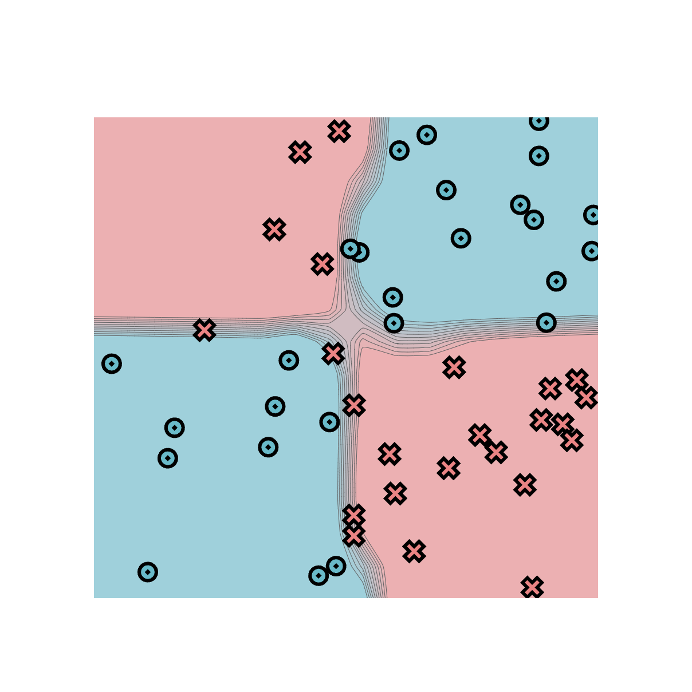

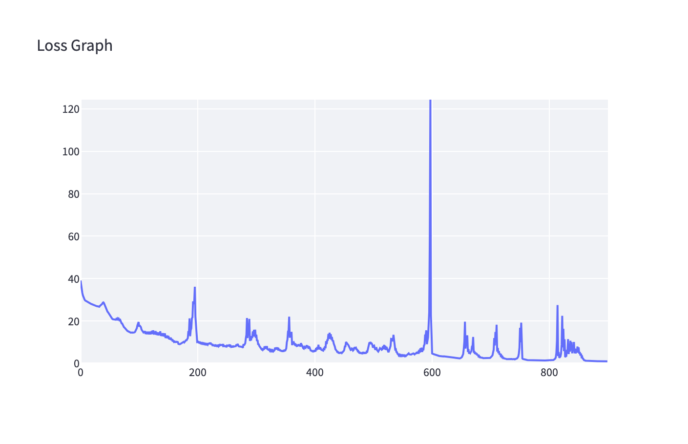

Training log

```bash
Epoch: 0/900, loss: 0, correct: 0
Epoch: 10/900, loss: 29.46862202257828, correct: 36
Epoch: 20/900, loss: 27.9337994141294, correct: 36
Epoch: 30/900, loss: 26.963275234600687, correct: 39
Epoch: 40/900, loss: 28.750771572672, correct: 36
Epoch: 50/900, loss: 23.101622848892482, correct: 41
Epoch: 60/900, loss: 20.722376570992573, correct: 42
Epoch: 70/900, loss: 19.971341987878613, correct: 42
Epoch: 80/900, loss: 15.558975452033794, correct: 44
Epoch: 90/900, loss: 14.484002437242406, correct: 47
Epoch: 100/900, loss: 19.534118840256212, correct: 40
Epoch: 110/900, loss: 14.335931220810242, correct: 44
Epoch: 120/900, loss: 13.657264773138564, correct: 44
Epoch: 130/900, loss: 13.476204742196188, correct: 43
Epoch: 140/900, loss: 12.887795185579265, correct: 43
Epoch: 150/900, loss: 11.821676007713744, correct: 44
Epoch: 160/900, loss: 10.253773523880058, correct: 45
Epoch: 170/900, loss: 9.063597685843915, correct: 47
Epoch: 180/900, loss: 10.249614010096693, correct: 46
Epoch: 190/900, loss: 16.52755499149607, correct: 43
Epoch: 200/900, loss: 10.183053089546899, correct: 44
Epoch: 210/900, loss: 9.21592496326576, correct: 45
Epoch: 220/900, loss: 9.002185920407122, correct: 44
Epoch: 230/900, loss: 8.267129403274025, correct: 47
Epoch: 240/900, loss: 8.56786160656515, correct: 46
Epoch: 250/900, loss: 7.622035996397223, correct: 47
Epoch: 260/900, loss: 7.583600342177728, correct: 47
Epoch: 270/900, loss: 8.052670543815573, correct: 46
Epoch: 280/900, loss: 8.545963682352726, correct: 45
Epoch: 290/900, loss: 10.583065609245828, correct: 44
Epoch: 300/900, loss: 12.086854870880199, correct: 44
Epoch: 310/900, loss: 6.631889765462148, correct: 47
Epoch: 320/900, loss: 6.468076331481887, correct: 48
Epoch: 330/900, loss: 5.660541903359598, correct: 48
Epoch: 340/900, loss: 6.1071103702692575, correct: 47
Epoch: 350/900, loss: 5.869461879211359, correct: 48
Epoch: 360/900, loss: 12.36094199494515, correct: 43
Epoch: 370/900, loss: 8.17474625848713, correct: 47
Epoch: 380/900, loss: 7.782617302683845, correct: 46
Epoch: 390/900, loss: 6.885020367428006, correct: 47
Epoch: 400/900, loss: 5.410761295080726, correct: 48
Epoch: 410/900, loss: 6.675040524551362, correct: 46
Epoch: 420/900, loss: 10.514299775938321, correct: 46
Epoch: 430/900, loss: 12.45803982767832, correct: 46
Epoch: 440/900, loss: 5.46681714673899, correct: 47
Epoch: 450/900, loss: 5.826142152880877, correct: 47
Epoch: 460/900, loss: 7.2553061774577134, correct: 46
Epoch: 470/900, loss: 7.160665191877258, correct: 47
Epoch: 480/900, loss: 4.520755491917096, correct: 49
Epoch: 490/900, loss: 5.0878641262388555, correct: 48
Epoch: 500/900, loss: 7.397058680823627, correct: 45
Epoch: 510/900, loss: 6.043151131257391, correct: 48
Epoch: 520/900, loss: 6.601675575273849, correct: 46
Epoch: 530/900, loss: 8.223845136715097, correct: 45
Epoch: 540/900, loss: 5.383549866416397, correct: 47
Epoch: 550/900, loss: 3.5355499695655874, correct: 50
Epoch: 560/900, loss: 4.119208800817654, correct: 48
Epoch: 570/900, loss: 4.606547346049013, correct: 48
Epoch: 580/900, loss: 5.1061442727487245, correct: 48
Epoch: 590/900, loss: 13.31593574731712, correct: 42
Epoch: 600/900, loss: 7.672911132520378, correct: 46
Epoch: 610/900, loss: 3.7578834653941926, correct: 50
Epoch: 620/900, loss: 3.2916219740676818, correct: 50
Epoch: 630/900, loss: 3.165189454756024, correct: 50
Epoch: 640/900, loss: 2.659789581461949, correct: 50
Epoch: 650/900, loss: 2.5228260225856154, correct: 50
Epoch: 660/900, loss: 8.857293006129952, correct: 45
Epoch: 670/900, loss: 8.329265689842803, correct: 46
Epoch: 680/900, loss: 3.370962078718966, correct: 50
Epoch: 690/900, loss: 2.375352336847335, correct: 50
Epoch: 700/900, loss: 2.609097737210271, correct: 50
Epoch: 710/900, loss: 11.020370288851659, correct: 45
Epoch: 720/900, loss: 2.998471125740831, correct: 50
Epoch: 730/900, loss: 1.9364661075482295, correct: 50
Epoch: 740/900, loss: 1.9396046280259966, correct: 50
Epoch: 750/900, loss: 7.4299120160645264, correct: 45
Epoch: 760/900, loss: 1.6949280882078683, correct: 50
Epoch: 770/900, loss: 1.4740280147019242, correct: 50
Epoch: 780/900, loss: 1.3899251245363597, correct: 50
Epoch: 790/900, loss: 1.367091948036271, correct: 50
Epoch: 800/900, loss: 1.4117343211384985, correct: 50
Epoch: 810/900, loss: 1.9642947177056196, correct: 50
Epoch: 820/900, loss: 3.256382796117901, correct: 49
Epoch: 830/900, loss: 3.5180919298992595, correct: 49
Epoch: 840/900, loss: 4.7716443461823195, correct: 47
Epoch: 850/900, loss: 5.025009195820685, correct: 46
Epoch: 860/900, loss: 1.567927192103266, correct: 50
Epoch: 870/900, loss: 1.187373489396747, correct: 50
Epoch: 880/900, loss: 1.0868860978454928, correct: 50
Epoch: 890/900, loss: 1.0216084279775943, correct: 50
Epoch: 900/900, loss: 0.9847695112338157, correct: 50
```

### Circle

Parameters

|           | Size of hidden layer | Learning rate | Number of epochs |
| --------- | -------------------- | ------------- | ---------------- |
| parameter | 7                    | 0.5           | 900              |

Training results

- Time per epoch: 0.176s

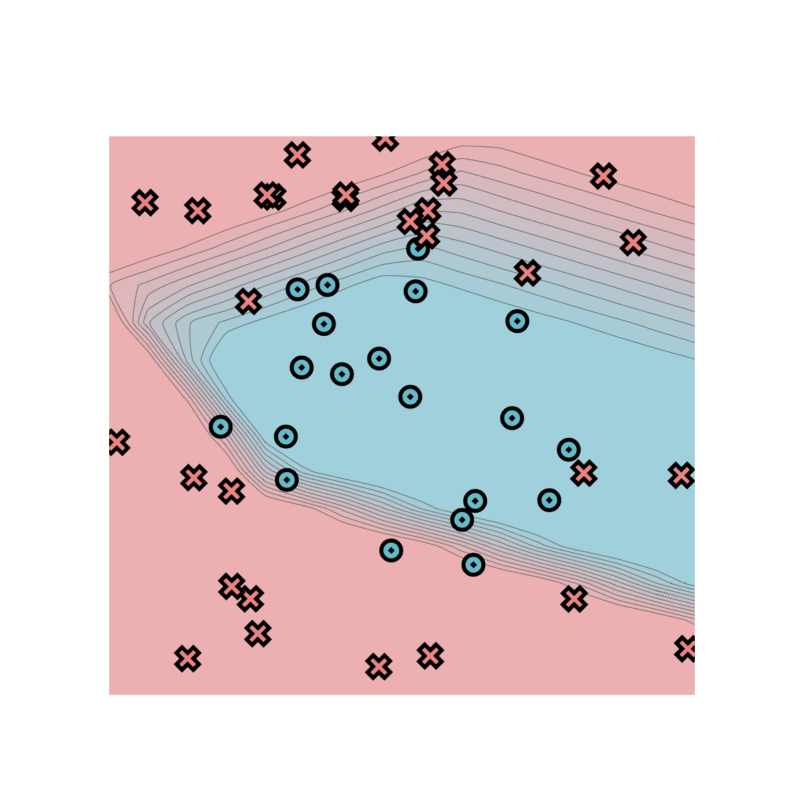

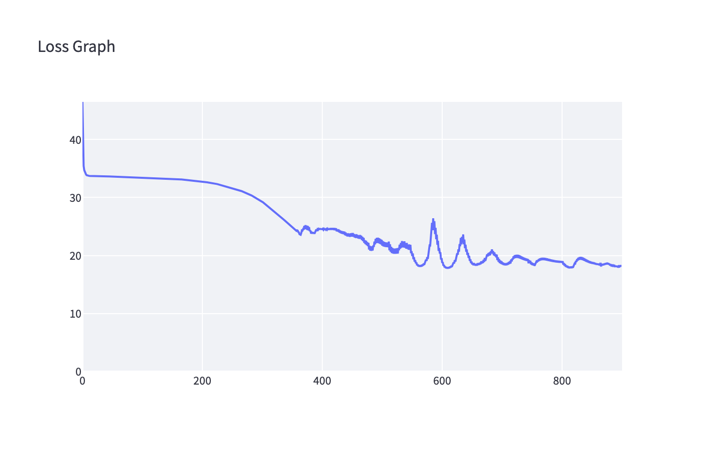

Training log

```bash
Epoch: 0/900, loss: 0, correct: 0
Epoch: 10/900, loss: 33.74587619341894, correct: 30
Epoch: 20/900, loss: 33.67980506720361, correct: 30
Epoch: 30/900, loss: 33.654509976495106, correct: 30
Epoch: 40/900, loss: 33.63639172404643, correct: 30
Epoch: 50/900, loss: 33.612114625619824, correct: 30
Epoch: 60/900, loss: 33.5817602894846, correct: 30
Epoch: 70/900, loss: 33.55469422848879, correct: 30
Epoch: 80/900, loss: 33.525525613745984, correct: 30
Epoch: 90/900, loss: 33.4937828012442, correct: 30
Epoch: 100/900, loss: 33.45958723296899, correct: 30
Epoch: 110/900, loss: 33.42137637284692, correct: 30
Epoch: 120/900, loss: 33.3789800331215, correct: 30
Epoch: 130/900, loss: 33.33140032822648, correct: 30
Epoch: 140/900, loss: 33.277101045359714, correct: 30
Epoch: 150/900, loss: 33.216863357817985, correct: 30
Epoch: 160/900, loss: 33.14665897404298, correct: 30
Epoch: 170/900, loss: 33.06699936709744, correct: 30
Epoch: 180/900, loss: 32.975283922847375, correct: 30
Epoch: 190/900, loss: 32.868127584258175, correct: 30
Epoch: 200/900, loss: 32.74026695161896, correct: 30
Epoch: 210/900, loss: 32.592153536514026, correct: 30
Epoch: 220/900, loss: 32.41490474653907, correct: 30
Epoch: 230/900, loss: 32.203393748328054, correct: 30
Epoch: 240/900, loss: 31.94662547184618, correct: 30
Epoch: 250/900, loss: 31.668329045655213, correct: 30
Epoch: 260/900, loss: 31.333611681119883, correct: 30
Epoch: 270/900, loss: 30.950188983144095, correct: 30
Epoch: 280/900, loss: 30.49982872661795, correct: 30
Epoch: 290/900, loss: 29.9487434283953, correct: 33
Epoch: 300/900, loss: 29.312174729667156, correct: 33
Epoch: 310/900, loss: 28.559200182094166, correct: 34
Epoch: 320/900, loss: 27.751202810740292, correct: 36
Epoch: 330/900, loss: 26.843019022076238, correct: 38
Epoch: 340/900, loss: 25.870181517004408, correct: 40
Epoch: 350/900, loss: 24.928596293154712, correct: 41
Epoch: 360/900, loss: 24.292283508197233, correct: 40
Epoch: 370/900, loss: 24.435598716921984, correct: 36
Epoch: 380/900, loss: 24.204797631515067, correct: 36
Epoch: 390/900, loss: 24.093742335980014, correct: 36
Epoch: 400/900, loss: 24.552101718485368, correct: 37
Epoch: 410/900, loss: 24.603713110061687, correct: 37
Epoch: 420/900, loss: 24.727830341839553, correct: 37
Epoch: 430/900, loss: 24.36933203006961, correct: 36
Epoch: 440/900, loss: 23.965840451923572, correct: 37
Epoch: 450/900, loss: 23.856676756245783, correct: 37
Epoch: 460/900, loss: 23.537438484001424, correct: 37
Epoch: 470/900, loss: 23.036119187526666, correct: 39
Epoch: 480/900, loss: 21.683435725749575, correct: 39
Epoch: 490/900, loss: 22.86199299250165, correct: 39
Epoch: 500/900, loss: 22.691755656038833, correct: 39
Epoch: 510/900, loss: 22.217299849469338, correct: 39
Epoch: 520/900, loss: 21.20201075778088, correct: 39
Epoch: 530/900, loss: 21.858016748866966, correct: 39
Epoch: 540/900, loss: 22.155897608463295, correct: 39
Epoch: 550/900, loss: 20.72812457208465, correct: 39
Epoch: 560/900, loss: 18.490777002091384, correct: 39
Epoch: 570/900, loss: 18.61660737360148, correct: 39
Epoch: 580/900, loss: 21.75670337937457, correct: 39
Epoch: 590/900, loss: 24.7640048543429, correct: 37
Epoch: 600/900, loss: 19.55693731792143, correct: 39
Epoch: 610/900, loss: 17.979607853990732, correct: 40
Epoch: 620/900, loss: 18.80821802704264, correct: 39
Epoch: 630/900, loss: 21.975416728485907, correct: 39
Epoch: 640/900, loss: 21.866920189555447, correct: 39
Epoch: 650/900, loss: 18.947985755139054, correct: 39
Epoch: 660/900, loss: 18.678493311071016, correct: 39
Epoch: 670/900, loss: 19.27535779470615, correct: 39
Epoch: 680/900, loss: 20.544680428149032, correct: 39
Epoch: 690/900, loss: 20.242741118368397, correct: 39
Epoch: 700/900, loss: 18.99597438350525, correct: 39
Epoch: 710/900, loss: 18.747012611160997, correct: 39
Epoch: 720/900, loss: 19.86868869700804, correct: 39
Epoch: 730/900, loss: 20.0178364495819, correct: 39
Epoch: 740/900, loss: 19.515554594475553, correct: 39
Epoch: 750/900, loss: 18.829428109077558, correct: 39
Epoch: 760/900, loss: 19.18727945763228, correct: 39
Epoch: 770/900, loss: 19.596193407596402, correct: 39
Epoch: 780/900, loss: 19.37046640568239, correct: 39
Epoch: 790/900, loss: 19.13695280399404, correct: 39
Epoch: 800/900, loss: 19.025587812860834, correct: 39
Epoch: 810/900, loss: 18.2048929414956, correct: 40
Epoch: 820/900, loss: 18.212006641907863, correct: 40
Epoch: 830/900, loss: 19.720890479119586, correct: 39
Epoch: 840/900, loss: 19.38840995043476, correct: 39
Epoch: 850/900, loss: 18.89730570297293, correct: 39
Epoch: 860/900, loss: 18.602612005395937, correct: 40
Epoch: 870/900, loss: 18.548963446788125, correct: 40
Epoch: 880/900, loss: 18.586714571633525, correct: 39
Epoch: 890/900, loss: 18.152908957588895, correct: 40
Epoch: 900/900, loss: 18.20247517019764, correct: 40
```

### Spiral

Parameters

|           | Size of hidden layer | Learning rate | Number of epochs |
| --------- | -------------------- | ------------- | ---------------- |
| parameter | 16                   | 0.5           | 800              |

Training results

- Time per epoch: 1.222s

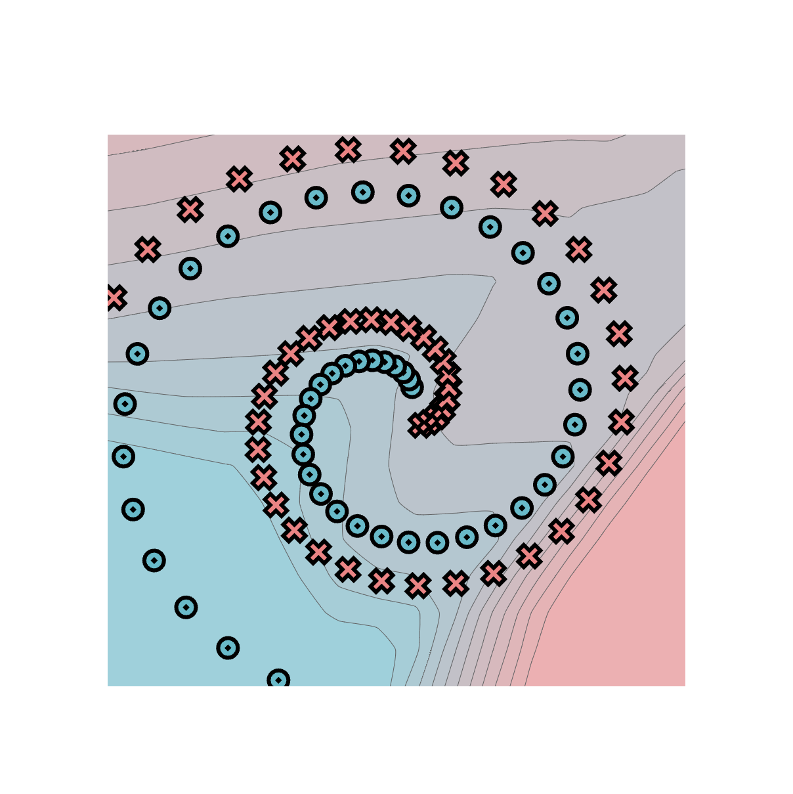

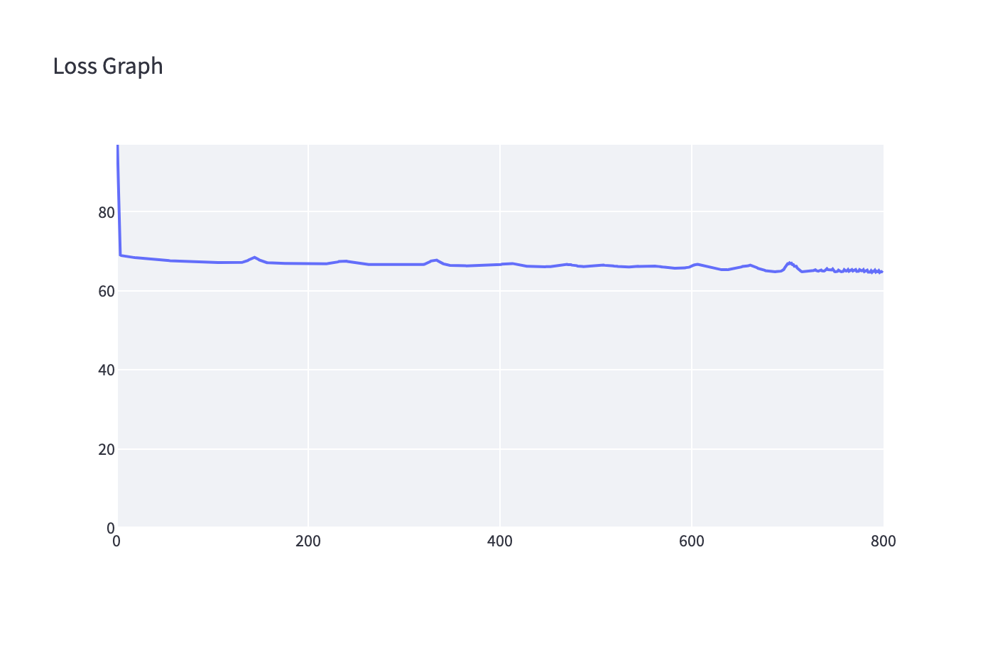

Training log

```bash
Epoch: 0/800, loss: 0, correct: 0
Epoch: 10/800, loss: 68.68619028884403, correct: 55
Epoch: 20/800, loss: 68.3561667459355, correct: 59
Epoch: 30/800, loss: 68.09172983040025, correct: 59
Epoch: 40/800, loss: 67.87063863954977, correct: 58
Epoch: 50/800, loss: 67.68408089084281, correct: 58
Epoch: 60/800, loss: 67.52662377239982, correct: 60
Epoch: 70/800, loss: 67.40105954589376, correct: 59
Epoch: 80/800, loss: 67.302605623504, correct: 59
Epoch: 90/800, loss: 67.22598990385825, correct: 59
Epoch: 100/800, loss: 67.16180934657395, correct: 59
Epoch: 110/800, loss: 67.1115768306706, correct: 59
Epoch: 120/800, loss: 67.07809724695242, correct: 59
Epoch: 130/800, loss: 67.11733012336356, correct: 58
Epoch: 140/800, loss: 67.91770004628565, correct: 56
Epoch: 150/800, loss: 67.75075790109916, correct: 57
Epoch: 160/800, loss: 67.02369834157997, correct: 59
Epoch: 170/800, loss: 66.90857207579833, correct: 60
Epoch: 180/800, loss: 66.85750751233614, correct: 61
Epoch: 190/800, loss: 66.82017906819246, correct: 62
Epoch: 200/800, loss: 66.78448772016571, correct: 61
Epoch: 210/800, loss: 66.76914997839802, correct: 61
Epoch: 220/800, loss: 66.81485487565084, correct: 59
Epoch: 230/800, loss: 67.1187002168632, correct: 59
Epoch: 240/800, loss: 67.4743444867311, correct: 58
Epoch: 250/800, loss: 66.86638568031049, correct: 59
Epoch: 260/800, loss: 66.65694324633758, correct: 61
Epoch: 270/800, loss: 66.59534121561506, correct: 61
Epoch: 280/800, loss: 66.54710901575048, correct: 62
Epoch: 290/800, loss: 66.48928704952958, correct: 63
Epoch: 300/800, loss: 66.44473076351856, correct: 63
Epoch: 310/800, loss: 66.42896690524198, correct: 63
Epoch: 320/800, loss: 66.56593390066378, correct: 60
Epoch: 330/800, loss: 67.55987440948081, correct: 57
Epoch: 340/800, loss: 67.00672246721416, correct: 59
Epoch: 350/800, loss: 66.38427251096014, correct: 62
Epoch: 360/800, loss: 66.2885792241174, correct: 65
Epoch: 370/800, loss: 66.23760566980627, correct: 65
Epoch: 380/800, loss: 66.22157577727768, correct: 64
Epoch: 390/800, loss: 66.25367782328853, correct: 63
Epoch: 400/800, loss: 66.52803458390036, correct: 60
Epoch: 410/800, loss: 66.9041016428288, correct: 59
Epoch: 420/800, loss: 66.5303692735563, correct: 60
Epoch: 430/800, loss: 66.16805390578745, correct: 63
Epoch: 440/800, loss: 66.03888145705572, correct: 64
Epoch: 450/800, loss: 66.03786669572139, correct: 64
Epoch: 460/800, loss: 66.35651281312289, correct: 60
Epoch: 470/800, loss: 66.58408191620555, correct: 58
Epoch: 480/800, loss: 66.28639014046112, correct: 59
Epoch: 490/800, loss: 66.07044609176802, correct: 61
Epoch: 500/800, loss: 66.16972409543986, correct: 61
Epoch: 510/800, loss: 66.41188363091103, correct: 58
Epoch: 520/800, loss: 66.21073204313929, correct: 59
Epoch: 530/800, loss: 66.01169334681082, correct: 62
Epoch: 540/800, loss: 66.01274434877672, correct: 62
Epoch: 550/800, loss: 66.13968554796033, correct: 59
Epoch: 560/800, loss: 66.19985098615524, correct: 59
Epoch: 570/800, loss: 66.00147190984971, correct: 59
Epoch: 580/800, loss: 65.71020712500398, correct: 64
Epoch: 590/800, loss: 65.69276038520641, correct: 63
Epoch: 600/800, loss: 66.04719656233772, correct: 60
Epoch: 610/800, loss: 66.42017604868686, correct: 59
Epoch: 620/800, loss: 65.77007218943562, correct: 61
Epoch: 630/800, loss: 65.31954692949326, correct: 65
Epoch: 640/800, loss: 65.35551104034107, correct: 64
Epoch: 650/800, loss: 65.67218462840162, correct: 60
Epoch: 660/800, loss: 66.29336312111269, correct: 57
Epoch: 670/800, loss: 65.64219436642684, correct: 60
Epoch: 680/800, loss: 64.96666297504355, correct: 65
Epoch: 690/800, loss: 64.79786552167211, correct: 65
Epoch: 700/800, loss: 66.81787222614338, correct: 55
Epoch: 710/800, loss: 66.1673478254152, correct: 54
Epoch: 720/800, loss: 64.87356254426247, correct: 65
Epoch: 730/800, loss: 65.28164531717466, correct: 60
Epoch: 740/800, loss: 65.1062740310185, correct: 61
Epoch: 750/800, loss: 64.84382020191603, correct: 56
Epoch: 760/800, loss: 65.31173827429417, correct: 55
Epoch: 770/800, loss: 65.13793115880473, correct: 55
Epoch: 780/800, loss: 65.30643390184454, correct: 56
Epoch: 790/800, loss: 64.88802310697932, correct: 55
Epoch: 800/800, loss: 65.05789666592386, correct: 56
```

## Module 3: Performance

### Task 1: Parallelization

Diagnostics output from `project/parallel_check.py`:

````bash
(.venv) (base) ➜  mle-module-3-iamyufan git:(master) python project/parallel_check.py
MAP

================================================================================
 Parallel Accelerator Optimizing:  Function tensor_map.<locals>._map,
/Users/yufanzhang/Desktop/CornellTech/courses/23Fall/CS5781/workspace/mle-
module-3-iamyufan/minitorch/fast_ops.py (154)
================================================================================


Parallel loop listing for  Function tensor_map.<locals>._map, /Users/yufanzhang/Desktop/CornellTech/courses/23Fall/CS5781/workspace/mle-module-3-iamyufan/minitorch/fast_ops.py (154)
-----------------------------------------------------------------------------------------|loop #ID
    def _map(                                                                            |
        out: Storage,                                                                    |
        out_shape: Shape,                                                                |
        out_strides: Strides,                                                            |
        in_storage: Storage,                                                             |
        in_shape: Shape,                                                                 |
        in_strides: Strides,                                                             |
    ) -> None:                                                                           |
        # TODO: Implement for Task 3.1.                                                  |
        out_size: int = len(out)                                                         |
        # When `out` and `in` are stride-aligned, avoid indexing                         |
        if np.array_equal(out_strides, in_strides) and np.array_equal(                   |
            out_shape, in_shape                                                          |
        ):                                                                               |
            for i in prange(out_size):---------------------------------------------------| #2
                out[i] = fn(in_storage[i])                                               |
        else:                                                                            |
            # Main loop in parallel                                                      |
            for i in prange(out_size):---------------------------------------------------| #3
                # All indices use numpy buffers                                          |
                # out_index = np.zeros_like(out_shape, dtype=np.int32)                   |
                out_index = np.zeros(MAX_DIMS, dtype=np.int32)---------------------------| #0
                # in_index = np.zeros_like(in_shape, dtype=np.int32)                     |
                in_index = np.zeros(MAX_DIMS, dtype=np.int32)----------------------------| #1
                # The index of out[i]                                                    |
                to_index(i, out_shape, out_index)                                        |
                # The corresponding index in in                                          |
                broadcast_index(out_index, out_shape, in_shape, in_index)                |
                # Calculate the mapped value of in[i]                                    |
                mapped_data = fn(in_storage[index_to_position(in_index, in_strides)])    |
                # Put the mapped data into out                                           |
                out[i] = mapped_data                                                     |
--------------------------------- Fusing loops ---------------------------------
Attempting fusion of parallel loops (combines loops with similar properties)...

Fused loop summary:
+--0 has the following loops fused into it:
   +--1 (fused)
Following the attempted fusion of parallel for-loops there are 3 parallel for-
loop(s) (originating from loops labelled: #2, #3, #0).
--------------------------------------------------------------------------------
---------------------------- Optimising loop nests -----------------------------
Attempting loop nest rewrites (optimising for the largest parallel loops)...

+--3 is a parallel loop
   +--0 --> rewritten as a serial loop
--------------------------------------------------------------------------------
----------------------------- Before Optimisation ------------------------------
Parallel region 0:
+--3 (parallel)
   +--0 (parallel)
   +--1 (parallel)


--------------------------------------------------------------------------------
------------------------------ After Optimisation ------------------------------
Parallel region 0:
+--3 (parallel)
   +--0 (serial, fused with loop(s): 1)


Parallel region 0 (loop #3) had 1 loop(s) fused and 1 loop(s) serialized as part
 of the larger parallel loop (#3).
--------------------------------------------------------------------------------
--------------------------------------------------------------------------------

---------------------------Loop invariant code motion---------------------------
Allocation hoisting:
The memory allocation derived from the instruction at
/Users/yufanzhang/Desktop/CornellTech/courses/23Fall/CS5781/workspace/mle-
module-3-iamyufan/minitorch/fast_ops.py (175) is hoisted out of the parallel
loop labelled #3 (it will be performed before the loop is executed and reused
inside the loop):
   Allocation:: out_index = np.zeros(MAX_DIMS, dtype=np.int32)
    - numpy.empty() is used for the allocation.
The memory allocation derived from the instruction at
/Users/yufanzhang/Desktop/CornellTech/courses/23Fall/CS5781/workspace/mle-
module-3-iamyufan/minitorch/fast_ops.py (177) is hoisted out of the parallel
loop labelled #3 (it will be performed before the loop is executed and reused
inside the loop):
   Allocation:: in_index = np.zeros(MAX_DIMS, dtype=np.int32)
    - numpy.empty() is used for the allocation.
None
ZIP

================================================================================
 Parallel Accelerator Optimizing:  Function tensor_zip.<locals>._zip,
/Users/yufanzhang/Desktop/CornellTech/courses/23Fall/CS5781/workspace/mle-
module-3-iamyufan/minitorch/fast_ops.py (212)
================================================================================


Parallel loop listing for  Function tensor_zip.<locals>._zip, /Users/yufanzhang/Desktop/CornellTech/courses/23Fall/CS5781/workspace/mle-module-3-iamyufan/minitorch/fast_ops.py (212)
---------------------------------------------------------------------------------|loop #ID
    def _zip(                                                                    |
        out: Storage,                                                            |
        out_shape: Shape,                                                        |
        out_strides: Strides,                                                    |
        a_storage: Storage,                                                      |
        a_shape: Shape,                                                          |
        a_strides: Strides,                                                      |
        b_storage: Storage,                                                      |
        b_shape: Shape,                                                          |
        b_strides: Strides,                                                      |
    ) -> None:                                                                   |
        # TODO: Implement for Task 3.1.                                          |
        out_size: int = len(out)                                                 |
        # When `out`, `a`, `b` are stride-aligned, avoid indexing                |
        if (                                                                     |
            np.array_equal(out_strides, a_strides)                               |
            and np.array_equal(out_strides, b_strides)                           |
            and np.array_equal(out_shape, a_shape)                               |
            and np.array_equal(out_shape, b_shape)                               |
        ):                                                                       |
            for i in prange(out_size):-------------------------------------------| #7
                out[i] = fn(a_storage[i], b_storage[i])                          |
        else:                                                                    |
            # Main loop in parallel                                              |
            for i in prange(out_size):-------------------------------------------| #8
                # All indices use numpy buffers                                  |
                # out_index: Index = np.zeros_like(out_shape, dtype=np.int32)    |
                out_index: Index = np.zeros(MAX_DIMS, dtype=np.int32)------------| #4
                # a_index: Index = np.zeros_like(a_shape, dtype=np.int32)        |
                a_index: Index = np.zeros(MAX_DIMS, dtype=np.int32)--------------| #5
                # b_index: Index = np.zeros_like(b_shape, dtype=np.int32)        |
                b_index: Index = np.zeros(MAX_DIMS, dtype=np.int32)--------------| #6
                # The index of out[i]                                            |
                to_index(i, out_shape, out_index)                                |
                # The corresponding index in a and b                             |
                broadcast_index(out_index, out_shape, a_shape, a_index)          |
                broadcast_index(out_index, out_shape, b_shape, b_index)          |
                # Calculate the zipped value of a[i] and b[i]                    |
                zipped_data = fn(                                                |
                    a_storage[index_to_position(a_index, a_strides)],            |
                    b_storage[index_to_position(b_index, b_strides)],            |
                )                                                                |
                # Put the zipped data into out                                   |
                out[i] = zipped_data                                             |
--------------------------------- Fusing loops ---------------------------------
Attempting fusion of parallel loops (combines loops with similar properties)...

Fused loop summary:
+--4 has the following loops fused into it:
   +--5 (fused)
   +--6 (fused)
Following the attempted fusion of parallel for-loops there are 3 parallel for-
loop(s) (originating from loops labelled: #7, #8, #4).
--------------------------------------------------------------------------------
---------------------------- Optimising loop nests -----------------------------
Attempting loop nest rewrites (optimising for the largest parallel loops)...

+--8 is a parallel loop
   +--4 --> rewritten as a serial loop
--------------------------------------------------------------------------------
----------------------------- Before Optimisation ------------------------------
Parallel region 0:
+--8 (parallel)
   +--4 (parallel)
   +--5 (parallel)
   +--6 (parallel)


--------------------------------------------------------------------------------
------------------------------ After Optimisation ------------------------------
Parallel region 0:
+--8 (parallel)
   +--4 (serial, fused with loop(s): 5, 6)


Parallel region 0 (loop #8) had 2 loop(s) fused and 1 loop(s) serialized as part
 of the larger parallel loop (#8).
--------------------------------------------------------------------------------
--------------------------------------------------------------------------------

---------------------------Loop invariant code motion---------------------------
Allocation hoisting:
The memory allocation derived from the instruction at
/Users/yufanzhang/Desktop/CornellTech/courses/23Fall/CS5781/workspace/mle-
module-3-iamyufan/minitorch/fast_ops.py (239) is hoisted out of the parallel
loop labelled #8 (it will be performed before the loop is executed and reused
inside the loop):
   Allocation:: out_index: Index = np.zeros(MAX_DIMS, dtype=np.int32)
    - numpy.empty() is used for the allocation.
The memory allocation derived from the instruction at
/Users/yufanzhang/Desktop/CornellTech/courses/23Fall/CS5781/workspace/mle-
module-3-iamyufan/minitorch/fast_ops.py (241) is hoisted out of the parallel
loop labelled #8 (it will be performed before the loop is executed and reused
inside the loop):
   Allocation:: a_index: Index = np.zeros(MAX_DIMS, dtype=np.int32)
    - numpy.empty() is used for the allocation.
The memory allocation derived from the instruction at
/Users/yufanzhang/Desktop/CornellTech/courses/23Fall/CS5781/workspace/mle-
module-3-iamyufan/minitorch/fast_ops.py (243) is hoisted out of the parallel
loop labelled #8 (it will be performed before the loop is executed and reused
inside the loop):
   Allocation:: b_index: Index = np.zeros(MAX_DIMS, dtype=np.int32)
    - numpy.empty() is used for the allocation.
None
REDUCE

================================================================================
 Parallel Accelerator Optimizing:  Function tensor_reduce.<locals>._reduce,
/Users/yufanzhang/Desktop/CornellTech/courses/23Fall/CS5781/workspace/mle-
module-3-iamyufan/minitorch/fast_ops.py (279)
================================================================================


Parallel loop listing for  Function tensor_reduce.<locals>._reduce, /Users/yufanzhang/Desktop/CornellTech/courses/23Fall/CS5781/workspace/mle-module-3-iamyufan/minitorch/fast_ops.py (279)
---------------------------------------------------------------------------------------|loop #ID
    def _reduce(                                                                       |
        out: Storage,                                                                  |
        out_shape: Shape,                                                              |
        out_strides: Strides,                                                          |
        a_storage: Storage,                                                            |
        a_shape: Shape,                                                                |
        a_strides: Strides,                                                            |
        reduce_dim: int,                                                               |
    ) -> None:                                                                         |
        # TODO: Implement for Task 3.1.                                                |
        out_size: int = len(out)                                                       |
        reduce_size: int = a_shape[reduce_dim]                                         |
        # Main loop in parallel                                                        |
        for i in prange(out_size):-----------------------------------------------------| #10
            # All indices use numpy buffers                                            |
            # out_index: Index = np.zeros_like(out_shape, dtype=np.int32)              |
            out_index: Index = np.zeros(MAX_DIMS, dtype=np.int32)----------------------| #9
            # The index of out[i]                                                      |
            to_index(i, out_shape, out_index)                                          |
            # The starting position in a to be reduced                                 |
            a_ordinal = index_to_position(out_index, a_strides)                        |
            # Initialize the reduced value of a[i]                                     |
            reduced_val = out[i]                                                       |
            # Inner-loop should not call any functions or write non-local variables    |
            for j in range(reduce_size):                                               |
                # Calculate the reduced value of a[i]                                  |
                reduced_val = fn(                                                      |
                    reduced_val,                                                       |
                    a_storage[a_ordinal + j * a_strides[reduce_dim]],                  |
                )                                                                      |
            # Put the reduced data into out                                            |
            out[i] = reduced_val                                                       |
--------------------------------- Fusing loops ---------------------------------
Attempting fusion of parallel loops (combines loops with similar properties)...
Following the attempted fusion of parallel for-loops there are 2 parallel for-
loop(s) (originating from loops labelled: #10, #9).
--------------------------------------------------------------------------------
---------------------------- Optimising loop nests -----------------------------
Attempting loop nest rewrites (optimising for the largest parallel loops)...

+--10 is a parallel loop
   +--9 --> rewritten as a serial loop
--------------------------------------------------------------------------------
----------------------------- Before Optimisation ------------------------------
Parallel region 0:
+--10 (parallel)
   +--9 (parallel)


--------------------------------------------------------------------------------
------------------------------ After Optimisation ------------------------------
Parallel region 0:
+--10 (parallel)
   +--9 (serial)


Parallel region 0 (loop #10) had 0 loop(s) fused and 1 loop(s) serialized as
part of the larger parallel loop (#10).
--------------------------------------------------------------------------------
--------------------------------------------------------------------------------

---------------------------Loop invariant code motion---------------------------
Allocation hoisting:
The memory allocation derived from the instruction at
/Users/yufanzhang/Desktop/CornellTech/courses/23Fall/CS5781/workspace/mle-
module-3-iamyufan/minitorch/fast_ops.py (295) is hoisted out of the parallel
loop labelled #10 (it will be performed before the loop is executed and reused
inside the loop):
   Allocation:: out_index: Index = np.zeros(MAX_DIMS, dtype=np.int32)
    - numpy.empty() is used for the allocation.
None
MATRIX MULTIPLY

================================================================================
 Parallel Accelerator Optimizing:  Function _tensor_matrix_multiply,
/Users/yufanzhang/Desktop/CornellTech/courses/23Fall/CS5781/workspace/mle-
module-3-iamyufan/minitorch/fast_ops.py (315)
================================================================================


Parallel loop listing for  Function _tensor_matrix_multiply, /Users/yufanzhang/Desktop/CornellTech/courses/23Fall/CS5781/workspace/mle-module-3-iamyufan/minitorch/fast_ops.py (315)
--------------------------------------------------------------------------------------------|loop #ID
def _tensor_matrix_multiply(                                                                |
    out: Storage,                                                                           |
    out_shape: Shape,                                                                       |
    out_strides: Strides,                                                                   |
    a_storage: Storage,                                                                     |
    a_shape: Shape,                                                                         |
    a_strides: Strides,                                                                     |
    b_storage: Storage,                                                                     |
    b_shape: Shape,                                                                         |
    b_strides: Strides,                                                                     |
) -> None:                                                                                  |
    """                                                                                     |
    NUMBA tensor matrix multiply function.                                                  |
                                                                                            |
    Should work for any tensor shapes that broadcast as long as                             |
                                                                                            |
    ```                                                                                     |
    assert a_shape[-1] == b_shape[-2]                                                       |
    ```                                                                                     |
                                                                                            |
    Optimizations:                                                                          |
                                                                                            |
    * Outer loop in parallel                                                                |
    * No index buffers or function calls                                                    |
    * Inner loop should have no global writes, 1 multiply.                                  |
                                                                                            |
                                                                                            |
    Args:                                                                                   |
        out (Storage): storage for `out` tensor                                             |
        out_shape (Shape): shape for `out` tensor                                           |
        out_strides (Strides): strides for `out` tensor                                     |
        a_storage (Storage): storage for `a` tensor                                         |
        a_shape (Shape): shape for `a` tensor                                               |
        a_strides (Strides): strides for `a` tensor                                         |
        b_storage (Storage): storage for `b` tensor                                         |
        b_shape (Shape): shape for `b` tensor                                               |
        b_strides (Strides): strides for `b` tensor                                         |
                                                                                            |
    Returns:                                                                                |
        None : Fills in `out`                                                               |
    """                                                                                     |
    a_batch_stride = a_strides[0] if a_shape[0] > 1 else 0                                  |
    b_batch_stride = b_strides[0] if b_shape[0] > 1 else 0                                  |
                                                                                            |
    # TODO: Implement for Task 3.2.                                                         |
    # out[n, i, j] = \Sum_k {a[n, i, k] * b[n, k, j]}                                       |
    K = a_shape[-1]  # This is equal to b_shape[-2]                                         |
    N, I, J = out_shape[-3:]                                                                |
    for n in prange(N):---------------------------------------------------------------------| #13
        for i in prange(I):-----------------------------------------------------------------| #12
            for j in prange(J):-------------------------------------------------------------| #11
                sum_val: float = 0.0                                                        |
                a_ordinal: int = n * a_batch_stride + i * a_strides[-2]                     |
                b_ordinal: int = n * b_batch_stride + j * b_strides[-1]                     |
                for _ in range(K):                                                          |
                    sum_val += a_storage[a_ordinal] * b_storage[b_ordinal]  # 1 multiply    |
                    a_ordinal += a_strides[-1]                                              |
                    b_ordinal += b_strides[-2]                                              |
                out_ordinal = (                                                             |
                    n * out_strides[-3] + i * out_strides[-2] + j * out_strides[-1]         |
                )                                                                           |
                out[out_ordinal] = sum_val                                                  |
--------------------------------- Fusing loops ---------------------------------
Attempting fusion of parallel loops (combines loops with similar properties)...
Following the attempted fusion of parallel for-loops there are 2 parallel for-
loop(s) (originating from loops labelled: #13, #12).
--------------------------------------------------------------------------------
---------------------------- Optimising loop nests -----------------------------
Attempting loop nest rewrites (optimising for the largest parallel loops)...

+--13 is a parallel loop
   +--12 --> rewritten as a serial loop
      +--11 --> rewritten as a serial loop
--------------------------------------------------------------------------------
----------------------------- Before Optimisation ------------------------------
Parallel region 0:
+--13 (parallel)
   +--12 (parallel)
      +--11 (parallel)


--------------------------------------------------------------------------------
------------------------------ After Optimisation ------------------------------
Parallel region 0:
+--13 (parallel)
   +--12 (serial)
      +--11 (serial)


Parallel region 0 (loop #13) had 0 loop(s) fused and 2 loop(s) serialized as
part of the larger parallel loop (#13).
--------------------------------------------------------------------------------
--------------------------------------------------------------------------------

---------------------------Loop invariant code motion---------------------------
Allocation hoisting:
No allocation hoisting found
None
````

### Task 4: CUDA Matrix Multiplication

Comparison of Matrix Multiplication Execution Time between `FastOps` and `CudaOps`:

| Matrix Size (n x n) | FastOps Time (s) | CudaOps Time (s) |
|---------------------|------------------|------------------|
| 64                  | 0.00371          | 0.00642          |
| 128                 | 0.01814          | 0.01659          |
| 256                 | 0.09998          | 0.05484          |
| 512                 | 0.99039          | 0.21646          |
| 1024                | 9.05483          | 1.17544          |


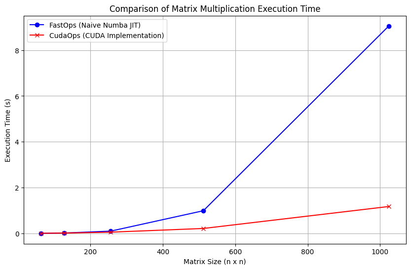


### Task 5: Training

#### CPU

1. `Split` dataset

   ```bash
   !cd $DIR; PYTHONPATH=/content/$DIR python3 project/run_fast_tensor.py --BACKEND cpu --HIDDEN 100 --DATASET split --RATE 0.05
   ```

   ```bash
   Epoch: 0 	 loss: 7.416926056050638 	 correct: 35 	 time: 1.9763298988342286
   Epoch: 10 	 loss: 6.792116212496707 	 correct: 41 	 time: 0.10316529273986816
   Epoch: 20 	 loss: 6.4929720284275225 	 correct: 47 	 time: 0.16965119838714598
   Epoch: 30 	 loss: 3.7119380141974654 	 correct: 46 	 time: 0.2241373062133789
   Epoch: 40 	 loss: 3.256689495337322 	 correct: 47 	 time: 0.22992217540740967
   Epoch: 50 	 loss: 2.1047522762097364 	 correct: 49 	 time: 0.17312679290771485
   Epoch: 60 	 loss: 1.630234171181419 	 correct: 49 	 time: 0.10134143829345703
   Epoch: 70 	 loss: 2.5691213706718394 	 correct: 49 	 time: 0.10219261646270753
   Epoch: 80 	 loss: 1.193947084999619 	 correct: 49 	 time: 0.10293803215026856
   Epoch: 90 	 loss: 1.2459348879919214 	 correct: 49 	 time: 0.13014256954193115
   Epoch: 100 	 loss: 1.5854711851616754 	 correct: 49 	 time: 0.1010373592376709
   Epoch: 110 	 loss: 1.200290023441873 	 correct: 49 	 time: 0.10425686836242676
   Epoch: 120 	 loss: 0.7314045505964265 	 correct: 49 	 time: 0.10081908702850342
   Epoch: 130 	 loss: 0.5970400240459084 	 correct: 49 	 time: 0.10023055076599122
   Epoch: 140 	 loss: 0.6955733792610108 	 correct: 49 	 time: 0.10091290473937989
   Epoch: 150 	 loss: 0.7057068198015551 	 correct: 49 	 time: 0.2039186954498291
   Epoch: 160 	 loss: 0.8696692454396773 	 correct: 49 	 time: 0.22645869255065917
   Epoch: 170 	 loss: 0.4801829385791019 	 correct: 49 	 time: 0.22891623973846437
   Epoch: 180 	 loss: 0.4699322579727792 	 correct: 49 	 time: 0.13071072101593018
   Epoch: 190 	 loss: 0.27240836506372706 	 correct: 49 	 time: 0.10251779556274414
   Epoch: 200 	 loss: 0.11697064698724144 	 correct: 49 	 time: 0.10057127475738525
   Epoch: 210 	 loss: 1.25964004850645 	 correct: 50 	 time: 0.10149497985839843
   Epoch: 220 	 loss: 0.18592621872918302 	 correct: 50 	 time: 0.10133697986602783
   Epoch: 230 	 loss: 0.3584523287653319 	 correct: 49 	 time: 0.09877607822418213
   Epoch: 240 	 loss: 1.1857987741611855 	 correct: 50 	 time: 0.09900994300842285
   Epoch: 250 	 loss: 0.4655290067784311 	 correct: 49 	 time: 0.10262494087219239
   Epoch: 260 	 loss: 0.08755238353906422 	 correct: 50 	 time: 0.10716710090637208
   Epoch: 270 	 loss: 1.0673053171754234 	 correct: 50 	 time: 0.11750800609588623
   Epoch: 280 	 loss: 0.22282054972684023 	 correct: 49 	 time: 0.2324007272720337
   Epoch: 290 	 loss: 0.054614562042594274 	 correct: 50 	 time: 0.1971668243408203
   Epoch: 300 	 loss: 0.3678509209031379 	 correct: 50 	 time: 0.22619938850402832
   Epoch: 310 	 loss: 1.1213041951901483 	 correct: 50 	 time: 0.12219753265380859
   Epoch: 320 	 loss: 0.12574386520774747 	 correct: 50 	 time: 0.09924209117889404
   Epoch: 330 	 loss: 0.4037794613442156 	 correct: 50 	 time: 0.10246634483337402
   Epoch: 340 	 loss: 0.18387471119156074 	 correct: 50 	 time: 0.10014817714691163
   Epoch: 350 	 loss: 0.24592526835095554 	 correct: 50 	 time: 0.10341775417327881
   Epoch: 360 	 loss: 0.05926813039279591 	 correct: 50 	 time: 0.09846253395080566
   Epoch: 370 	 loss: 0.23027514742565364 	 correct: 50 	 time: 0.09795236587524414
   Epoch: 380 	 loss: 0.09090080988521469 	 correct: 50 	 time: 0.09912915229797363
   Epoch: 390 	 loss: 0.2183102512124395 	 correct: 50 	 time: 0.10087974071502685
   Epoch: 400 	 loss: 0.5609351291812226 	 correct: 50 	 time: 0.10073714256286621
   Epoch: 410 	 loss: 0.27468009996653675 	 correct: 50 	 time: 0.2067584991455078
   Epoch: 420 	 loss: 0.11189263243316709 	 correct: 50 	 time: 0.20749413967132568
   Epoch: 430 	 loss: 0.09213631842018738 	 correct: 50 	 time: 0.22740023136138915
   Epoch: 440 	 loss: 0.07826507554140598 	 correct: 50 	 time: 0.14264404773712158
   Epoch: 450 	 loss: 0.19168719564876982 	 correct: 50 	 time: 0.10887742042541504
   Epoch: 460 	 loss: 0.0201110057714424 	 correct: 50 	 time: 0.10987112522125245
   Epoch: 470 	 loss: 0.10063141712320638 	 correct: 50 	 time: 0.11324777603149414
   Epoch: 480 	 loss: 0.5197503928592335 	 correct: 50 	 time: 0.12039060592651367
   Epoch: 490 	 loss: 0.48899427388894484 	 correct: 50 	 time: 0.13115036487579346
   ```

2. `Simple` dataset

   ```bash
   !cd $DIR; PYTHONPATH=/content/$DIR python3 project/run_fast_tensor.py --BACKEND cpu --HIDDEN 100 --DATASET simple --RATE 0.05
   ```

   ```bash
   Epoch: 0 	 loss: 5.760991462388089 	 correct: 44 	 time: 2.048647093772888
   Epoch: 10 	 loss: 2.5284639211778193 	 correct: 50 	 time: 0.11870474815368652
   Epoch: 20 	 loss: 1.5487798904754981 	 correct: 50 	 time: 0.1435093402862549
   Epoch: 30 	 loss: 0.8176694778655555 	 correct: 50 	 time: 0.2656704902648926
   Epoch: 40 	 loss: 0.32935843922623576 	 correct: 49 	 time: 0.259994649887085
   Epoch: 50 	 loss: 0.7016983910753636 	 correct: 50 	 time: 0.27710058689117434
   Epoch: 60 	 loss: 0.35445818117582006 	 correct: 50 	 time: 0.26247992515563967
   Epoch: 70 	 loss: 0.21593458105679766 	 correct: 50 	 time: 0.17344520092010499
   Epoch: 80 	 loss: 0.09985829645389951 	 correct: 50 	 time: 0.11889641284942627
   Epoch: 90 	 loss: 0.2633159412223597 	 correct: 50 	 time: 0.1209580659866333
   Epoch: 100 	 loss: 0.24734946679911204 	 correct: 50 	 time: 0.1219550371170044
   Epoch: 110 	 loss: 0.3671947434988742 	 correct: 50 	 time: 0.12197289466857911
   Epoch: 120 	 loss: 0.4077030173992145 	 correct: 50 	 time: 0.11989772319793701
   Epoch: 130 	 loss: 0.15416806425213594 	 correct: 50 	 time: 0.11938021183013917
   Epoch: 140 	 loss: 0.3095327551579536 	 correct: 50 	 time: 0.11863501071929931
   Epoch: 150 	 loss: 0.1124966174266846 	 correct: 50 	 time: 0.1656095266342163
   Epoch: 160 	 loss: 0.5082449224252708 	 correct: 50 	 time: 0.2733527421951294
   Epoch: 170 	 loss: 0.3777809563731974 	 correct: 50 	 time: 0.24965214729309082
   Epoch: 180 	 loss: 0.038465200963874825 	 correct: 50 	 time: 0.26277933120727537
   Epoch: 190 	 loss: 0.01378093240632733 	 correct: 50 	 time: 0.2586636543273926
   Epoch: 200 	 loss: 0.3238021362858816 	 correct: 50 	 time: 0.1691925048828125
   Epoch: 210 	 loss: 0.010309627911644404 	 correct: 50 	 time: 0.11888625621795654
   Epoch: 220 	 loss: 0.22517144670494174 	 correct: 50 	 time: 0.11894590854644775
   Epoch: 230 	 loss: 0.04187635594466017 	 correct: 50 	 time: 0.1257237672805786
   Epoch: 240 	 loss: 0.022883372948240374 	 correct: 50 	 time: 0.1254577159881592
   Epoch: 250 	 loss: 0.10327259149170367 	 correct: 50 	 time: 0.12479591369628906
   Epoch: 260 	 loss: 0.15271244106879467 	 correct: 50 	 time: 0.11932203769683838
   Epoch: 270 	 loss: 0.001445908981331684 	 correct: 50 	 time: 0.11807451248168946
   Epoch: 280 	 loss: 0.07993676825762563 	 correct: 50 	 time: 0.17763800621032716
   Epoch: 290 	 loss: 0.033519938489169 	 correct: 50 	 time: 0.25775556564331054
   Epoch: 300 	 loss: 0.2643046921427624 	 correct: 50 	 time: 0.25469379425048827
   Epoch: 310 	 loss: 0.1954707569610113 	 correct: 50 	 time: 0.25527777671813967
   Epoch: 320 	 loss: 0.07796895810463476 	 correct: 50 	 time: 0.2559648990631104
   Epoch: 330 	 loss: 0.15094932334152686 	 correct: 50 	 time: 0.17158207893371583
   Epoch: 340 	 loss: 0.025230378211161808 	 correct: 50 	 time: 0.11948344707489014
   Epoch: 350 	 loss: 0.016378403194168497 	 correct: 50 	 time: 0.12185351848602295
   Epoch: 360 	 loss: 0.0005804632939570647 	 correct: 50 	 time: 0.12049398422241211
   Epoch: 370 	 loss: 0.09775826329277362 	 correct: 50 	 time: 0.119087815284729
   Epoch: 380 	 loss: 0.1259266275619465 	 correct: 50 	 time: 0.12032136917114258
   Epoch: 390 	 loss: 0.12636617191351313 	 correct: 50 	 time: 0.12107367515563965
   Epoch: 400 	 loss: 0.011705486938166693 	 correct: 50 	 time: 0.12149925231933593
   Epoch: 410 	 loss: 0.04303484560590785 	 correct: 50 	 time: 0.18089671134948732
   Epoch: 420 	 loss: 0.24918912344712243 	 correct: 50 	 time: 0.27691073417663575
   Epoch: 430 	 loss: 0.09629028291923945 	 correct: 50 	 time: 0.27452864646911623
   Epoch: 440 	 loss: 0.06698568981479491 	 correct: 50 	 time: 0.25959053039550783
   Epoch: 450 	 loss: 0.10239260922148687 	 correct: 50 	 time: 0.26047701835632325
   Epoch: 460 	 loss: 0.0371393689201923 	 correct: 50 	 time: 0.1429124355316162
   Epoch: 470 	 loss: 0.035998432517657414 	 correct: 50 	 time: 0.11831834316253662
   Epoch: 480 	 loss: 0.03572181533508143 	 correct: 50 	 time: 0.12069616317749024
   Epoch: 490 	 loss: 0.029598731490568426 	 correct: 50 	 time: 0.1191415548324585
   ```

3. `Xor` dataset

   ```bash
   !cd $DIR; PYTHONPATH=/content/$DIR python3 project/run_fast_tensor.py --BACKEND cpu --HIDDEN 100 --DATASET xor --RATE 0.05
   ```

   ```bash
    Epoch: 0 	 loss: 7.149485955076543 	 correct: 23 	 time: 1.910509705543518
    Epoch: 10 	 loss: 5.165926885337489 	 correct: 42 	 time: 0.1185845136642456
    Epoch: 20 	 loss: 4.771285050533374 	 correct: 30 	 time: 0.11948909759521484
    Epoch: 30 	 loss: 2.937630622412629 	 correct: 46 	 time: 0.12210187911987305
    Epoch: 40 	 loss: 2.244229527868942 	 correct: 42 	 time: 0.1190265417098999
    Epoch: 50 	 loss: 2.111106124062713 	 correct: 47 	 time: 0.12087695598602295
    Epoch: 60 	 loss: 2.8709099673526923 	 correct: 48 	 time: 0.11923799514770508
    Epoch: 70 	 loss: 3.802501921372042 	 correct: 48 	 time: 0.12004613876342773
    Epoch: 80 	 loss: 1.649192837953345 	 correct: 48 	 time: 0.2406684637069702
    Epoch: 90 	 loss: 1.6216444310281548 	 correct: 48 	 time: 0.26747205257415774
    Epoch: 100 	 loss: 2.397478284838178 	 correct: 44 	 time: 0.27411823272705077
    Epoch: 110 	 loss: 2.5621992563569873 	 correct: 48 	 time: 0.25393917560577395
    Epoch: 120 	 loss: 4.1250903507444585 	 correct: 48 	 time: 0.23578956127166747
    Epoch: 130 	 loss: 1.2819724805022927 	 correct: 49 	 time: 0.12173228263854981
    Epoch: 140 	 loss: 0.48146006862764174 	 correct: 49 	 time: 0.12607598304748535
    Epoch: 150 	 loss: 0.9035874237309591 	 correct: 47 	 time: 0.1212735652923584
    Epoch: 160 	 loss: 1.0202509731253333 	 correct: 49 	 time: 0.11916844844818116
    Epoch: 170 	 loss: 0.6485885270860865 	 correct: 49 	 time: 0.12043943405151367
    Epoch: 180 	 loss: 0.6130229252474579 	 correct: 49 	 time: 0.1210017204284668
    Epoch: 190 	 loss: 0.35771008873797416 	 correct: 50 	 time: 0.12222990989685059
    Epoch: 200 	 loss: 1.0675709469898238 	 correct: 49 	 time: 0.11842336654663085
    Epoch: 210 	 loss: 0.8058596916101433 	 correct: 49 	 time: 0.24701521396636963
    Epoch: 220 	 loss: 1.728784984733414 	 correct: 50 	 time: 0.2496196746826172
    Epoch: 230 	 loss: 0.24812514336354924 	 correct: 50 	 time: 0.2373826265335083
    Epoch: 240 	 loss: 0.7827060912079379 	 correct: 49 	 time: 0.2730739593505859
    Epoch: 250 	 loss: 1.0212392902449094 	 correct: 49 	 time: 0.25217466354370116
    Epoch: 260 	 loss: 2.033102176992803 	 correct: 49 	 time: 0.12258126735687255
    Epoch: 270 	 loss: 1.8222570818284494 	 correct: 50 	 time: 0.12069318294525147
    Epoch: 280 	 loss: 0.7989565010440426 	 correct: 50 	 time: 0.12038002014160157
    Epoch: 290 	 loss: 0.4584380510032904 	 correct: 50 	 time: 0.12026851177215576
    Epoch: 300 	 loss: 0.4145210606789282 	 correct: 49 	 time: 0.11973357200622559
    Epoch: 310 	 loss: 0.47927904764984164 	 correct: 49 	 time: 0.11870784759521484
    Epoch: 320 	 loss: 0.5273927284875287 	 correct: 50 	 time: 0.12035489082336426
    Epoch: 330 	 loss: 0.03348687306462111 	 correct: 50 	 time: 0.118064284324646
    Epoch: 340 	 loss: 0.2555559176020399 	 correct: 50 	 time: 0.25224151611328127
    Epoch: 350 	 loss: 0.34155389349406745 	 correct: 50 	 time: 0.26549055576324465
    Epoch: 360 	 loss: 0.1473974384498928 	 correct: 50 	 time: 0.2584312200546265
    Epoch: 370 	 loss: 1.1784671380273077 	 correct: 50 	 time: 0.27012474536895753
    Epoch: 380 	 loss: 0.41352261037136584 	 correct: 50 	 time: 0.21838641166687012
    Epoch: 390 	 loss: 1.137851326396454 	 correct: 49 	 time: 0.11879794597625733
    Epoch: 400 	 loss: 1.2697890482648237 	 correct: 49 	 time: 0.11979236602783203
    Epoch: 410 	 loss: 0.18803961977462108 	 correct: 50 	 time: 0.12144827842712402
    Epoch: 420 	 loss: 0.8862801772103992 	 correct: 50 	 time: 0.12657322883605956
    Epoch: 430 	 loss: 1.1686788936842543 	 correct: 49 	 time: 0.12200326919555664
    Epoch: 440 	 loss: 0.38955656827217144 	 correct: 50 	 time: 0.11921284198760987
    Epoch: 450 	 loss: 0.3159707733638321 	 correct: 50 	 time: 0.1197432041168213
    Epoch: 460 	 loss: 0.2225953023935584 	 correct: 50 	 time: 0.12769248485565185
    Epoch: 470 	 loss: 0.2305039462255885 	 correct: 50 	 time: 0.2586981773376465
    Epoch: 480 	 loss: 0.2692166781781793 	 correct: 50 	 time: 0.2521495819091797
    Epoch: 490 	 loss: 0.3934011582438322 	 correct: 50 	 time: 0.25053155422210693
   ```

#### GPU

1. `Split` dataset

   ```bash
   !cd $DIR; PYTHONPATH=/content/$DIR python3 project/run_fast_tensor.py --BACKEND gpu --HIDDEN 100 --DATASET split --RATE 0.05
   ```

   ```bash
   Epoch: 0 	 loss: 8.023539736529125 	 correct: 38 	 time: 0.6759792566299438
   Epoch: 10 	 loss: 5.5821856058737716 	 correct: 41 	 time: 2.147471475601196
   Epoch: 20 	 loss: 3.24271591847363 	 correct: 41 	 time: 2.1366048097610473
   Epoch: 30 	 loss: 5.084539983675283 	 correct: 45 	 time: 2.319426488876343
   Epoch: 40 	 loss: 3.1265014520912935 	 correct: 46 	 time: 2.10177161693573
   Epoch: 50 	 loss: 3.9494815744044818 	 correct: 46 	 time: 2.119654130935669
   Epoch: 60 	 loss: 3.065202189397376 	 correct: 46 	 time: 2.2724744081497192
   Epoch: 70 	 loss: 3.7796835289728286 	 correct: 47 	 time: 2.1811086893081666
   Epoch: 80 	 loss: 2.5759446332705696 	 correct: 42 	 time: 2.1379848957061767
   Epoch: 90 	 loss: 3.1021224017854423 	 correct: 47 	 time: 2.1649187564849854
   Epoch: 100 	 loss: 1.1487212920883538 	 correct: 49 	 time: 2.2820067167282105
   Epoch: 110 	 loss: 1.6943231482261547 	 correct: 49 	 time: 2.08520884513855
   Epoch: 120 	 loss: 1.373993585811249 	 correct: 48 	 time: 2.0874931812286377
   Epoch: 130 	 loss: 0.9072663873948379 	 correct: 48 	 time: 2.2722702264785766
   Epoch: 140 	 loss: 0.8153935215383017 	 correct: 49 	 time: 2.173226261138916
   Epoch: 150 	 loss: 1.362351509766932 	 correct: 49 	 time: 2.1036305904388426
   Epoch: 160 	 loss: 1.3469583373711342 	 correct: 47 	 time: 2.208749556541443
   Epoch: 170 	 loss: 1.0017002102518462 	 correct: 49 	 time: 2.256648564338684
   Epoch: 180 	 loss: 0.9957496439826833 	 correct: 49 	 time: 2.103678798675537
   Epoch: 190 	 loss: 0.639693828695966 	 correct: 49 	 time: 2.1098540782928468
   Epoch: 200 	 loss: 0.5354974070674015 	 correct: 49 	 time: 2.3549691915512083
   Epoch: 210 	 loss: 1.0644956957226726 	 correct: 49 	 time: 2.1133179903030395
   Epoch: 220 	 loss: 0.7215675738621975 	 correct: 49 	 time: 2.093727540969849
   Epoch: 230 	 loss: 2.5992049638814505 	 correct: 49 	 time: 2.260373568534851
   Epoch: 240 	 loss: 0.23289148422173456 	 correct: 49 	 time: 2.1937474966049195
   Epoch: 250 	 loss: 0.9122723562513666 	 correct: 50 	 time: 2.1287903070449827
   Epoch: 260 	 loss: 0.1934690924744426 	 correct: 50 	 time: 2.1582913160324098
   Epoch: 270 	 loss: 0.6017984631712474 	 correct: 49 	 time: 2.3353777647018434
   Epoch: 280 	 loss: 0.9070067379473788 	 correct: 49 	 time: 2.1175817489624023
   Epoch: 290 	 loss: 0.08143053280782347 	 correct: 50 	 time: 2.10555214881897
   Epoch: 300 	 loss: 0.8896901351229632 	 correct: 49 	 time: 2.3228121757507325
   Epoch: 310 	 loss: 0.9794970906699882 	 correct: 49 	 time: 2.1547027826309204
   Epoch: 320 	 loss: 0.6092274162695305 	 correct: 49 	 time: 2.1036127328872682
   Epoch: 330 	 loss: 1.1263705388470788 	 correct: 50 	 time: 2.262516140937805
   Epoch: 340 	 loss: 1.3092362699806126 	 correct: 50 	 time: 2.284215211868286
   Epoch: 350 	 loss: 0.15586870201030856 	 correct: 50 	 time: 2.096510481834412
   Epoch: 360 	 loss: 0.3921405190783464 	 correct: 50 	 time: 2.126324677467346
   Epoch: 370 	 loss: 1.3857272155351494 	 correct: 50 	 time: 2.3333044767379763
   Epoch: 380 	 loss: 0.5754365214473582 	 correct: 50 	 time: 2.089085030555725
   Epoch: 390 	 loss: 0.4123086344549868 	 correct: 49 	 time: 2.088583254814148
   Epoch: 400 	 loss: 0.6436248027273457 	 correct: 50 	 time: 2.2217939853668214
   Epoch: 410 	 loss: 0.2662424687906599 	 correct: 50 	 time: 2.2337647676467896
   Epoch: 420 	 loss: 0.633545295307098 	 correct: 50 	 time: 2.142848801612854
   Epoch: 430 	 loss: 0.8396489614671401 	 correct: 49 	 time: 2.1305474281311034
   Epoch: 440 	 loss: 0.31524076982844784 	 correct: 50 	 time: 2.321561026573181
   Epoch: 450 	 loss: 0.06618714041500091 	 correct: 50 	 time: 2.1034682989120483
   Epoch: 460 	 loss: 0.24161712710131597 	 correct: 50 	 time: 2.114767241477966
   Epoch: 470 	 loss: 0.7328657058858211 	 correct: 49 	 time: 2.276424503326416
   Epoch: 480 	 loss: 0.4642621708578311 	 correct: 50 	 time: 2.1753551244735716
   Epoch: 490 	 loss: 0.37944184749431503 	 correct: 50 	 time: 2.1051730871200562
   ```

2. `Simple` dataset

   ```bash
   !cd $DIR; PYTHONPATH=/content/$DIR python3 project/run_fast_tensor.py --BACKEND gpu --HIDDEN 100 --DATASET simple --RATE 0.05
   ```

   ```bash
   Epoch: 0 	 loss: 5.55330612977303 	 correct: 43 	 time: 0.4966816663742065
   Epoch: 10 	 loss: 1.9957080568233119 	 correct: 49 	 time: 2.284906435012817
   Epoch: 20 	 loss: 1.1322363570629197 	 correct: 50 	 time: 2.183769774436951
   Epoch: 30 	 loss: 0.6266136642881713 	 correct: 50 	 time: 2.1000087738037108
   Epoch: 40 	 loss: 1.066012619798161 	 correct: 50 	 time: 2.186567711830139
   Epoch: 50 	 loss: 0.6178279107445204 	 correct: 50 	 time: 2.267444610595703
   Epoch: 60 	 loss: 1.1922132532713756 	 correct: 50 	 time: 2.1220214128494264
   Epoch: 70 	 loss: 0.7234757980676024 	 correct: 50 	 time: 2.125244402885437
   Epoch: 80 	 loss: 0.4848284441308814 	 correct: 50 	 time: 2.3540323972702026
   Epoch: 90 	 loss: 1.0696902373432318 	 correct: 50 	 time: 2.10403094291687
   Epoch: 100 	 loss: 0.6963811751107061 	 correct: 50 	 time: 2.0992087841033937
   Epoch: 110 	 loss: 0.5641653670009793 	 correct: 50 	 time: 2.2827664375305177
   Epoch: 120 	 loss: 0.21715948983400174 	 correct: 50 	 time: 2.1724411725997923
   Epoch: 130 	 loss: 0.6602503314074103 	 correct: 50 	 time: 2.112850880622864
   Epoch: 140 	 loss: 0.4007584431252436 	 correct: 50 	 time: 2.2045236110687254
   Epoch: 150 	 loss: 0.1626016259501473 	 correct: 50 	 time: 2.29017231464386
   Epoch: 160 	 loss: 0.09769975043873828 	 correct: 50 	 time: 2.0848377466201784
   Epoch: 170 	 loss: 0.43804454700467516 	 correct: 50 	 time: 2.11133189201355
   Epoch: 180 	 loss: 0.397904650448048 	 correct: 50 	 time: 2.3488156318664553
   Epoch: 190 	 loss: 0.23936566650920627 	 correct: 50 	 time: 2.1022849321365356
   Epoch: 200 	 loss: 0.36630936795212793 	 correct: 50 	 time: 2.1079967975616456
   Epoch: 210 	 loss: 0.027689861352395265 	 correct: 50 	 time: 2.2843506574630736
   Epoch: 220 	 loss: 0.3245106051474864 	 correct: 50 	 time: 2.1907992362976074
   Epoch: 230 	 loss: 0.06531932303837217 	 correct: 50 	 time: 2.11426682472229
   Epoch: 240 	 loss: 0.16125631323054876 	 correct: 50 	 time: 2.180779814720154
   Epoch: 250 	 loss: 0.07842262616919186 	 correct: 50 	 time: 2.2706786394119263
   Epoch: 260 	 loss: 0.08489400971933456 	 correct: 50 	 time: 2.1145328521728515
   Epoch: 270 	 loss: 0.3104198776294714 	 correct: 50 	 time: 2.0837549924850465
   Epoch: 280 	 loss: 0.05364555526518152 	 correct: 50 	 time: 2.360784578323364
   Epoch: 290 	 loss: 0.3169184543404541 	 correct: 50 	 time: 2.1024883508682253
   Epoch: 300 	 loss: 0.017137195488231904 	 correct: 50 	 time: 2.0988242864608764
   Epoch: 310 	 loss: 0.07839321806537117 	 correct: 50 	 time: 2.2391273975372314
   Epoch: 320 	 loss: 0.05935719547217156 	 correct: 50 	 time: 2.272798705101013
   Epoch: 330 	 loss: 0.0874024957629584 	 correct: 50 	 time: 2.139209747314453
   Epoch: 340 	 loss: 0.0004443077940283366 	 correct: 50 	 time: 2.2091679096221926
   Epoch: 350 	 loss: 0.09008095752639722 	 correct: 50 	 time: 2.3182801723480226
   Epoch: 360 	 loss: 0.06422344370398576 	 correct: 50 	 time: 2.1057631731033326
   Epoch: 370 	 loss: 0.10020771475977826 	 correct: 50 	 time: 2.1233279705047607
   Epoch: 380 	 loss: 0.018387464349437273 	 correct: 50 	 time: 2.328896474838257
   Epoch: 390 	 loss: 0.31018563876582395 	 correct: 50 	 time: 2.096540665626526
   Epoch: 400 	 loss: 0.05410240727040144 	 correct: 50 	 time: 2.1121410131454468
   Epoch: 410 	 loss: 0.11033983137818748 	 correct: 50 	 time: 2.271157908439636
   Epoch: 420 	 loss: 0.0309633452649768 	 correct: 50 	 time: 2.1778453588485718
   Epoch: 430 	 loss: 0.03179979919513687 	 correct: 50 	 time: 2.0944753885269165
   Epoch: 440 	 loss: 0.159156514066438 	 correct: 50 	 time: 2.1814504623413087
   Epoch: 450 	 loss: 0.18584295340442156 	 correct: 50 	 time: 2.2916350603103637
   Epoch: 460 	 loss: 0.016454020263133355 	 correct: 50 	 time: 2.0997920513153074
   Epoch: 470 	 loss: 0.04259274993844469 	 correct: 50 	 time: 2.098102355003357
   Epoch: 480 	 loss: 0.005217807061522903 	 correct: 50 	 time: 2.315219855308533
   Epoch: 490 	 loss: 1.5152159428219971e-05 	 correct: 50 	 time: 2.154339551925659
   ```

3. `Xor` dataset

   ```bash
   !cd $DIR; PYTHONPATH=/content/$DIR python3 project/run_fast_tensor.py --BACKEND gpu --HIDDEN 100 --DATASET xor --RATE 0.05
   ```

   ```bash
   Epoch: 0 	 loss: 7.194664995685286 	 correct: 32 	 time: 0.39042646884918214
   Epoch: 10 	 loss: 5.518670173316256 	 correct: 42 	 time: 2.202633333206177
   Epoch: 20 	 loss: 4.136710621285703 	 correct: 43 	 time: 2.3226151704788207
   Epoch: 30 	 loss: 4.073732083131506 	 correct: 42 	 time: 2.13520188331604
   Epoch: 40 	 loss: 4.266792865630286 	 correct: 45 	 time: 2.1470532178878785
   Epoch: 50 	 loss: 2.8447455969344295 	 correct: 44 	 time: 2.352779769897461
   Epoch: 60 	 loss: 1.8396069141452536 	 correct: 46 	 time: 2.145019268989563
   Epoch: 70 	 loss: 3.849007885304477 	 correct: 46 	 time: 2.139802026748657
   Epoch: 80 	 loss: 2.080620047920248 	 correct: 46 	 time: 2.385815453529358
   Epoch: 90 	 loss: 3.521374085835361 	 correct: 47 	 time: 2.1322012662887575
   Epoch: 100 	 loss: 1.6718151110893043 	 correct: 46 	 time: 2.125269818305969
   Epoch: 110 	 loss: 2.2011520445700117 	 correct: 44 	 time: 2.3266170740127565
   Epoch: 120 	 loss: 1.0769532848295027 	 correct: 45 	 time: 2.1943318843841553
   Epoch: 130 	 loss: 2.78170929396493 	 correct: 47 	 time: 2.1174461126327513
   Epoch: 140 	 loss: 2.6148032740514267 	 correct: 47 	 time: 2.2872160911560058
   Epoch: 150 	 loss: 2.207618838829578 	 correct: 46 	 time: 2.247498869895935
   Epoch: 160 	 loss: 1.2657368445326416 	 correct: 48 	 time: 2.130723738670349
   Epoch: 170 	 loss: 0.6176094467194196 	 correct: 48 	 time: 2.2153765201568603
   Epoch: 180 	 loss: 1.0314022701621783 	 correct: 49 	 time: 2.2945773601531982
   Epoch: 190 	 loss: 1.2472845981010126 	 correct: 48 	 time: 2.1435618877410887
   Epoch: 200 	 loss: 0.9680186665268209 	 correct: 45 	 time: 2.203331732749939
   Epoch: 210 	 loss: 1.050912569817421 	 correct: 46 	 time: 2.3200711011886597
   Epoch: 220 	 loss: 2.267320677123325 	 correct: 47 	 time: 2.122454619407654
   Epoch: 230 	 loss: 3.5781419432878416 	 correct: 49 	 time: 2.166304898262024
   Epoch: 240 	 loss: 0.5840607403150286 	 correct: 49 	 time: 2.3481820583343507
   Epoch: 250 	 loss: 1.9571346293138634 	 correct: 47 	 time: 2.115333008766174
   Epoch: 260 	 loss: 0.3226803124594151 	 correct: 49 	 time: 2.134294557571411
   Epoch: 270 	 loss: 0.8950017890327286 	 correct: 46 	 time: 2.348386311531067
   Epoch: 280 	 loss: 1.8412122126779944 	 correct: 49 	 time: 2.1718087911605837
   Epoch: 290 	 loss: 0.5107177231770013 	 correct: 47 	 time: 2.132834792137146
   Epoch: 300 	 loss: 0.09907781364468794 	 correct: 50 	 time: 2.2898624658584597
   Epoch: 310 	 loss: 0.9166146355445961 	 correct: 48 	 time: 2.195593738555908
   Epoch: 320 	 loss: 1.6094050441549332 	 correct: 49 	 time: 2.1439659118652346
   Epoch: 330 	 loss: 2.152595831048399 	 correct: 49 	 time: 2.2068852186203003
   Epoch: 340 	 loss: 0.8818154897767102 	 correct: 48 	 time: 2.26354124546051
   Epoch: 350 	 loss: 0.7667879688112351 	 correct: 49 	 time: 2.132659888267517
   Epoch: 360 	 loss: 0.6370065745980709 	 correct: 49 	 time: 2.211960530281067
   Epoch: 370 	 loss: 0.5819790056858314 	 correct: 49 	 time: 2.282002878189087
   Epoch: 380 	 loss: 0.3805509887252293 	 correct: 49 	 time: 2.119944930076599
   Epoch: 390 	 loss: 2.2834867051436962 	 correct: 50 	 time: 2.1692577362060548
   Epoch: 400 	 loss: 0.35566142905631 	 correct: 48 	 time: 2.350715756416321
   Epoch: 410 	 loss: 1.2100380672180306 	 correct: 50 	 time: 2.165178990364075
   Epoch: 420 	 loss: 0.879569197691435 	 correct: 50 	 time: 2.1287463426589968
   Epoch: 430 	 loss: 1.836880243596537 	 correct: 48 	 time: 2.3750969409942626
   Epoch: 440 	 loss: 1.0847649383197597 	 correct: 49 	 time: 2.1370877981185914
   Epoch: 450 	 loss: 1.42867351682977 	 correct: 48 	 time: 2.1118388175964355
   Epoch: 460 	 loss: 2.2278686191059687 	 correct: 49 	 time: 2.326609492301941
   Epoch: 470 	 loss: 0.6101836511747742 	 correct: 49 	 time: 2.1978176832199097
   Epoch: 480 	 loss: 0.7120380564857185 	 correct: 50 	 time: 2.107789659500122
   Epoch: 490 	 loss: 0.11533232890149278 	 correct: 49 	 time: 2.2336391687393187
   ```

#### Bigger Model

1. CPU

   ```bash
   !cd $DIR; PYTHONPATH=/content/$DIR python3 project/run_fast_tensor.py --BACKEND cpu --HIDDEN 200 --DATASET xor --RATE 0.05
   ```

   ```bash
   Epoch: 0 	 loss: 26.46205136491111 	 correct: 30 	 time: 2.0600966691970823
   Epoch: 10 	 loss: 4.234059050136677 	 correct: 40 	 time: 0.18702781200408936
   Epoch: 20 	 loss: 2.2847054809279017 	 correct: 45 	 time: 0.18785955905914306
   Epoch: 30 	 loss: 2.8511816761244537 	 correct: 45 	 time: 0.18684537410736085
   Epoch: 40 	 loss: 0.40831809451215706 	 correct: 46 	 time: 0.1888136386871338
   Epoch: 50 	 loss: 2.7538642110563645 	 correct: 47 	 time: 0.32138915061950685
   Epoch: 60 	 loss: 2.504938147400266 	 correct: 46 	 time: 0.36296184062957765
   Epoch: 70 	 loss: 1.1421058341588832 	 correct: 47 	 time: 0.22458093166351317
   Epoch: 80 	 loss: 2.0368028953090853 	 correct: 47 	 time: 0.18949601650238038
   Epoch: 90 	 loss: 1.001511398240223 	 correct: 49 	 time: 0.1904442071914673
   Epoch: 100 	 loss: 0.8466210528373413 	 correct: 47 	 time: 0.18654510974884034
   Epoch: 110 	 loss: 0.7135480528568742 	 correct: 49 	 time: 0.18686647415161134
   Epoch: 120 	 loss: 2.0869605020491315 	 correct: 49 	 time: 0.27227420806884767
   Epoch: 130 	 loss: 2.260253514747112 	 correct: 49 	 time: 0.364253306388855
   Epoch: 140 	 loss: 1.0205851474780798 	 correct: 47 	 time: 0.276145339012146
   Epoch: 150 	 loss: 0.8087359768138471 	 correct: 48 	 time: 0.1863924741744995
   Epoch: 160 	 loss: 0.7645088794317746 	 correct: 50 	 time: 0.187701416015625
   Epoch: 170 	 loss: 1.5640728746897619 	 correct: 48 	 time: 0.18479361534118652
   Epoch: 180 	 loss: 0.5327983074315565 	 correct: 50 	 time: 0.1974231243133545
   Epoch: 190 	 loss: 0.16970034391890787 	 correct: 46 	 time: 0.25103116035461426
   Epoch: 200 	 loss: 1.2176687523630794 	 correct: 50 	 time: 0.35154478549957274
   Epoch: 210 	 loss: 1.8871337229321719 	 correct: 50 	 time: 0.3205507755279541
   Epoch: 220 	 loss: 0.9992704363672694 	 correct: 50 	 time: 0.18679273128509521
   Epoch: 230 	 loss: 1.2090863721155198 	 correct: 50 	 time: 0.18725650310516356
   Epoch: 240 	 loss: 1.7870997232905161 	 correct: 50 	 time: 0.1835240125656128
   Epoch: 250 	 loss: 1.3344969465387806 	 correct: 47 	 time: 0.1886823892593384
   Epoch: 260 	 loss: 0.669648179418256 	 correct: 50 	 time: 0.1963355779647827
   Epoch: 270 	 loss: 0.5001524588403417 	 correct: 50 	 time: 0.3491281270980835
   Epoch: 280 	 loss: 0.34212872148460727 	 correct: 50 	 time: 0.3676774024963379
   Epoch: 290 	 loss: 0.409908137757465 	 correct: 49 	 time: 0.1887042760848999
   Epoch: 300 	 loss: 0.9694275162400267 	 correct: 50 	 time: 0.19261059761047364
   Epoch: 310 	 loss: 0.05724592962299196 	 correct: 50 	 time: 0.1894397735595703
   Epoch: 320 	 loss: 0.2729113880827773 	 correct: 50 	 time: 0.18732409477233886
   Epoch: 330 	 loss: 1.6458732044764384 	 correct: 48 	 time: 0.18783435821533204
   Epoch: 340 	 loss: 0.3671959702043178 	 correct: 50 	 time: 0.35276901721954346
   Epoch: 350 	 loss: 1.543290797625887 	 correct: 49 	 time: 0.35841569900512693
   Epoch: 360 	 loss: 0.955262946769746 	 correct: 50 	 time: 0.18977525234222412
   Epoch: 370 	 loss: 1.18646128451159 	 correct: 50 	 time: 0.18546659946441652
   Epoch: 380 	 loss: 0.573254335089028 	 correct: 50 	 time: 0.19106452465057372
   Epoch: 390 	 loss: 1.1716226463903956 	 correct: 50 	 time: 0.18438079357147216
   Epoch: 400 	 loss: 0.3889801019984124 	 correct: 50 	 time: 0.18534629344940184
   Epoch: 410 	 loss: 0.04330528406296372 	 correct: 50 	 time: 0.2849681615829468
   Epoch: 420 	 loss: 0.16680464977946002 	 correct: 50 	 time: 0.3651202440261841
   Epoch: 430 	 loss: 0.22760731823224048 	 correct: 50 	 time: 0.26432464122772215
   Epoch: 440 	 loss: 0.2744749428981803 	 correct: 50 	 time: 0.1889045476913452
   Epoch: 450 	 loss: 0.8795007832099508 	 correct: 50 	 time: 0.18470416069030762
   Epoch: 460 	 loss: 0.7419510571897566 	 correct: 50 	 time: 0.1860586643218994
   Epoch: 470 	 loss: 0.31485630599453357 	 correct: 50 	 time: 0.18295869827270508
   Epoch: 480 	 loss: 0.13372929801389163 	 correct: 49 	 time: 0.21827976703643798
   Epoch: 490 	 loss: 0.0973941075868659 	 correct: 50 	 time: 0.355080246925354
   ```

2. GPU

   ```bash
   !cd $DIR; PYTHONPATH=/content/$DIR python3 project/run_fast_tensor.py --BACKEND gpu --HIDDEN 200 --DATASET xor --RATE 0.05
   ```

   ```bash
   Epoch: 0 	 loss: 4.046003511893338 	 correct: 30 	 time: 0.4230589628219604
   Epoch: 10 	 loss: 1.3181062550627933 	 correct: 41 	 time: 2.3893728256225586
   Epoch: 20 	 loss: 1.7866191498816137 	 correct: 44 	 time: 2.1804355144500733
   Epoch: 30 	 loss: 2.794972373211081 	 correct: 49 	 time: 2.327899718284607
   Epoch: 40 	 loss: 1.9541289007368823 	 correct: 47 	 time: 2.332233190536499
   Epoch: 50 	 loss: 1.23438235267232 	 correct: 48 	 time: 2.217619037628174
   Epoch: 60 	 loss: 2.3387388542738896 	 correct: 47 	 time: 2.4683841705322265
   Epoch: 70 	 loss: 1.1981829737042804 	 correct: 49 	 time: 2.2237198114395142
   Epoch: 80 	 loss: 1.6025786686355419 	 correct: 49 	 time: 2.28967764377594
   Epoch: 90 	 loss: 0.7412814864608995 	 correct: 49 	 time: 2.449548602104187
   Epoch: 100 	 loss: 1.0100854449759302 	 correct: 49 	 time: 2.215818238258362
   Epoch: 110 	 loss: 4.738135919081292 	 correct: 49 	 time: 2.3566921234130858
   Epoch: 120 	 loss: 2.2598860251904687 	 correct: 48 	 time: 2.3360361814498902
   Epoch: 130 	 loss: 1.8007215355932895 	 correct: 49 	 time: 2.2298171281814576
   Epoch: 140 	 loss: 1.1620618246668748 	 correct: 49 	 time: 2.4876123666763306
   Epoch: 150 	 loss: 0.5210536228252447 	 correct: 49 	 time: 2.209350752830505
   Epoch: 160 	 loss: 1.2585367564891423 	 correct: 49 	 time: 2.2421059370040894
   Epoch: 170 	 loss: 2.1568580931483936 	 correct: 50 	 time: 2.462639331817627
   Epoch: 180 	 loss: 0.726748107286407 	 correct: 48 	 time: 2.21211416721344
   Epoch: 190 	 loss: 0.27266731744060285 	 correct: 50 	 time: 2.308778738975525
   Epoch: 200 	 loss: 0.4305888427711483 	 correct: 49 	 time: 2.362569546699524
   Epoch: 210 	 loss: 0.28837346643767137 	 correct: 50 	 time: 2.2063506841659546
   Epoch: 220 	 loss: 0.20495377696995715 	 correct: 49 	 time: 2.400188755989075
   Epoch: 230 	 loss: 0.05535149828562301 	 correct: 50 	 time: 2.2543551683425904
   Epoch: 240 	 loss: 0.3077334255122875 	 correct: 50 	 time: 2.204996109008789
   Epoch: 250 	 loss: 0.36463228682717 	 correct: 49 	 time: 2.4925485134124754
   Epoch: 260 	 loss: 0.1711592871066513 	 correct: 50 	 time: 2.208894968032837
   Epoch: 270 	 loss: 0.5255527359232237 	 correct: 50 	 time: 2.2500433921813965
   Epoch: 280 	 loss: 0.6218495185904184 	 correct: 50 	 time: 2.3960714817047117
   Epoch: 290 	 loss: 1.7858465164113948 	 correct: 50 	 time: 2.2268184661865233
   Epoch: 300 	 loss: 0.6491523313774682 	 correct: 49 	 time: 2.3594318151474
   Epoch: 310 	 loss: 0.12285829728504048 	 correct: 50 	 time: 2.3111589670181276
   Epoch: 320 	 loss: 0.4325539094380133 	 correct: 50 	 time: 2.214467167854309
   Epoch: 330 	 loss: 0.09456075070607999 	 correct: 50 	 time: 2.424709916114807
   Epoch: 340 	 loss: 0.38356474825328735 	 correct: 50 	 time: 2.239116883277893
   Epoch: 350 	 loss: 0.20460313840345493 	 correct: 50 	 time: 2.230786442756653
   Epoch: 360 	 loss: 0.3931084372900771 	 correct: 50 	 time: 2.437948751449585
   Epoch: 370 	 loss: 1.0893907480766305 	 correct: 50 	 time: 2.2010202407836914
   Epoch: 380 	 loss: 0.5766801204392629 	 correct: 50 	 time: 2.316675090789795
   Epoch: 390 	 loss: 0.3927667067356843 	 correct: 50 	 time: 2.2618538618087767
   Epoch: 400 	 loss: 0.3800373340733371 	 correct: 50 	 time: 2.2077431440353394
   Epoch: 410 	 loss: 0.15426868781501124 	 correct: 50 	 time: 2.315204930305481
   Epoch: 420 	 loss: 0.2232475774861185 	 correct: 50 	 time: 2.1573935985565185
   Epoch: 430 	 loss: 0.19725395037888346 	 correct: 50 	 time: 2.37328987121582
   Epoch: 440 	 loss: 0.5816087930494459 	 correct: 50 	 time: 2.1444195747375487
   Epoch: 450 	 loss: 0.21151691039650494 	 correct: 50 	 time: 2.361870050430298
   Epoch: 460 	 loss: 0.10536998979547058 	 correct: 50 	 time: 2.1577337980270386
   Epoch: 470 	 loss: 0.15410671283705854 	 correct: 50 	 time: 2.364146876335144
   Epoch: 480 	 loss: 0.29106941668242475 	 correct: 50 	 time: 2.136246109008789
   Epoch: 490 	 loss: 0.45173028212770416 	 correct: 50 	 time: 2.3403259038925173
   ```

## Module 4 Networks: Training an Image Classifier

### Sentiment (SST2)

See [`sentiment.txt`](sentiment.txt) for the logs of the training process.

### Digit classification (MNIST)

See [`mnist.txt`](mnist.txt) for the logs of the training process.
