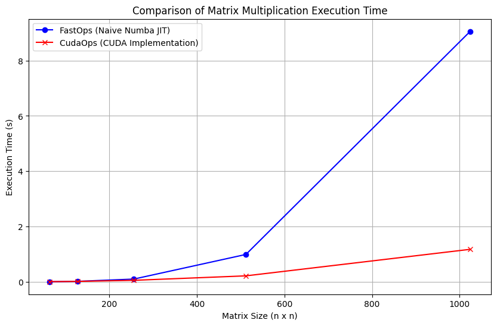

# Module 3: Efficiency


<!-- ## Assignment Answers

Find my answers to the assignment [here](./Assignment.md). -->

## Task 1: Parallelization

Diagnostics output from `project/parallel_check.py`:

````bash
(.venv) (base) ➜  mle-module-3-iamyufan git:(master) python project/parallel_check.py
MAP

================================================================================
 Parallel Accelerator Optimizing:  Function tensor_map.<locals>._map,
/Users/yufanzhang/Desktop/CornellTech/courses/23Fall/CS5781/workspace/mle-
module-3-iamyufan/minitorch/fast_ops.py (154)
================================================================================


Parallel loop listing for  Function tensor_map.<locals>._map, /Users/yufanzhang/Desktop/CornellTech/courses/23Fall/CS5781/workspace/mle-module-3-iamyufan/minitorch/fast_ops.py (154)
-----------------------------------------------------------------------------------------|loop #ID
    def _map(                                                                            |
        out: Storage,                                                                    |
        out_shape: Shape,                                                                |
        out_strides: Strides,                                                            |
        in_storage: Storage,                                                             |
        in_shape: Shape,                                                                 |
        in_strides: Strides,                                                             |
    ) -> None:                                                                           |
        # TODO: Implement for Task 3.1.                                                  |
        out_size: int = len(out)                                                         |
        # When `out` and `in` are stride-aligned, avoid indexing                         |
        if np.array_equal(out_strides, in_strides) and np.array_equal(                   |
            out_shape, in_shape                                                          |
        ):                                                                               |
            for i in prange(out_size):---------------------------------------------------| #2
                out[i] = fn(in_storage[i])                                               |
        else:                                                                            |
            # Main loop in parallel                                                      |
            for i in prange(out_size):---------------------------------------------------| #3
                # All indices use numpy buffers                                          |
                # out_index = np.zeros_like(out_shape, dtype=np.int32)                   |
                out_index = np.zeros(MAX_DIMS, dtype=np.int32)---------------------------| #0
                # in_index = np.zeros_like(in_shape, dtype=np.int32)                     |
                in_index = np.zeros(MAX_DIMS, dtype=np.int32)----------------------------| #1
                # The index of out[i]                                                    |
                to_index(i, out_shape, out_index)                                        |
                # The corresponding index in in                                          |
                broadcast_index(out_index, out_shape, in_shape, in_index)                |
                # Calculate the mapped value of in[i]                                    |
                mapped_data = fn(in_storage[index_to_position(in_index, in_strides)])    |
                # Put the mapped data into out                                           |
                out[i] = mapped_data                                                     |
--------------------------------- Fusing loops ---------------------------------
Attempting fusion of parallel loops (combines loops with similar properties)...

Fused loop summary:
+--0 has the following loops fused into it:
   +--1 (fused)
Following the attempted fusion of parallel for-loops there are 3 parallel for-
loop(s) (originating from loops labelled: #2, #3, #0).
--------------------------------------------------------------------------------
---------------------------- Optimising loop nests -----------------------------
Attempting loop nest rewrites (optimising for the largest parallel loops)...

+--3 is a parallel loop
   +--0 --> rewritten as a serial loop
--------------------------------------------------------------------------------
----------------------------- Before Optimisation ------------------------------
Parallel region 0:
+--3 (parallel)
   +--0 (parallel)
   +--1 (parallel)


--------------------------------------------------------------------------------
------------------------------ After Optimisation ------------------------------
Parallel region 0:
+--3 (parallel)
   +--0 (serial, fused with loop(s): 1)


Parallel region 0 (loop #3) had 1 loop(s) fused and 1 loop(s) serialized as part
 of the larger parallel loop (#3).
--------------------------------------------------------------------------------
--------------------------------------------------------------------------------

---------------------------Loop invariant code motion---------------------------
Allocation hoisting:
The memory allocation derived from the instruction at
/Users/yufanzhang/Desktop/CornellTech/courses/23Fall/CS5781/workspace/mle-
module-3-iamyufan/minitorch/fast_ops.py (175) is hoisted out of the parallel
loop labelled #3 (it will be performed before the loop is executed and reused
inside the loop):
   Allocation:: out_index = np.zeros(MAX_DIMS, dtype=np.int32)
    - numpy.empty() is used for the allocation.
The memory allocation derived from the instruction at
/Users/yufanzhang/Desktop/CornellTech/courses/23Fall/CS5781/workspace/mle-
module-3-iamyufan/minitorch/fast_ops.py (177) is hoisted out of the parallel
loop labelled #3 (it will be performed before the loop is executed and reused
inside the loop):
   Allocation:: in_index = np.zeros(MAX_DIMS, dtype=np.int32)
    - numpy.empty() is used for the allocation.
None
ZIP

================================================================================
 Parallel Accelerator Optimizing:  Function tensor_zip.<locals>._zip,
/Users/yufanzhang/Desktop/CornellTech/courses/23Fall/CS5781/workspace/mle-
module-3-iamyufan/minitorch/fast_ops.py (212)
================================================================================


Parallel loop listing for  Function tensor_zip.<locals>._zip, /Users/yufanzhang/Desktop/CornellTech/courses/23Fall/CS5781/workspace/mle-module-3-iamyufan/minitorch/fast_ops.py (212)
---------------------------------------------------------------------------------|loop #ID
    def _zip(                                                                    |
        out: Storage,                                                            |
        out_shape: Shape,                                                        |
        out_strides: Strides,                                                    |
        a_storage: Storage,                                                      |
        a_shape: Shape,                                                          |
        a_strides: Strides,                                                      |
        b_storage: Storage,                                                      |
        b_shape: Shape,                                                          |
        b_strides: Strides,                                                      |
    ) -> None:                                                                   |
        # TODO: Implement for Task 3.1.                                          |
        out_size: int = len(out)                                                 |
        # When `out`, `a`, `b` are stride-aligned, avoid indexing                |
        if (                                                                     |
            np.array_equal(out_strides, a_strides)                               |
            and np.array_equal(out_strides, b_strides)                           |
            and np.array_equal(out_shape, a_shape)                               |
            and np.array_equal(out_shape, b_shape)                               |
        ):                                                                       |
            for i in prange(out_size):-------------------------------------------| #7
                out[i] = fn(a_storage[i], b_storage[i])                          |
        else:                                                                    |
            # Main loop in parallel                                              |
            for i in prange(out_size):-------------------------------------------| #8
                # All indices use numpy buffers                                  |
                # out_index: Index = np.zeros_like(out_shape, dtype=np.int32)    |
                out_index: Index = np.zeros(MAX_DIMS, dtype=np.int32)------------| #4
                # a_index: Index = np.zeros_like(a_shape, dtype=np.int32)        |
                a_index: Index = np.zeros(MAX_DIMS, dtype=np.int32)--------------| #5
                # b_index: Index = np.zeros_like(b_shape, dtype=np.int32)        |
                b_index: Index = np.zeros(MAX_DIMS, dtype=np.int32)--------------| #6
                # The index of out[i]                                            |
                to_index(i, out_shape, out_index)                                |
                # The corresponding index in a and b                             |
                broadcast_index(out_index, out_shape, a_shape, a_index)          |
                broadcast_index(out_index, out_shape, b_shape, b_index)          |
                # Calculate the zipped value of a[i] and b[i]                    |
                zipped_data = fn(                                                |
                    a_storage[index_to_position(a_index, a_strides)],            |
                    b_storage[index_to_position(b_index, b_strides)],            |
                )                                                                |
                # Put the zipped data into out                                   |
                out[i] = zipped_data                                             |
--------------------------------- Fusing loops ---------------------------------
Attempting fusion of parallel loops (combines loops with similar properties)...

Fused loop summary:
+--4 has the following loops fused into it:
   +--5 (fused)
   +--6 (fused)
Following the attempted fusion of parallel for-loops there are 3 parallel for-
loop(s) (originating from loops labelled: #7, #8, #4).
--------------------------------------------------------------------------------
---------------------------- Optimising loop nests -----------------------------
Attempting loop nest rewrites (optimising for the largest parallel loops)...

+--8 is a parallel loop
   +--4 --> rewritten as a serial loop
--------------------------------------------------------------------------------
----------------------------- Before Optimisation ------------------------------
Parallel region 0:
+--8 (parallel)
   +--4 (parallel)
   +--5 (parallel)
   +--6 (parallel)


--------------------------------------------------------------------------------
------------------------------ After Optimisation ------------------------------
Parallel region 0:
+--8 (parallel)
   +--4 (serial, fused with loop(s): 5, 6)


Parallel region 0 (loop #8) had 2 loop(s) fused and 1 loop(s) serialized as part
 of the larger parallel loop (#8).
--------------------------------------------------------------------------------
--------------------------------------------------------------------------------

---------------------------Loop invariant code motion---------------------------
Allocation hoisting:
The memory allocation derived from the instruction at
/Users/yufanzhang/Desktop/CornellTech/courses/23Fall/CS5781/workspace/mle-
module-3-iamyufan/minitorch/fast_ops.py (239) is hoisted out of the parallel
loop labelled #8 (it will be performed before the loop is executed and reused
inside the loop):
   Allocation:: out_index: Index = np.zeros(MAX_DIMS, dtype=np.int32)
    - numpy.empty() is used for the allocation.
The memory allocation derived from the instruction at
/Users/yufanzhang/Desktop/CornellTech/courses/23Fall/CS5781/workspace/mle-
module-3-iamyufan/minitorch/fast_ops.py (241) is hoisted out of the parallel
loop labelled #8 (it will be performed before the loop is executed and reused
inside the loop):
   Allocation:: a_index: Index = np.zeros(MAX_DIMS, dtype=np.int32)
    - numpy.empty() is used for the allocation.
The memory allocation derived from the instruction at
/Users/yufanzhang/Desktop/CornellTech/courses/23Fall/CS5781/workspace/mle-
module-3-iamyufan/minitorch/fast_ops.py (243) is hoisted out of the parallel
loop labelled #8 (it will be performed before the loop is executed and reused
inside the loop):
   Allocation:: b_index: Index = np.zeros(MAX_DIMS, dtype=np.int32)
    - numpy.empty() is used for the allocation.
None
REDUCE

================================================================================
 Parallel Accelerator Optimizing:  Function tensor_reduce.<locals>._reduce,
/Users/yufanzhang/Desktop/CornellTech/courses/23Fall/CS5781/workspace/mle-
module-3-iamyufan/minitorch/fast_ops.py (279)
================================================================================


Parallel loop listing for  Function tensor_reduce.<locals>._reduce, /Users/yufanzhang/Desktop/CornellTech/courses/23Fall/CS5781/workspace/mle-module-3-iamyufan/minitorch/fast_ops.py (279)
---------------------------------------------------------------------------------------|loop #ID
    def _reduce(                                                                       |
        out: Storage,                                                                  |
        out_shape: Shape,                                                              |
        out_strides: Strides,                                                          |
        a_storage: Storage,                                                            |
        a_shape: Shape,                                                                |
        a_strides: Strides,                                                            |
        reduce_dim: int,                                                               |
    ) -> None:                                                                         |
        # TODO: Implement for Task 3.1.                                                |
        out_size: int = len(out)                                                       |
        reduce_size: int = a_shape[reduce_dim]                                         |
        # Main loop in parallel                                                        |
        for i in prange(out_size):-----------------------------------------------------| #10
            # All indices use numpy buffers                                            |
            # out_index: Index = np.zeros_like(out_shape, dtype=np.int32)              |
            out_index: Index = np.zeros(MAX_DIMS, dtype=np.int32)----------------------| #9
            # The index of out[i]                                                      |
            to_index(i, out_shape, out_index)                                          |
            # The starting position in a to be reduced                                 |
            a_ordinal = index_to_position(out_index, a_strides)                        |
            # Initialize the reduced value of a[i]                                     |
            reduced_val = out[i]                                                       |
            # Inner-loop should not call any functions or write non-local variables    |
            for j in range(reduce_size):                                               |
                # Calculate the reduced value of a[i]                                  |
                reduced_val = fn(                                                      |
                    reduced_val,                                                       |
                    a_storage[a_ordinal + j * a_strides[reduce_dim]],                  |
                )                                                                      |
            # Put the reduced data into out                                            |
            out[i] = reduced_val                                                       |
--------------------------------- Fusing loops ---------------------------------
Attempting fusion of parallel loops (combines loops with similar properties)...
Following the attempted fusion of parallel for-loops there are 2 parallel for-
loop(s) (originating from loops labelled: #10, #9).
--------------------------------------------------------------------------------
---------------------------- Optimising loop nests -----------------------------
Attempting loop nest rewrites (optimising for the largest parallel loops)...

+--10 is a parallel loop
   +--9 --> rewritten as a serial loop
--------------------------------------------------------------------------------
----------------------------- Before Optimisation ------------------------------
Parallel region 0:
+--10 (parallel)
   +--9 (parallel)


--------------------------------------------------------------------------------
------------------------------ After Optimisation ------------------------------
Parallel region 0:
+--10 (parallel)
   +--9 (serial)


Parallel region 0 (loop #10) had 0 loop(s) fused and 1 loop(s) serialized as
part of the larger parallel loop (#10).
--------------------------------------------------------------------------------
--------------------------------------------------------------------------------

---------------------------Loop invariant code motion---------------------------
Allocation hoisting:
The memory allocation derived from the instruction at
/Users/yufanzhang/Desktop/CornellTech/courses/23Fall/CS5781/workspace/mle-
module-3-iamyufan/minitorch/fast_ops.py (295) is hoisted out of the parallel
loop labelled #10 (it will be performed before the loop is executed and reused
inside the loop):
   Allocation:: out_index: Index = np.zeros(MAX_DIMS, dtype=np.int32)
    - numpy.empty() is used for the allocation.
None
MATRIX MULTIPLY

================================================================================
 Parallel Accelerator Optimizing:  Function _tensor_matrix_multiply,
/Users/yufanzhang/Desktop/CornellTech/courses/23Fall/CS5781/workspace/mle-
module-3-iamyufan/minitorch/fast_ops.py (315)
================================================================================


Parallel loop listing for  Function _tensor_matrix_multiply, /Users/yufanzhang/Desktop/CornellTech/courses/23Fall/CS5781/workspace/mle-module-3-iamyufan/minitorch/fast_ops.py (315)
--------------------------------------------------------------------------------------------|loop #ID
def _tensor_matrix_multiply(                                                                |
    out: Storage,                                                                           |
    out_shape: Shape,                                                                       |
    out_strides: Strides,                                                                   |
    a_storage: Storage,                                                                     |
    a_shape: Shape,                                                                         |
    a_strides: Strides,                                                                     |
    b_storage: Storage,                                                                     |
    b_shape: Shape,                                                                         |
    b_strides: Strides,                                                                     |
) -> None:                                                                                  |
    """                                                                                     |
    NUMBA tensor matrix multiply function.                                                  |
                                                                                            |
    Should work for any tensor shapes that broadcast as long as                             |
                                                                                            |
    ```                                                                                     |
    assert a_shape[-1] == b_shape[-2]                                                       |
    ```                                                                                     |
                                                                                            |
    Optimizations:                                                                          |
                                                                                            |
    * Outer loop in parallel                                                                |
    * No index buffers or function calls                                                    |
    * Inner loop should have no global writes, 1 multiply.                                  |
                                                                                            |
                                                                                            |
    Args:                                                                                   |
        out (Storage): storage for `out` tensor                                             |
        out_shape (Shape): shape for `out` tensor                                           |
        out_strides (Strides): strides for `out` tensor                                     |
        a_storage (Storage): storage for `a` tensor                                         |
        a_shape (Shape): shape for `a` tensor                                               |
        a_strides (Strides): strides for `a` tensor                                         |
        b_storage (Storage): storage for `b` tensor                                         |
        b_shape (Shape): shape for `b` tensor                                               |
        b_strides (Strides): strides for `b` tensor                                         |
                                                                                            |
    Returns:                                                                                |
        None : Fills in `out`                                                               |
    """                                                                                     |
    a_batch_stride = a_strides[0] if a_shape[0] > 1 else 0                                  |
    b_batch_stride = b_strides[0] if b_shape[0] > 1 else 0                                  |
                                                                                            |
    # TODO: Implement for Task 3.2.                                                         |
    # out[n, i, j] = \Sum_k {a[n, i, k] * b[n, k, j]}                                       |
    K = a_shape[-1]  # This is equal to b_shape[-2]                                         |
    N, I, J = out_shape[-3:]                                                                |
    for n in prange(N):---------------------------------------------------------------------| #13
        for i in prange(I):-----------------------------------------------------------------| #12
            for j in prange(J):-------------------------------------------------------------| #11
                sum_val: float = 0.0                                                        |
                a_ordinal: int = n * a_batch_stride + i * a_strides[-2]                     |
                b_ordinal: int = n * b_batch_stride + j * b_strides[-1]                     |
                for _ in range(K):                                                          |
                    sum_val += a_storage[a_ordinal] * b_storage[b_ordinal]  # 1 multiply    |
                    a_ordinal += a_strides[-1]                                              |
                    b_ordinal += b_strides[-2]                                              |
                out_ordinal = (                                                             |
                    n * out_strides[-3] + i * out_strides[-2] + j * out_strides[-1]         |
                )                                                                           |
                out[out_ordinal] = sum_val                                                  |
--------------------------------- Fusing loops ---------------------------------
Attempting fusion of parallel loops (combines loops with similar properties)...
Following the attempted fusion of parallel for-loops there are 2 parallel for-
loop(s) (originating from loops labelled: #13, #12).
--------------------------------------------------------------------------------
---------------------------- Optimising loop nests -----------------------------
Attempting loop nest rewrites (optimising for the largest parallel loops)...

+--13 is a parallel loop
   +--12 --> rewritten as a serial loop
      +--11 --> rewritten as a serial loop
--------------------------------------------------------------------------------
----------------------------- Before Optimisation ------------------------------
Parallel region 0:
+--13 (parallel)
   +--12 (parallel)
      +--11 (parallel)


--------------------------------------------------------------------------------
------------------------------ After Optimisation ------------------------------
Parallel region 0:
+--13 (parallel)
   +--12 (serial)
      +--11 (serial)


Parallel region 0 (loop #13) had 0 loop(s) fused and 2 loop(s) serialized as
part of the larger parallel loop (#13).
--------------------------------------------------------------------------------
--------------------------------------------------------------------------------

---------------------------Loop invariant code motion---------------------------
Allocation hoisting:
No allocation hoisting found
None
````

## Task 4: CUDA Matrix Multiplication

Comparison of Matrix Multiplication Execution Time between `FastOps` and `CudaOps`:

| Matrix Size (n x n) | FastOps Time (s) | CudaOps Time (s) |
|---------------------|------------------|------------------|
| 64                  | 0.00371          | 0.00642          |
| 128                 | 0.01814          | 0.01659          |
| 256                 | 0.09998          | 0.05484          |
| 512                 | 0.99039          | 0.21646          |
| 1024                | 9.05483          | 1.17544          |




## Task 5: Training

### CPU

1. `Split` dataset

   ```bash
   !cd $DIR; PYTHONPATH=/content/$DIR python3 project/run_fast_tensor.py --BACKEND cpu --HIDDEN 100 --DATASET split --RATE 0.05
   ```

   ```bash
   Epoch: 0 	 loss: 7.416926056050638 	 correct: 35 	 time: 1.9763298988342286
   Epoch: 10 	 loss: 6.792116212496707 	 correct: 41 	 time: 0.10316529273986816
   Epoch: 20 	 loss: 6.4929720284275225 	 correct: 47 	 time: 0.16965119838714598
   Epoch: 30 	 loss: 3.7119380141974654 	 correct: 46 	 time: 0.2241373062133789
   Epoch: 40 	 loss: 3.256689495337322 	 correct: 47 	 time: 0.22992217540740967
   Epoch: 50 	 loss: 2.1047522762097364 	 correct: 49 	 time: 0.17312679290771485
   Epoch: 60 	 loss: 1.630234171181419 	 correct: 49 	 time: 0.10134143829345703
   Epoch: 70 	 loss: 2.5691213706718394 	 correct: 49 	 time: 0.10219261646270753
   Epoch: 80 	 loss: 1.193947084999619 	 correct: 49 	 time: 0.10293803215026856
   Epoch: 90 	 loss: 1.2459348879919214 	 correct: 49 	 time: 0.13014256954193115
   Epoch: 100 	 loss: 1.5854711851616754 	 correct: 49 	 time: 0.1010373592376709
   Epoch: 110 	 loss: 1.200290023441873 	 correct: 49 	 time: 0.10425686836242676
   Epoch: 120 	 loss: 0.7314045505964265 	 correct: 49 	 time: 0.10081908702850342
   Epoch: 130 	 loss: 0.5970400240459084 	 correct: 49 	 time: 0.10023055076599122
   Epoch: 140 	 loss: 0.6955733792610108 	 correct: 49 	 time: 0.10091290473937989
   Epoch: 150 	 loss: 0.7057068198015551 	 correct: 49 	 time: 0.2039186954498291
   Epoch: 160 	 loss: 0.8696692454396773 	 correct: 49 	 time: 0.22645869255065917
   Epoch: 170 	 loss: 0.4801829385791019 	 correct: 49 	 time: 0.22891623973846437
   Epoch: 180 	 loss: 0.4699322579727792 	 correct: 49 	 time: 0.13071072101593018
   Epoch: 190 	 loss: 0.27240836506372706 	 correct: 49 	 time: 0.10251779556274414
   Epoch: 200 	 loss: 0.11697064698724144 	 correct: 49 	 time: 0.10057127475738525
   Epoch: 210 	 loss: 1.25964004850645 	 correct: 50 	 time: 0.10149497985839843
   Epoch: 220 	 loss: 0.18592621872918302 	 correct: 50 	 time: 0.10133697986602783
   Epoch: 230 	 loss: 0.3584523287653319 	 correct: 49 	 time: 0.09877607822418213
   Epoch: 240 	 loss: 1.1857987741611855 	 correct: 50 	 time: 0.09900994300842285
   Epoch: 250 	 loss: 0.4655290067784311 	 correct: 49 	 time: 0.10262494087219239
   Epoch: 260 	 loss: 0.08755238353906422 	 correct: 50 	 time: 0.10716710090637208
   Epoch: 270 	 loss: 1.0673053171754234 	 correct: 50 	 time: 0.11750800609588623
   Epoch: 280 	 loss: 0.22282054972684023 	 correct: 49 	 time: 0.2324007272720337
   Epoch: 290 	 loss: 0.054614562042594274 	 correct: 50 	 time: 0.1971668243408203
   Epoch: 300 	 loss: 0.3678509209031379 	 correct: 50 	 time: 0.22619938850402832
   Epoch: 310 	 loss: 1.1213041951901483 	 correct: 50 	 time: 0.12219753265380859
   Epoch: 320 	 loss: 0.12574386520774747 	 correct: 50 	 time: 0.09924209117889404
   Epoch: 330 	 loss: 0.4037794613442156 	 correct: 50 	 time: 0.10246634483337402
   Epoch: 340 	 loss: 0.18387471119156074 	 correct: 50 	 time: 0.10014817714691163
   Epoch: 350 	 loss: 0.24592526835095554 	 correct: 50 	 time: 0.10341775417327881
   Epoch: 360 	 loss: 0.05926813039279591 	 correct: 50 	 time: 0.09846253395080566
   Epoch: 370 	 loss: 0.23027514742565364 	 correct: 50 	 time: 0.09795236587524414
   Epoch: 380 	 loss: 0.09090080988521469 	 correct: 50 	 time: 0.09912915229797363
   Epoch: 390 	 loss: 0.2183102512124395 	 correct: 50 	 time: 0.10087974071502685
   Epoch: 400 	 loss: 0.5609351291812226 	 correct: 50 	 time: 0.10073714256286621
   Epoch: 410 	 loss: 0.27468009996653675 	 correct: 50 	 time: 0.2067584991455078
   Epoch: 420 	 loss: 0.11189263243316709 	 correct: 50 	 time: 0.20749413967132568
   Epoch: 430 	 loss: 0.09213631842018738 	 correct: 50 	 time: 0.22740023136138915
   Epoch: 440 	 loss: 0.07826507554140598 	 correct: 50 	 time: 0.14264404773712158
   Epoch: 450 	 loss: 0.19168719564876982 	 correct: 50 	 time: 0.10887742042541504
   Epoch: 460 	 loss: 0.0201110057714424 	 correct: 50 	 time: 0.10987112522125245
   Epoch: 470 	 loss: 0.10063141712320638 	 correct: 50 	 time: 0.11324777603149414
   Epoch: 480 	 loss: 0.5197503928592335 	 correct: 50 	 time: 0.12039060592651367
   Epoch: 490 	 loss: 0.48899427388894484 	 correct: 50 	 time: 0.13115036487579346
   ```

2. `Simple` dataset

   ```bash
   !cd $DIR; PYTHONPATH=/content/$DIR python3 project/run_fast_tensor.py --BACKEND cpu --HIDDEN 100 --DATASET simple --RATE 0.05
   ```

   ```bash
   Epoch: 0 	 loss: 5.760991462388089 	 correct: 44 	 time: 2.048647093772888
   Epoch: 10 	 loss: 2.5284639211778193 	 correct: 50 	 time: 0.11870474815368652
   Epoch: 20 	 loss: 1.5487798904754981 	 correct: 50 	 time: 0.1435093402862549
   Epoch: 30 	 loss: 0.8176694778655555 	 correct: 50 	 time: 0.2656704902648926
   Epoch: 40 	 loss: 0.32935843922623576 	 correct: 49 	 time: 0.259994649887085
   Epoch: 50 	 loss: 0.7016983910753636 	 correct: 50 	 time: 0.27710058689117434
   Epoch: 60 	 loss: 0.35445818117582006 	 correct: 50 	 time: 0.26247992515563967
   Epoch: 70 	 loss: 0.21593458105679766 	 correct: 50 	 time: 0.17344520092010499
   Epoch: 80 	 loss: 0.09985829645389951 	 correct: 50 	 time: 0.11889641284942627
   Epoch: 90 	 loss: 0.2633159412223597 	 correct: 50 	 time: 0.1209580659866333
   Epoch: 100 	 loss: 0.24734946679911204 	 correct: 50 	 time: 0.1219550371170044
   Epoch: 110 	 loss: 0.3671947434988742 	 correct: 50 	 time: 0.12197289466857911
   Epoch: 120 	 loss: 0.4077030173992145 	 correct: 50 	 time: 0.11989772319793701
   Epoch: 130 	 loss: 0.15416806425213594 	 correct: 50 	 time: 0.11938021183013917
   Epoch: 140 	 loss: 0.3095327551579536 	 correct: 50 	 time: 0.11863501071929931
   Epoch: 150 	 loss: 0.1124966174266846 	 correct: 50 	 time: 0.1656095266342163
   Epoch: 160 	 loss: 0.5082449224252708 	 correct: 50 	 time: 0.2733527421951294
   Epoch: 170 	 loss: 0.3777809563731974 	 correct: 50 	 time: 0.24965214729309082
   Epoch: 180 	 loss: 0.038465200963874825 	 correct: 50 	 time: 0.26277933120727537
   Epoch: 190 	 loss: 0.01378093240632733 	 correct: 50 	 time: 0.2586636543273926
   Epoch: 200 	 loss: 0.3238021362858816 	 correct: 50 	 time: 0.1691925048828125
   Epoch: 210 	 loss: 0.010309627911644404 	 correct: 50 	 time: 0.11888625621795654
   Epoch: 220 	 loss: 0.22517144670494174 	 correct: 50 	 time: 0.11894590854644775
   Epoch: 230 	 loss: 0.04187635594466017 	 correct: 50 	 time: 0.1257237672805786
   Epoch: 240 	 loss: 0.022883372948240374 	 correct: 50 	 time: 0.1254577159881592
   Epoch: 250 	 loss: 0.10327259149170367 	 correct: 50 	 time: 0.12479591369628906
   Epoch: 260 	 loss: 0.15271244106879467 	 correct: 50 	 time: 0.11932203769683838
   Epoch: 270 	 loss: 0.001445908981331684 	 correct: 50 	 time: 0.11807451248168946
   Epoch: 280 	 loss: 0.07993676825762563 	 correct: 50 	 time: 0.17763800621032716
   Epoch: 290 	 loss: 0.033519938489169 	 correct: 50 	 time: 0.25775556564331054
   Epoch: 300 	 loss: 0.2643046921427624 	 correct: 50 	 time: 0.25469379425048827
   Epoch: 310 	 loss: 0.1954707569610113 	 correct: 50 	 time: 0.25527777671813967
   Epoch: 320 	 loss: 0.07796895810463476 	 correct: 50 	 time: 0.2559648990631104
   Epoch: 330 	 loss: 0.15094932334152686 	 correct: 50 	 time: 0.17158207893371583
   Epoch: 340 	 loss: 0.025230378211161808 	 correct: 50 	 time: 0.11948344707489014
   Epoch: 350 	 loss: 0.016378403194168497 	 correct: 50 	 time: 0.12185351848602295
   Epoch: 360 	 loss: 0.0005804632939570647 	 correct: 50 	 time: 0.12049398422241211
   Epoch: 370 	 loss: 0.09775826329277362 	 correct: 50 	 time: 0.119087815284729
   Epoch: 380 	 loss: 0.1259266275619465 	 correct: 50 	 time: 0.12032136917114258
   Epoch: 390 	 loss: 0.12636617191351313 	 correct: 50 	 time: 0.12107367515563965
   Epoch: 400 	 loss: 0.011705486938166693 	 correct: 50 	 time: 0.12149925231933593
   Epoch: 410 	 loss: 0.04303484560590785 	 correct: 50 	 time: 0.18089671134948732
   Epoch: 420 	 loss: 0.24918912344712243 	 correct: 50 	 time: 0.27691073417663575
   Epoch: 430 	 loss: 0.09629028291923945 	 correct: 50 	 time: 0.27452864646911623
   Epoch: 440 	 loss: 0.06698568981479491 	 correct: 50 	 time: 0.25959053039550783
   Epoch: 450 	 loss: 0.10239260922148687 	 correct: 50 	 time: 0.26047701835632325
   Epoch: 460 	 loss: 0.0371393689201923 	 correct: 50 	 time: 0.1429124355316162
   Epoch: 470 	 loss: 0.035998432517657414 	 correct: 50 	 time: 0.11831834316253662
   Epoch: 480 	 loss: 0.03572181533508143 	 correct: 50 	 time: 0.12069616317749024
   Epoch: 490 	 loss: 0.029598731490568426 	 correct: 50 	 time: 0.1191415548324585
   ```

3. `Xor` dataset

   ```bash
   !cd $DIR; PYTHONPATH=/content/$DIR python3 project/run_fast_tensor.py --BACKEND cpu --HIDDEN 100 --DATASET xor --RATE 0.05
   ```

   ```bash
    Epoch: 0 	 loss: 7.149485955076543 	 correct: 23 	 time: 1.910509705543518
    Epoch: 10 	 loss: 5.165926885337489 	 correct: 42 	 time: 0.1185845136642456
    Epoch: 20 	 loss: 4.771285050533374 	 correct: 30 	 time: 0.11948909759521484
    Epoch: 30 	 loss: 2.937630622412629 	 correct: 46 	 time: 0.12210187911987305
    Epoch: 40 	 loss: 2.244229527868942 	 correct: 42 	 time: 0.1190265417098999
    Epoch: 50 	 loss: 2.111106124062713 	 correct: 47 	 time: 0.12087695598602295
    Epoch: 60 	 loss: 2.8709099673526923 	 correct: 48 	 time: 0.11923799514770508
    Epoch: 70 	 loss: 3.802501921372042 	 correct: 48 	 time: 0.12004613876342773
    Epoch: 80 	 loss: 1.649192837953345 	 correct: 48 	 time: 0.2406684637069702
    Epoch: 90 	 loss: 1.6216444310281548 	 correct: 48 	 time: 0.26747205257415774
    Epoch: 100 	 loss: 2.397478284838178 	 correct: 44 	 time: 0.27411823272705077
    Epoch: 110 	 loss: 2.5621992563569873 	 correct: 48 	 time: 0.25393917560577395
    Epoch: 120 	 loss: 4.1250903507444585 	 correct: 48 	 time: 0.23578956127166747
    Epoch: 130 	 loss: 1.2819724805022927 	 correct: 49 	 time: 0.12173228263854981
    Epoch: 140 	 loss: 0.48146006862764174 	 correct: 49 	 time: 0.12607598304748535
    Epoch: 150 	 loss: 0.9035874237309591 	 correct: 47 	 time: 0.1212735652923584
    Epoch: 160 	 loss: 1.0202509731253333 	 correct: 49 	 time: 0.11916844844818116
    Epoch: 170 	 loss: 0.6485885270860865 	 correct: 49 	 time: 0.12043943405151367
    Epoch: 180 	 loss: 0.6130229252474579 	 correct: 49 	 time: 0.1210017204284668
    Epoch: 190 	 loss: 0.35771008873797416 	 correct: 50 	 time: 0.12222990989685059
    Epoch: 200 	 loss: 1.0675709469898238 	 correct: 49 	 time: 0.11842336654663085
    Epoch: 210 	 loss: 0.8058596916101433 	 correct: 49 	 time: 0.24701521396636963
    Epoch: 220 	 loss: 1.728784984733414 	 correct: 50 	 time: 0.2496196746826172
    Epoch: 230 	 loss: 0.24812514336354924 	 correct: 50 	 time: 0.2373826265335083
    Epoch: 240 	 loss: 0.7827060912079379 	 correct: 49 	 time: 0.2730739593505859
    Epoch: 250 	 loss: 1.0212392902449094 	 correct: 49 	 time: 0.25217466354370116
    Epoch: 260 	 loss: 2.033102176992803 	 correct: 49 	 time: 0.12258126735687255
    Epoch: 270 	 loss: 1.8222570818284494 	 correct: 50 	 time: 0.12069318294525147
    Epoch: 280 	 loss: 0.7989565010440426 	 correct: 50 	 time: 0.12038002014160157
    Epoch: 290 	 loss: 0.4584380510032904 	 correct: 50 	 time: 0.12026851177215576
    Epoch: 300 	 loss: 0.4145210606789282 	 correct: 49 	 time: 0.11973357200622559
    Epoch: 310 	 loss: 0.47927904764984164 	 correct: 49 	 time: 0.11870784759521484
    Epoch: 320 	 loss: 0.5273927284875287 	 correct: 50 	 time: 0.12035489082336426
    Epoch: 330 	 loss: 0.03348687306462111 	 correct: 50 	 time: 0.118064284324646
    Epoch: 340 	 loss: 0.2555559176020399 	 correct: 50 	 time: 0.25224151611328127
    Epoch: 350 	 loss: 0.34155389349406745 	 correct: 50 	 time: 0.26549055576324465
    Epoch: 360 	 loss: 0.1473974384498928 	 correct: 50 	 time: 0.2584312200546265
    Epoch: 370 	 loss: 1.1784671380273077 	 correct: 50 	 time: 0.27012474536895753
    Epoch: 380 	 loss: 0.41352261037136584 	 correct: 50 	 time: 0.21838641166687012
    Epoch: 390 	 loss: 1.137851326396454 	 correct: 49 	 time: 0.11879794597625733
    Epoch: 400 	 loss: 1.2697890482648237 	 correct: 49 	 time: 0.11979236602783203
    Epoch: 410 	 loss: 0.18803961977462108 	 correct: 50 	 time: 0.12144827842712402
    Epoch: 420 	 loss: 0.8862801772103992 	 correct: 50 	 time: 0.12657322883605956
    Epoch: 430 	 loss: 1.1686788936842543 	 correct: 49 	 time: 0.12200326919555664
    Epoch: 440 	 loss: 0.38955656827217144 	 correct: 50 	 time: 0.11921284198760987
    Epoch: 450 	 loss: 0.3159707733638321 	 correct: 50 	 time: 0.1197432041168213
    Epoch: 460 	 loss: 0.2225953023935584 	 correct: 50 	 time: 0.12769248485565185
    Epoch: 470 	 loss: 0.2305039462255885 	 correct: 50 	 time: 0.2586981773376465
    Epoch: 480 	 loss: 0.2692166781781793 	 correct: 50 	 time: 0.2521495819091797
    Epoch: 490 	 loss: 0.3934011582438322 	 correct: 50 	 time: 0.25053155422210693
   ```

### GPU

1. `Split` dataset

   ```bash
   !cd $DIR; PYTHONPATH=/content/$DIR python3 project/run_fast_tensor.py --BACKEND gpu --HIDDEN 100 --DATASET split --RATE 0.05
   ```

   ```bash
   Epoch: 0 	 loss: 8.023539736529125 	 correct: 38 	 time: 0.6759792566299438
   Epoch: 10 	 loss: 5.5821856058737716 	 correct: 41 	 time: 2.147471475601196
   Epoch: 20 	 loss: 3.24271591847363 	 correct: 41 	 time: 2.1366048097610473
   Epoch: 30 	 loss: 5.084539983675283 	 correct: 45 	 time: 2.319426488876343
   Epoch: 40 	 loss: 3.1265014520912935 	 correct: 46 	 time: 2.10177161693573
   Epoch: 50 	 loss: 3.9494815744044818 	 correct: 46 	 time: 2.119654130935669
   Epoch: 60 	 loss: 3.065202189397376 	 correct: 46 	 time: 2.2724744081497192
   Epoch: 70 	 loss: 3.7796835289728286 	 correct: 47 	 time: 2.1811086893081666
   Epoch: 80 	 loss: 2.5759446332705696 	 correct: 42 	 time: 2.1379848957061767
   Epoch: 90 	 loss: 3.1021224017854423 	 correct: 47 	 time: 2.1649187564849854
   Epoch: 100 	 loss: 1.1487212920883538 	 correct: 49 	 time: 2.2820067167282105
   Epoch: 110 	 loss: 1.6943231482261547 	 correct: 49 	 time: 2.08520884513855
   Epoch: 120 	 loss: 1.373993585811249 	 correct: 48 	 time: 2.0874931812286377
   Epoch: 130 	 loss: 0.9072663873948379 	 correct: 48 	 time: 2.2722702264785766
   Epoch: 140 	 loss: 0.8153935215383017 	 correct: 49 	 time: 2.173226261138916
   Epoch: 150 	 loss: 1.362351509766932 	 correct: 49 	 time: 2.1036305904388426
   Epoch: 160 	 loss: 1.3469583373711342 	 correct: 47 	 time: 2.208749556541443
   Epoch: 170 	 loss: 1.0017002102518462 	 correct: 49 	 time: 2.256648564338684
   Epoch: 180 	 loss: 0.9957496439826833 	 correct: 49 	 time: 2.103678798675537
   Epoch: 190 	 loss: 0.639693828695966 	 correct: 49 	 time: 2.1098540782928468
   Epoch: 200 	 loss: 0.5354974070674015 	 correct: 49 	 time: 2.3549691915512083
   Epoch: 210 	 loss: 1.0644956957226726 	 correct: 49 	 time: 2.1133179903030395
   Epoch: 220 	 loss: 0.7215675738621975 	 correct: 49 	 time: 2.093727540969849
   Epoch: 230 	 loss: 2.5992049638814505 	 correct: 49 	 time: 2.260373568534851
   Epoch: 240 	 loss: 0.23289148422173456 	 correct: 49 	 time: 2.1937474966049195
   Epoch: 250 	 loss: 0.9122723562513666 	 correct: 50 	 time: 2.1287903070449827
   Epoch: 260 	 loss: 0.1934690924744426 	 correct: 50 	 time: 2.1582913160324098
   Epoch: 270 	 loss: 0.6017984631712474 	 correct: 49 	 time: 2.3353777647018434
   Epoch: 280 	 loss: 0.9070067379473788 	 correct: 49 	 time: 2.1175817489624023
   Epoch: 290 	 loss: 0.08143053280782347 	 correct: 50 	 time: 2.10555214881897
   Epoch: 300 	 loss: 0.8896901351229632 	 correct: 49 	 time: 2.3228121757507325
   Epoch: 310 	 loss: 0.9794970906699882 	 correct: 49 	 time: 2.1547027826309204
   Epoch: 320 	 loss: 0.6092274162695305 	 correct: 49 	 time: 2.1036127328872682
   Epoch: 330 	 loss: 1.1263705388470788 	 correct: 50 	 time: 2.262516140937805
   Epoch: 340 	 loss: 1.3092362699806126 	 correct: 50 	 time: 2.284215211868286
   Epoch: 350 	 loss: 0.15586870201030856 	 correct: 50 	 time: 2.096510481834412
   Epoch: 360 	 loss: 0.3921405190783464 	 correct: 50 	 time: 2.126324677467346
   Epoch: 370 	 loss: 1.3857272155351494 	 correct: 50 	 time: 2.3333044767379763
   Epoch: 380 	 loss: 0.5754365214473582 	 correct: 50 	 time: 2.089085030555725
   Epoch: 390 	 loss: 0.4123086344549868 	 correct: 49 	 time: 2.088583254814148
   Epoch: 400 	 loss: 0.6436248027273457 	 correct: 50 	 time: 2.2217939853668214
   Epoch: 410 	 loss: 0.2662424687906599 	 correct: 50 	 time: 2.2337647676467896
   Epoch: 420 	 loss: 0.633545295307098 	 correct: 50 	 time: 2.142848801612854
   Epoch: 430 	 loss: 0.8396489614671401 	 correct: 49 	 time: 2.1305474281311034
   Epoch: 440 	 loss: 0.31524076982844784 	 correct: 50 	 time: 2.321561026573181
   Epoch: 450 	 loss: 0.06618714041500091 	 correct: 50 	 time: 2.1034682989120483
   Epoch: 460 	 loss: 0.24161712710131597 	 correct: 50 	 time: 2.114767241477966
   Epoch: 470 	 loss: 0.7328657058858211 	 correct: 49 	 time: 2.276424503326416
   Epoch: 480 	 loss: 0.4642621708578311 	 correct: 50 	 time: 2.1753551244735716
   Epoch: 490 	 loss: 0.37944184749431503 	 correct: 50 	 time: 2.1051730871200562
   ```

2. `Simple` dataset

   ```bash
   !cd $DIR; PYTHONPATH=/content/$DIR python3 project/run_fast_tensor.py --BACKEND gpu --HIDDEN 100 --DATASET simple --RATE 0.05
   ```

   ```bash
   Epoch: 0 	 loss: 5.55330612977303 	 correct: 43 	 time: 0.4966816663742065
   Epoch: 10 	 loss: 1.9957080568233119 	 correct: 49 	 time: 2.284906435012817
   Epoch: 20 	 loss: 1.1322363570629197 	 correct: 50 	 time: 2.183769774436951
   Epoch: 30 	 loss: 0.6266136642881713 	 correct: 50 	 time: 2.1000087738037108
   Epoch: 40 	 loss: 1.066012619798161 	 correct: 50 	 time: 2.186567711830139
   Epoch: 50 	 loss: 0.6178279107445204 	 correct: 50 	 time: 2.267444610595703
   Epoch: 60 	 loss: 1.1922132532713756 	 correct: 50 	 time: 2.1220214128494264
   Epoch: 70 	 loss: 0.7234757980676024 	 correct: 50 	 time: 2.125244402885437
   Epoch: 80 	 loss: 0.4848284441308814 	 correct: 50 	 time: 2.3540323972702026
   Epoch: 90 	 loss: 1.0696902373432318 	 correct: 50 	 time: 2.10403094291687
   Epoch: 100 	 loss: 0.6963811751107061 	 correct: 50 	 time: 2.0992087841033937
   Epoch: 110 	 loss: 0.5641653670009793 	 correct: 50 	 time: 2.2827664375305177
   Epoch: 120 	 loss: 0.21715948983400174 	 correct: 50 	 time: 2.1724411725997923
   Epoch: 130 	 loss: 0.6602503314074103 	 correct: 50 	 time: 2.112850880622864
   Epoch: 140 	 loss: 0.4007584431252436 	 correct: 50 	 time: 2.2045236110687254
   Epoch: 150 	 loss: 0.1626016259501473 	 correct: 50 	 time: 2.29017231464386
   Epoch: 160 	 loss: 0.09769975043873828 	 correct: 50 	 time: 2.0848377466201784
   Epoch: 170 	 loss: 0.43804454700467516 	 correct: 50 	 time: 2.11133189201355
   Epoch: 180 	 loss: 0.397904650448048 	 correct: 50 	 time: 2.3488156318664553
   Epoch: 190 	 loss: 0.23936566650920627 	 correct: 50 	 time: 2.1022849321365356
   Epoch: 200 	 loss: 0.36630936795212793 	 correct: 50 	 time: 2.1079967975616456
   Epoch: 210 	 loss: 0.027689861352395265 	 correct: 50 	 time: 2.2843506574630736
   Epoch: 220 	 loss: 0.3245106051474864 	 correct: 50 	 time: 2.1907992362976074
   Epoch: 230 	 loss: 0.06531932303837217 	 correct: 50 	 time: 2.11426682472229
   Epoch: 240 	 loss: 0.16125631323054876 	 correct: 50 	 time: 2.180779814720154
   Epoch: 250 	 loss: 0.07842262616919186 	 correct: 50 	 time: 2.2706786394119263
   Epoch: 260 	 loss: 0.08489400971933456 	 correct: 50 	 time: 2.1145328521728515
   Epoch: 270 	 loss: 0.3104198776294714 	 correct: 50 	 time: 2.0837549924850465
   Epoch: 280 	 loss: 0.05364555526518152 	 correct: 50 	 time: 2.360784578323364
   Epoch: 290 	 loss: 0.3169184543404541 	 correct: 50 	 time: 2.1024883508682253
   Epoch: 300 	 loss: 0.017137195488231904 	 correct: 50 	 time: 2.0988242864608764
   Epoch: 310 	 loss: 0.07839321806537117 	 correct: 50 	 time: 2.2391273975372314
   Epoch: 320 	 loss: 0.05935719547217156 	 correct: 50 	 time: 2.272798705101013
   Epoch: 330 	 loss: 0.0874024957629584 	 correct: 50 	 time: 2.139209747314453
   Epoch: 340 	 loss: 0.0004443077940283366 	 correct: 50 	 time: 2.2091679096221926
   Epoch: 350 	 loss: 0.09008095752639722 	 correct: 50 	 time: 2.3182801723480226
   Epoch: 360 	 loss: 0.06422344370398576 	 correct: 50 	 time: 2.1057631731033326
   Epoch: 370 	 loss: 0.10020771475977826 	 correct: 50 	 time: 2.1233279705047607
   Epoch: 380 	 loss: 0.018387464349437273 	 correct: 50 	 time: 2.328896474838257
   Epoch: 390 	 loss: 0.31018563876582395 	 correct: 50 	 time: 2.096540665626526
   Epoch: 400 	 loss: 0.05410240727040144 	 correct: 50 	 time: 2.1121410131454468
   Epoch: 410 	 loss: 0.11033983137818748 	 correct: 50 	 time: 2.271157908439636
   Epoch: 420 	 loss: 0.0309633452649768 	 correct: 50 	 time: 2.1778453588485718
   Epoch: 430 	 loss: 0.03179979919513687 	 correct: 50 	 time: 2.0944753885269165
   Epoch: 440 	 loss: 0.159156514066438 	 correct: 50 	 time: 2.1814504623413087
   Epoch: 450 	 loss: 0.18584295340442156 	 correct: 50 	 time: 2.2916350603103637
   Epoch: 460 	 loss: 0.016454020263133355 	 correct: 50 	 time: 2.0997920513153074
   Epoch: 470 	 loss: 0.04259274993844469 	 correct: 50 	 time: 2.098102355003357
   Epoch: 480 	 loss: 0.005217807061522903 	 correct: 50 	 time: 2.315219855308533
   Epoch: 490 	 loss: 1.5152159428219971e-05 	 correct: 50 	 time: 2.154339551925659
   ```

3. `Xor` dataset

   ```bash
   !cd $DIR; PYTHONPATH=/content/$DIR python3 project/run_fast_tensor.py --BACKEND gpu --HIDDEN 100 --DATASET xor --RATE 0.05
   ```

   ```bash
   Epoch: 0 	 loss: 7.194664995685286 	 correct: 32 	 time: 0.39042646884918214
   Epoch: 10 	 loss: 5.518670173316256 	 correct: 42 	 time: 2.202633333206177
   Epoch: 20 	 loss: 4.136710621285703 	 correct: 43 	 time: 2.3226151704788207
   Epoch: 30 	 loss: 4.073732083131506 	 correct: 42 	 time: 2.13520188331604
   Epoch: 40 	 loss: 4.266792865630286 	 correct: 45 	 time: 2.1470532178878785
   Epoch: 50 	 loss: 2.8447455969344295 	 correct: 44 	 time: 2.352779769897461
   Epoch: 60 	 loss: 1.8396069141452536 	 correct: 46 	 time: 2.145019268989563
   Epoch: 70 	 loss: 3.849007885304477 	 correct: 46 	 time: 2.139802026748657
   Epoch: 80 	 loss: 2.080620047920248 	 correct: 46 	 time: 2.385815453529358
   Epoch: 90 	 loss: 3.521374085835361 	 correct: 47 	 time: 2.1322012662887575
   Epoch: 100 	 loss: 1.6718151110893043 	 correct: 46 	 time: 2.125269818305969
   Epoch: 110 	 loss: 2.2011520445700117 	 correct: 44 	 time: 2.3266170740127565
   Epoch: 120 	 loss: 1.0769532848295027 	 correct: 45 	 time: 2.1943318843841553
   Epoch: 130 	 loss: 2.78170929396493 	 correct: 47 	 time: 2.1174461126327513
   Epoch: 140 	 loss: 2.6148032740514267 	 correct: 47 	 time: 2.2872160911560058
   Epoch: 150 	 loss: 2.207618838829578 	 correct: 46 	 time: 2.247498869895935
   Epoch: 160 	 loss: 1.2657368445326416 	 correct: 48 	 time: 2.130723738670349
   Epoch: 170 	 loss: 0.6176094467194196 	 correct: 48 	 time: 2.2153765201568603
   Epoch: 180 	 loss: 1.0314022701621783 	 correct: 49 	 time: 2.2945773601531982
   Epoch: 190 	 loss: 1.2472845981010126 	 correct: 48 	 time: 2.1435618877410887
   Epoch: 200 	 loss: 0.9680186665268209 	 correct: 45 	 time: 2.203331732749939
   Epoch: 210 	 loss: 1.050912569817421 	 correct: 46 	 time: 2.3200711011886597
   Epoch: 220 	 loss: 2.267320677123325 	 correct: 47 	 time: 2.122454619407654
   Epoch: 230 	 loss: 3.5781419432878416 	 correct: 49 	 time: 2.166304898262024
   Epoch: 240 	 loss: 0.5840607403150286 	 correct: 49 	 time: 2.3481820583343507
   Epoch: 250 	 loss: 1.9571346293138634 	 correct: 47 	 time: 2.115333008766174
   Epoch: 260 	 loss: 0.3226803124594151 	 correct: 49 	 time: 2.134294557571411
   Epoch: 270 	 loss: 0.8950017890327286 	 correct: 46 	 time: 2.348386311531067
   Epoch: 280 	 loss: 1.8412122126779944 	 correct: 49 	 time: 2.1718087911605837
   Epoch: 290 	 loss: 0.5107177231770013 	 correct: 47 	 time: 2.132834792137146
   Epoch: 300 	 loss: 0.09907781364468794 	 correct: 50 	 time: 2.2898624658584597
   Epoch: 310 	 loss: 0.9166146355445961 	 correct: 48 	 time: 2.195593738555908
   Epoch: 320 	 loss: 1.6094050441549332 	 correct: 49 	 time: 2.1439659118652346
   Epoch: 330 	 loss: 2.152595831048399 	 correct: 49 	 time: 2.2068852186203003
   Epoch: 340 	 loss: 0.8818154897767102 	 correct: 48 	 time: 2.26354124546051
   Epoch: 350 	 loss: 0.7667879688112351 	 correct: 49 	 time: 2.132659888267517
   Epoch: 360 	 loss: 0.6370065745980709 	 correct: 49 	 time: 2.211960530281067
   Epoch: 370 	 loss: 0.5819790056858314 	 correct: 49 	 time: 2.282002878189087
   Epoch: 380 	 loss: 0.3805509887252293 	 correct: 49 	 time: 2.119944930076599
   Epoch: 390 	 loss: 2.2834867051436962 	 correct: 50 	 time: 2.1692577362060548
   Epoch: 400 	 loss: 0.35566142905631 	 correct: 48 	 time: 2.350715756416321
   Epoch: 410 	 loss: 1.2100380672180306 	 correct: 50 	 time: 2.165178990364075
   Epoch: 420 	 loss: 0.879569197691435 	 correct: 50 	 time: 2.1287463426589968
   Epoch: 430 	 loss: 1.836880243596537 	 correct: 48 	 time: 2.3750969409942626
   Epoch: 440 	 loss: 1.0847649383197597 	 correct: 49 	 time: 2.1370877981185914
   Epoch: 450 	 loss: 1.42867351682977 	 correct: 48 	 time: 2.1118388175964355
   Epoch: 460 	 loss: 2.2278686191059687 	 correct: 49 	 time: 2.326609492301941
   Epoch: 470 	 loss: 0.6101836511747742 	 correct: 49 	 time: 2.1978176832199097
   Epoch: 480 	 loss: 0.7120380564857185 	 correct: 50 	 time: 2.107789659500122
   Epoch: 490 	 loss: 0.11533232890149278 	 correct: 49 	 time: 2.2336391687393187
   ```

### Bigger Model

1. CPU

   ```bash
   !cd $DIR; PYTHONPATH=/content/$DIR python3 project/run_fast_tensor.py --BACKEND cpu --HIDDEN 200 --DATASET xor --RATE 0.05
   ```

   ```bash
   Epoch: 0 	 loss: 26.46205136491111 	 correct: 30 	 time: 2.0600966691970823
   Epoch: 10 	 loss: 4.234059050136677 	 correct: 40 	 time: 0.18702781200408936
   Epoch: 20 	 loss: 2.2847054809279017 	 correct: 45 	 time: 0.18785955905914306
   Epoch: 30 	 loss: 2.8511816761244537 	 correct: 45 	 time: 0.18684537410736085
   Epoch: 40 	 loss: 0.40831809451215706 	 correct: 46 	 time: 0.1888136386871338
   Epoch: 50 	 loss: 2.7538642110563645 	 correct: 47 	 time: 0.32138915061950685
   Epoch: 60 	 loss: 2.504938147400266 	 correct: 46 	 time: 0.36296184062957765
   Epoch: 70 	 loss: 1.1421058341588832 	 correct: 47 	 time: 0.22458093166351317
   Epoch: 80 	 loss: 2.0368028953090853 	 correct: 47 	 time: 0.18949601650238038
   Epoch: 90 	 loss: 1.001511398240223 	 correct: 49 	 time: 0.1904442071914673
   Epoch: 100 	 loss: 0.8466210528373413 	 correct: 47 	 time: 0.18654510974884034
   Epoch: 110 	 loss: 0.7135480528568742 	 correct: 49 	 time: 0.18686647415161134
   Epoch: 120 	 loss: 2.0869605020491315 	 correct: 49 	 time: 0.27227420806884767
   Epoch: 130 	 loss: 2.260253514747112 	 correct: 49 	 time: 0.364253306388855
   Epoch: 140 	 loss: 1.0205851474780798 	 correct: 47 	 time: 0.276145339012146
   Epoch: 150 	 loss: 0.8087359768138471 	 correct: 48 	 time: 0.1863924741744995
   Epoch: 160 	 loss: 0.7645088794317746 	 correct: 50 	 time: 0.187701416015625
   Epoch: 170 	 loss: 1.5640728746897619 	 correct: 48 	 time: 0.18479361534118652
   Epoch: 180 	 loss: 0.5327983074315565 	 correct: 50 	 time: 0.1974231243133545
   Epoch: 190 	 loss: 0.16970034391890787 	 correct: 46 	 time: 0.25103116035461426
   Epoch: 200 	 loss: 1.2176687523630794 	 correct: 50 	 time: 0.35154478549957274
   Epoch: 210 	 loss: 1.8871337229321719 	 correct: 50 	 time: 0.3205507755279541
   Epoch: 220 	 loss: 0.9992704363672694 	 correct: 50 	 time: 0.18679273128509521
   Epoch: 230 	 loss: 1.2090863721155198 	 correct: 50 	 time: 0.18725650310516356
   Epoch: 240 	 loss: 1.7870997232905161 	 correct: 50 	 time: 0.1835240125656128
   Epoch: 250 	 loss: 1.3344969465387806 	 correct: 47 	 time: 0.1886823892593384
   Epoch: 260 	 loss: 0.669648179418256 	 correct: 50 	 time: 0.1963355779647827
   Epoch: 270 	 loss: 0.5001524588403417 	 correct: 50 	 time: 0.3491281270980835
   Epoch: 280 	 loss: 0.34212872148460727 	 correct: 50 	 time: 0.3676774024963379
   Epoch: 290 	 loss: 0.409908137757465 	 correct: 49 	 time: 0.1887042760848999
   Epoch: 300 	 loss: 0.9694275162400267 	 correct: 50 	 time: 0.19261059761047364
   Epoch: 310 	 loss: 0.05724592962299196 	 correct: 50 	 time: 0.1894397735595703
   Epoch: 320 	 loss: 0.2729113880827773 	 correct: 50 	 time: 0.18732409477233886
   Epoch: 330 	 loss: 1.6458732044764384 	 correct: 48 	 time: 0.18783435821533204
   Epoch: 340 	 loss: 0.3671959702043178 	 correct: 50 	 time: 0.35276901721954346
   Epoch: 350 	 loss: 1.543290797625887 	 correct: 49 	 time: 0.35841569900512693
   Epoch: 360 	 loss: 0.955262946769746 	 correct: 50 	 time: 0.18977525234222412
   Epoch: 370 	 loss: 1.18646128451159 	 correct: 50 	 time: 0.18546659946441652
   Epoch: 380 	 loss: 0.573254335089028 	 correct: 50 	 time: 0.19106452465057372
   Epoch: 390 	 loss: 1.1716226463903956 	 correct: 50 	 time: 0.18438079357147216
   Epoch: 400 	 loss: 0.3889801019984124 	 correct: 50 	 time: 0.18534629344940184
   Epoch: 410 	 loss: 0.04330528406296372 	 correct: 50 	 time: 0.2849681615829468
   Epoch: 420 	 loss: 0.16680464977946002 	 correct: 50 	 time: 0.3651202440261841
   Epoch: 430 	 loss: 0.22760731823224048 	 correct: 50 	 time: 0.26432464122772215
   Epoch: 440 	 loss: 0.2744749428981803 	 correct: 50 	 time: 0.1889045476913452
   Epoch: 450 	 loss: 0.8795007832099508 	 correct: 50 	 time: 0.18470416069030762
   Epoch: 460 	 loss: 0.7419510571897566 	 correct: 50 	 time: 0.1860586643218994
   Epoch: 470 	 loss: 0.31485630599453357 	 correct: 50 	 time: 0.18295869827270508
   Epoch: 480 	 loss: 0.13372929801389163 	 correct: 49 	 time: 0.21827976703643798
   Epoch: 490 	 loss: 0.0973941075868659 	 correct: 50 	 time: 0.355080246925354
   ```

2. GPU

   ```bash
   !cd $DIR; PYTHONPATH=/content/$DIR python3 project/run_fast_tensor.py --BACKEND gpu --HIDDEN 200 --DATASET xor --RATE 0.05
   ```

   ```bash
   Epoch: 0 	 loss: 4.046003511893338 	 correct: 30 	 time: 0.4230589628219604
   Epoch: 10 	 loss: 1.3181062550627933 	 correct: 41 	 time: 2.3893728256225586
   Epoch: 20 	 loss: 1.7866191498816137 	 correct: 44 	 time: 2.1804355144500733
   Epoch: 30 	 loss: 2.794972373211081 	 correct: 49 	 time: 2.327899718284607
   Epoch: 40 	 loss: 1.9541289007368823 	 correct: 47 	 time: 2.332233190536499
   Epoch: 50 	 loss: 1.23438235267232 	 correct: 48 	 time: 2.217619037628174
   Epoch: 60 	 loss: 2.3387388542738896 	 correct: 47 	 time: 2.4683841705322265
   Epoch: 70 	 loss: 1.1981829737042804 	 correct: 49 	 time: 2.2237198114395142
   Epoch: 80 	 loss: 1.6025786686355419 	 correct: 49 	 time: 2.28967764377594
   Epoch: 90 	 loss: 0.7412814864608995 	 correct: 49 	 time: 2.449548602104187
   Epoch: 100 	 loss: 1.0100854449759302 	 correct: 49 	 time: 2.215818238258362
   Epoch: 110 	 loss: 4.738135919081292 	 correct: 49 	 time: 2.3566921234130858
   Epoch: 120 	 loss: 2.2598860251904687 	 correct: 48 	 time: 2.3360361814498902
   Epoch: 130 	 loss: 1.8007215355932895 	 correct: 49 	 time: 2.2298171281814576
   Epoch: 140 	 loss: 1.1620618246668748 	 correct: 49 	 time: 2.4876123666763306
   Epoch: 150 	 loss: 0.5210536228252447 	 correct: 49 	 time: 2.209350752830505
   Epoch: 160 	 loss: 1.2585367564891423 	 correct: 49 	 time: 2.2421059370040894
   Epoch: 170 	 loss: 2.1568580931483936 	 correct: 50 	 time: 2.462639331817627
   Epoch: 180 	 loss: 0.726748107286407 	 correct: 48 	 time: 2.21211416721344
   Epoch: 190 	 loss: 0.27266731744060285 	 correct: 50 	 time: 2.308778738975525
   Epoch: 200 	 loss: 0.4305888427711483 	 correct: 49 	 time: 2.362569546699524
   Epoch: 210 	 loss: 0.28837346643767137 	 correct: 50 	 time: 2.2063506841659546
   Epoch: 220 	 loss: 0.20495377696995715 	 correct: 49 	 time: 2.400188755989075
   Epoch: 230 	 loss: 0.05535149828562301 	 correct: 50 	 time: 2.2543551683425904
   Epoch: 240 	 loss: 0.3077334255122875 	 correct: 50 	 time: 2.204996109008789
   Epoch: 250 	 loss: 0.36463228682717 	 correct: 49 	 time: 2.4925485134124754
   Epoch: 260 	 loss: 0.1711592871066513 	 correct: 50 	 time: 2.208894968032837
   Epoch: 270 	 loss: 0.5255527359232237 	 correct: 50 	 time: 2.2500433921813965
   Epoch: 280 	 loss: 0.6218495185904184 	 correct: 50 	 time: 2.3960714817047117
   Epoch: 290 	 loss: 1.7858465164113948 	 correct: 50 	 time: 2.2268184661865233
   Epoch: 300 	 loss: 0.6491523313774682 	 correct: 49 	 time: 2.3594318151474
   Epoch: 310 	 loss: 0.12285829728504048 	 correct: 50 	 time: 2.3111589670181276
   Epoch: 320 	 loss: 0.4325539094380133 	 correct: 50 	 time: 2.214467167854309
   Epoch: 330 	 loss: 0.09456075070607999 	 correct: 50 	 time: 2.424709916114807
   Epoch: 340 	 loss: 0.38356474825328735 	 correct: 50 	 time: 2.239116883277893
   Epoch: 350 	 loss: 0.20460313840345493 	 correct: 50 	 time: 2.230786442756653
   Epoch: 360 	 loss: 0.3931084372900771 	 correct: 50 	 time: 2.437948751449585
   Epoch: 370 	 loss: 1.0893907480766305 	 correct: 50 	 time: 2.2010202407836914
   Epoch: 380 	 loss: 0.5766801204392629 	 correct: 50 	 time: 2.316675090789795
   Epoch: 390 	 loss: 0.3927667067356843 	 correct: 50 	 time: 2.2618538618087767
   Epoch: 400 	 loss: 0.3800373340733371 	 correct: 50 	 time: 2.2077431440353394
   Epoch: 410 	 loss: 0.15426868781501124 	 correct: 50 	 time: 2.315204930305481
   Epoch: 420 	 loss: 0.2232475774861185 	 correct: 50 	 time: 2.1573935985565185
   Epoch: 430 	 loss: 0.19725395037888346 	 correct: 50 	 time: 2.37328987121582
   Epoch: 440 	 loss: 0.5816087930494459 	 correct: 50 	 time: 2.1444195747375487
   Epoch: 450 	 loss: 0.21151691039650494 	 correct: 50 	 time: 2.361870050430298
   Epoch: 460 	 loss: 0.10536998979547058 	 correct: 50 	 time: 2.1577337980270386
   Epoch: 470 	 loss: 0.15410671283705854 	 correct: 50 	 time: 2.364146876335144
   Epoch: 480 	 loss: 0.29106941668242475 	 correct: 50 	 time: 2.136246109008789
   Epoch: 490 	 loss: 0.45173028212770416 	 correct: 50 	 time: 2.3403259038925173
   ```
